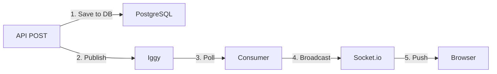

# Iggy Integration Testing Checklist
## *"How to Know Everything Works"*

**Purpose**: Systematic verification that Iggy event streaming is working correctly.

---

## Pre-Flight Checks

Before starting implementation, verify baseline:

- [ ] PostgreSQL (Gringotts) is running
- [ ] Express server starts without errors
- [ ] Can create incidents via API
- [ ] Socket.io direct broadcasts work (Year 3 baseline)
- [ ] JWT authentication works

---

## Phase 1: Infrastructure Tests

### Test 1.1: Iggy Container Running

```bash
docker ps | grep iggy
```

**Expected**: Container named `marauders-iggy` with status `Up X seconds/minutes`

**If Failed**:
```bash
docker-compose up -d iggy
docker logs marauders-iggy
```

---

### Test 1.2: Iggy HTTP API Accessible

```bash
curl http://localhost:3000/health
```

**Expected**:
```json
{
  "status": "ok",
  "version": "0.x.x"
}
```

**If Failed**:
- Check if port 3000 is available: `lsof -i :3000`
- Check Iggy logs: `docker logs marauders-iggy`
- Verify docker-compose.yml port mapping: `3000:3000`

---

### Test 1.3: Iggy TCP Port Accessible

```bash
telnet localhost 8090
```

**Expected**: Connection succeeds (Ctrl+] then `quit` to exit)

**If Failed**:
- Check if port 8090 is available: `lsof -i :8090`
- Verify docker-compose.yml port mapping: `8090:8090`

---

### Test 1.4: Iggy Persists Data

```bash
# Create stream and topic via HTTP API
curl -X POST http://localhost:3000/streams \
  -H "Content-Type: application/json" \
  -d '{"stream_id": 1, "name": "test-stream"}'

# Restart Iggy
docker-compose restart iggy

# Wait 5 seconds
sleep 5

# List streams
curl http://localhost:3000/streams
```

**Expected**: `test-stream` still exists after restart

---

## Phase 2: Producer Tests

### Test 2.1: Server Connects to Iggy

```bash
cd gryffindor/server/
npm run dev
```

**Expected logs**:
```
🦉 Connecting to Iggy event broker...
✅ Connected to Iggy event broker
```

**If Failed**:
- Verify IGGY_HOST and IGGY_PORT in .env
- Check if Iggy is running: `docker ps | grep iggy`
- Check network connectivity: `docker network inspect marauders-network`

---

### Test 2.2: Event Envelope Created Correctly

**Run Unit Test**:

```bash
npm test -- eventEnvelopeFactory.test.js
```

**Expected**: All tests pass

**Manual Verification**:

```javascript
// In Node REPL or test script
import { createIncidentCreatedEventEnvelope } from './src/streaming/eventEnvelopeFactory.js';

const incident = {
  id: 42,
  title: 'Test',
  severity: 'MISCHIEF',
  location: 'HOGWARTS',
  status: 'OPEN'
};

const envelope = createIncidentCreatedEventEnvelope(incident, 'user-123');
console.log(envelope);
```

**Expected fields**:
- `eventId`: UUID v4
- `eventType`: "incident.created"
- `timestamp`: ISO 8601 string
- `source`: "gryffindor-api"
- `userId`: "user-123"
- `data`: Contains incident fields

---

### Test 2.3: Event Published to Iggy

```bash
# Login to get token
TOKEN=$(curl -s -X POST http://localhost:4001/api/auth/login \
  -H "Content-Type: application/json" \
  -d '{"email":"admin@example.com","password":"admin123"}' \
  | jq -r '.accessToken')

# Create incident
curl -X POST http://localhost:4001/api/incidents \
  -H "Content-Type: application/json" \
  -H "Authorization: Bearer $TOKEN" \
  -d '{
    "title": "Test Publish",
    "severity": "MISCHIEF",
    "location": "HOGWARTS"
  }'
```

**Expected server logs**:
```
📤 Published event: incident.created (ID: <uuid>)
```

**Verify in Iggy**:
```bash
curl http://localhost:3000/streams/marauders-map/topics/incident-events | jq ".messages_count"
```

**Expected**: Message count > 0

---

### Test 2.4: Publishing Doesn't Block API Response

Add timing to route handler:

```javascript
const start = Date.now();
// ... create incident in DB ...
const dbTime = Date.now() - start;

publishIncidentCreatedEvent(eventEnvelope); // Fire-and-forget

const totalTime = Date.now() - start;
console.log(`DB: ${dbTime}ms, Total: ${totalTime}ms`);
```

**Expected**: Total time ≈ DB time (< 5ms difference)

---

### Test 2.5: Publishing Failure Doesn't Break API

```bash
# Stop Iggy
docker-compose stop iggy

# Create incident (should still succeed)
curl -X POST http://localhost:4001/api/incidents \
  -H "Content-Type: application/json" \
  -H "Authorization: Bearer $TOKEN" \
  -d '{
    "title": "Test Without Iggy",
    "severity": "MISCHIEF",
    "location": "HOGWARTS"
  }'
```

**Expected**:
- API returns 201 Created
- Incident saved to PostgreSQL
- Server logs: `⚠️ Failed to publish event to Iggy: ...`

**Cleanup**:
```bash
docker-compose start iggy
```

---

## Phase 3: Consumer Tests

### Test 3.1: Consumer Starts Successfully

```bash
npm run dev
```

**Expected logs**:
```
🦉 Starting WebSocket broadcast consumer...
✅ WebSocket broadcast consumer started
```

---

### Test 3.2: Consumer Receives Events

**Create incident** (from Test 2.3)

**Expected server logs**:
```
📤 Published event: incident.created (ID: abc123)
📥 Received 1 incident events from Iggy
📢 Broadcasting: incident.created
```

**If Failed**:
- Check consumer is running: Look for "Starting WebSocket broadcast consumer"
- Check consumer poll interval: Should be 100-500ms
- Check Iggy has messages: `curl http://localhost:3000/streams/marauders-map/topics/incident-events`

---

### Test 3.3: Consumer Tracks Offset

```bash
# Create 5 incidents
for i in {1..5}; do
  curl -X POST http://localhost:4001/api/incidents \
    -H "Content-Type: application/json" \
    -H "Authorization: Bearer $TOKEN" \
    -d "{\"title\":\"Incident $i\",\"severity\":\"MISCHIEF\",\"location\":\"HOGWARTS\"}"
  sleep 0.5
done

# Check consumer offset
curl http://localhost:3000/streams/marauders-map/topics/incident-events/consumers
```

**Expected**: Consumer `websocket-broadcaster` exists with offset = 5 (or current message count)

---

### Test 3.4: Consumer Resumes from Offset

```bash
# Note current offset
OFFSET=$(curl -s http://localhost:3000/streams/marauders-map/topics/incident-events/consumers | jq -r '.[0].offset // 0')

# Restart server
# Ctrl+C, then npm run dev

# Create new incident
curl -X POST http://localhost:4001/api/incidents \
  -H "Content-Type: application/json" \
  -H "Authorization: Bearer $TOKEN" \
  -d '{"title":"After Restart","severity":"MISCHIEF","location":"HOGWARTS"}'

# Check server logs
# Should see: "📥 Received 1 incident events from Iggy"
# Should NOT see old events re-broadcast
```

**Expected**: Consumer resumes from last offset, only new events are processed

---

### Test 3.5: Consumer Handles Malformed Events

**Manually inject malformed event**:

```bash
# Use test script to publish invalid JSON
# (Implementation detail - requires direct Iggy client access)
```

**Expected**:
- Consumer logs: `Error processing message: ...`
- Consumer skips to next message (doesn't crash)
- Offset is incremented

---

## Phase 4: End-to-End Integration Tests

### Test 4.1: Create Incident Flow



**Test Steps**:

1. Open browser console
2. Connect Socket.io client:
   ```javascript
   const socket = io('http://localhost:4001', {
     auth: { token: '<JWT_TOKEN>' }
   });
   socket.on('incident:created', (data) => console.log('Received:', data));
   ```
3. Create incident via API (Terminal 2)
4. Verify event received in browser console

**Expected**:
- API returns 201 Created
- Server logs: `📤 Published`, `📥 Received`, `📢 Broadcasting`
- Browser console: `Received: { incident: { ... } }`

---

### Test 4.2: Update Incident Flow

```bash
# Create incident
INCIDENT_ID=$(curl -s -X POST http://localhost:4001/api/incidents \
  -H "Content-Type: application/json" \
  -H "Authorization: Bearer $TOKEN" \
  -d '{"title":"To Update","severity":"MISCHIEF","location":"HOGWARTS"}' \
  | jq -r '.id')

# Join incident room in browser
socket.emit('room:join', { room: `incident:${INCIDENT_ID}` });
socket.on('incident:updated', (data) => console.log('Updated:', data));

# Update incident
curl -X PUT http://localhost:4001/api/incidents/$INCIDENT_ID \
  -H "Content-Type: application/json" \
  -H "Authorization: Bearer $TOKEN" \
  -d '{"severity":"DANGEROUS"}'
```

**Expected**:
- Server logs: `📤 Published event: incident.updated`
- Server logs: `📢 Broadcasting: incident.updated`
- Browser console: `Updated: { incident: { severity: "DANGEROUS" } }`

---

### Test 4.3: Resolve Incident Flow

```bash
# Resolve incident
curl -X DELETE http://localhost:4001/api/incidents/$INCIDENT_ID \
  -H "Authorization: Bearer $TOKEN"

# Listen for event in browser
socket.on('incident:resolved', (data) => console.log('Resolved:', data));
```

**Expected**:
- Server logs: `📤 Published event: incident.resolved`
- Browser console: `Resolved: { incidentId: X, resolvedBy: { ... } }`

---

## Phase 5: Resilience Tests

### Test 5.1: Server Restart with Persistent Events

```bash
# Create 10 incidents
for i in {1..10}; do
  curl -X POST http://localhost:4001/api/incidents \
    -H "Content-Type: application/json" \
    -H "Authorization: Bearer $TOKEN" \
    -d "{\"title\":\"Incident $i\",\"severity\":\"MISCHIEF\",\"location\":\"HOGWARTS\"}"
done

# Check message count
BEFORE=$(curl -s http://localhost:3000/streams/marauders-map/topics/incident-events | jq -r ".messages_count")

# Restart server
# Ctrl+C, then npm run dev

# Wait 5 seconds
sleep 5

# Check message count again
AFTER=$(curl -s http://localhost:3000/streams/marauders-map/topics/incident-events | jq -r ".messages_count")

# Compare
echo "Before: $BEFORE, After: $AFTER"
```

**Expected**: BEFORE == AFTER (events persisted)

---

### Test 5.2: Iggy Restart with Data Persistence

```bash
# Note message count
BEFORE=$(curl -s http://localhost:3000/streams/marauders-map/topics/incident-events | jq -r ".messages_count")

# Restart Iggy
docker-compose restart iggy

# Wait 10 seconds
sleep 10

# Check message count
AFTER=$(curl -s http://localhost:3000/streams/marauders-map/topics/incident-events | jq -r ".messages_count")

echo "Before: $BEFORE, After: $AFTER"
```

**Expected**: BEFORE == AFTER (Iggy volume persisted data)

---

### Test 5.3: Server Reconnects After Iggy Restart

```bash
# Server is running, Iggy is running

# Stop Iggy
docker-compose stop iggy

# Create incident (should fail to publish)
curl -X POST http://localhost:4001/api/incidents \
  -H "Content-Type: application/json" \
  -H "Authorization: Bearer $TOKEN" \
  -d '{"title":"During Outage","severity":"MISCHIEF","location":"HOGWARTS"}'

# Expected: API succeeds, server logs publish failure

# Start Iggy
docker-compose start iggy

# Wait 10 seconds for reconnection
sleep 10

# Create incident (should succeed)
curl -X POST http://localhost:4001/api/incidents \
  -H "Content-Type: application/json" \
  -H "Authorization: Bearer $TOKEN" \
  -d '{"title":"After Recovery","severity":"MISCHIEF","location":"HOGWARTS"}'

# Expected: API succeeds, event published successfully
```

**Expected**:
- Server logs: `⚠️ Failed to publish event` (during outage)
- Server logs: `✅ Connected to Iggy` (after recovery)
- Server logs: `📤 Published event: incident.created` (after recovery)

---

### Test 5.4: Consumer Handles High Load

```bash
# Create 100 incidents rapidly
for i in {1..100}; do
  curl -s -X POST http://localhost:4001/api/incidents \
    -H "Content-Type: application/json" \
    -H "Authorization: Bearer $TOKEN" \
    -d "{\"title\":\"Load Test $i\",\"severity\":\"MISCHIEF\",\"location\":\"HOGWARTS\"}" &
done
wait

# Wait 10 seconds for all events to be consumed
sleep 10

# Check consumer offset
OFFSET=$(curl -s http://localhost:3000/streams/marauders-map/topics/incident-events/consumers | jq -r '.[0].offset // 0')

# Check message count
MESSAGE_COUNT=$(curl -s http://localhost:3000/streams/marauders-map/topics/incident-events | jq -r ".messages_count")

echo "Consumer offset: $OFFSET, Message count: $MESSAGE_COUNT"
```

**Expected**: Offset ≈ Message count (consumer kept up)

---

## Phase 6: Performance Tests

### Test 6.1: Producer Latency

Add timing to route handler:

```javascript
const publishStart = Date.now();
await publishIncidentCreatedEvent(eventEnvelope);
const publishLatency = Date.now() - publishStart;
console.log(`⏱️  Publish latency: ${publishLatency}ms`);
```

**Run**:
```bash
for i in {1..10}; do
  curl -X POST http://localhost:4001/api/incidents \
    -H "Content-Type: application/json" \
    -H "Authorization: Bearer $TOKEN" \
    -d '{"title":"Latency Test","severity":"MISCHIEF","location":"HOGWARTS"}'
done
```

**Check logs for timing**:
```
⏱️  Publish latency: 2ms
⏱️  Publish latency: 3ms
⏱️  Publish latency: 2ms
...
```

**Expected**: Average < 5ms

---

### Test 6.2: Consumer Latency

Add timing to consumer:

```javascript
const eventTime = new Date(eventEnvelope.timestamp);
const now = new Date();
const latency = now - eventTime;
console.log(`⏱️  Consumer latency: ${latency}ms`);
```

**Expected**: < 100ms (from event creation to broadcast)

---

### Test 6.3: Throughput Test

```bash
# Create 1000 incidents
START=$(date +%s)
for i in {1..1000}; do
  curl -s -X POST http://localhost:4001/api/incidents \
    -H "Content-Type: application/json" \
    -H "Authorization: Bearer $TOKEN" \
    -d "{\"title\":\"Throughput $i\",\"severity\":\"MISCHIEF\",\"location\":\"HOGWARTS\"}" &

  # Batch every 100 to avoid overwhelming the shell
  if [ $((i % 100)) -eq 0 ]; then
    wait
  fi
done
wait
END=$(date +%s)

DURATION=$((END - START))
THROUGHPUT=$((1000 / DURATION))

echo "Duration: ${DURATION}s"
echo "Throughput: ${THROUGHPUT} events/sec"
```

**Expected**: > 100 events/second

---

## Phase 7: Monitoring Tests

### Test 7.1: Monitoring Endpoint Works

```bash
curl http://localhost:4001/api/monitoring/iggy-status
```

**Expected**:
```json
{
  "status": "connected",
  "consumer": {
    "id": "websocket-broadcaster",
    "currentOffset": 42,
    "stream": "marauders-map",
    "topic": "incident-events"
  }
}
```

---

### Test 7.2: Iggy HTTP API Accessible

```bash
# Health
curl http://localhost:3000/health

# Stats
curl http://localhost:3000/stats

# Streams
curl http://localhost:3000/streams

# Topics
curl http://localhost:3000/streams/marauders-map/topics

# Consumers
curl http://localhost:3000/streams/marauders-map/topics/incident-events/consumers
```

**Expected**: All endpoints return valid JSON

---

### Test 7.3: Consumer Lag Monitoring

```bash
# Get message count
MESSAGE_COUNT=$(curl -s http://localhost:3000/streams/marauders-map/topics/incident-events | jq -r ".messages_count")

# Get consumer offset
CONSUMER_OFFSET=$(curl -s http://localhost:3000/streams/marauders-map/topics/incident-events/consumers | jq -r '.[0].offset // 0')

# Calculate lag
LAG=$((MESSAGE_COUNT - CONSUMER_OFFSET))

echo "Message count: $MESSAGE_COUNT"
echo "Consumer offset: $CONSUMER_OFFSET"
echo "Lag: $LAG messages"
```

**Expected**: Lag = 0 (consumer is caught up)

---

## Phase 8: Code Quality Tests

### Test 8.1: All Function Names Follow 4WNC

```bash
# Check for non-4WNC function names
git diff main | grep "^+.*function\|^+.*async function" | grep -v "four_word_name_pattern"
```

**Expected**: No violations

---

### Test 8.2: Unit Test Coverage

```bash
npm test -- --coverage
```

**Expected**:
- Statements: > 80%
- Branches: > 70%
- Functions: > 80%
- Lines: > 80%

---

### Test 8.3: No TODOs or STUBs

```bash
grep -r "TODO\|STUB\|FIXME" gryffindor/server/src/streaming/
```

**Expected**: No matches

---

## Master Checklist

### Infrastructure (Phase 1)
- [ ] Iggy container running
- [ ] Iggy HTTP API accessible
- [ ] Iggy TCP port accessible
- [ ] Data persists across restarts

### Producer (Phase 2)
- [ ] Server connects to Iggy
- [ ] Event envelopes created correctly
- [ ] Events published to Iggy
- [ ] Publishing doesn't block API
- [ ] Publishing failure doesn't break API

### Consumer (Phase 3)
- [ ] Consumer starts successfully
- [ ] Consumer receives events
- [ ] Consumer tracks offset
- [ ] Consumer resumes from offset
- [ ] Consumer handles malformed events

### End-to-End (Phase 4)
- [ ] Create incident flow works
- [ ] Update incident flow works
- [ ] Resolve incident flow works

### Resilience (Phase 5)
- [ ] Events persist across server restart
- [ ] Events persist across Iggy restart
- [ ] Server reconnects after Iggy restart
- [ ] Consumer handles high load

### Performance (Phase 6)
- [ ] Producer latency < 5ms
- [ ] Consumer latency < 100ms
- [ ] Throughput > 100 events/sec

### Monitoring (Phase 7)
- [ ] Monitoring endpoint works
- [ ] Iggy HTTP API accessible
- [ ] Consumer lag monitoring works

### Code Quality (Phase 8)
- [ ] All functions follow 4WNC
- [ ] Unit test coverage > 80%
- [ ] No TODOs or STUBs in code

---

## Automated Test Script

```bash
#!/bin/bash
# File: test-iggy-integration.sh

echo "🧪 Running Iggy Integration Tests"
echo "===================================="
echo ""

FAILED=0
PASSED=0

# Helper function
test_pass() {
  echo "✅ PASS: $1"
  PASSED=$((PASSED + 1))
}

test_fail() {
  echo "❌ FAIL: $1"
  FAILED=$((FAILED + 1))
}

# Test 1: Iggy running
if docker ps | grep -q marauders-iggy; then
  test_pass "Iggy container running"
else
  test_fail "Iggy container NOT running"
fi

# Test 2: Iggy health
if curl -s http://localhost:3000/health | grep -q "ok"; then
  test_pass "Iggy HTTP API healthy"
else
  test_fail "Iggy HTTP API NOT responding"
fi

# Test 3: Stream exists
if curl -s http://localhost:3000/streams | grep -q "marauders-map"; then
  test_pass "marauders-map stream exists"
else
  test_fail "marauders-map stream NOT found"
fi

# Test 4: Can create incident
TOKEN=$(curl -s -X POST http://localhost:4001/api/auth/login \
  -H "Content-Type: application/json" \
  -d '{"email":"admin@example.com","password":"admin123"}' \
  | jq -r '.accessToken')

if [ ! -z "$TOKEN" ] && [ "$TOKEN" != "null" ]; then
  test_pass "Authentication successful"
else
  test_fail "Authentication FAILED"
fi

BEFORE=$(curl -s http://localhost:3000/streams/marauders-map/topics/incident-events | jq -r ".messages_count // 0")

curl -s -X POST http://localhost:4001/api/incidents \
  -H "Content-Type: application/json" \
  -H "Authorization: Bearer $TOKEN" \
  -d '{"title":"Test","severity":"MISCHIEF","location":"HOGWARTS"}' > /dev/null

sleep 2

AFTER=$(curl -s http://localhost:3000/streams/marauders-map/topics/incident-events | jq -r ".messages_count")

if [ $AFTER -gt $BEFORE ]; then
  test_pass "Event published to Iggy"
else
  test_fail "Event NOT published"
fi

# Test 5: Consumer status
if curl -s http://localhost:4001/api/monitoring/iggy-status | grep -q "connected"; then
  test_pass "Consumer connected and monitoring"
else
  test_fail "Consumer NOT connected"
fi

# Summary
echo ""
echo "===================================="
echo "Summary: $PASSED passed, $FAILED failed"

if [ $FAILED -eq 0 ]; then
  echo "✅ All tests PASSED!"
  exit 0
else
  echo "❌ Some tests FAILED"
  exit 1
fi
```

**Run it:**

```bash
chmod +x test-iggy-integration.sh
./test-iggy-integration.sh
```

---

## Continuous Integration

Add to GitHub Actions (optional):

```yaml
# .github/workflows/test-iggy.yml
name: Test Iggy Integration

on: [push, pull_request]

jobs:
  test:
    runs-on: ubuntu-latest

    services:
      postgres:
        image: postgres:16-alpine
        env:
          POSTGRES_DB: marauders_map
          POSTGRES_USER: postgres
          POSTGRES_PASSWORD: postgres

      iggy:
        image: iggyrs/iggy:latest
        ports:
          - 8090:8090
          - 3000:3000

    steps:
      - uses: actions/checkout@v3

      - name: Setup Node.js
        uses: actions/setup-node@v3
        with:
          node-version: '18'

      - name: Install dependencies
        run: |
          cd gryffindor/server
          npm install

      - name: Run tests
        run: |
          cd gryffindor/server
          npm test

      - name: Run integration tests
        run: ./test-iggy-integration.sh
```

---

**Version**: 1.0.0 (2026-02-16)

*"If you can check all these boxes, your Iggy integration is production-ready."*
