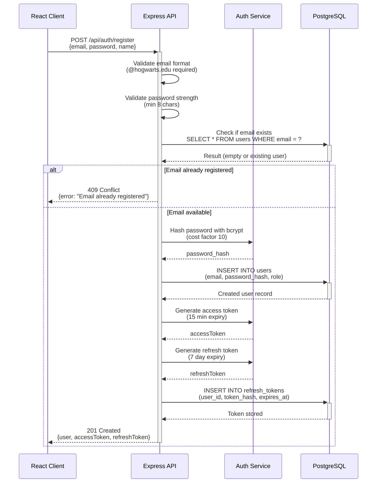
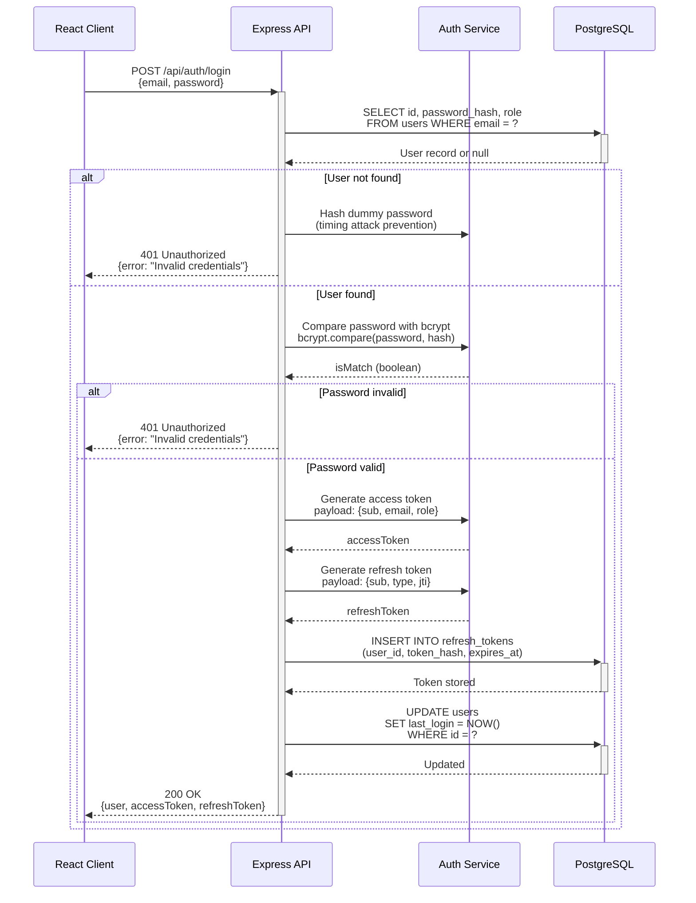
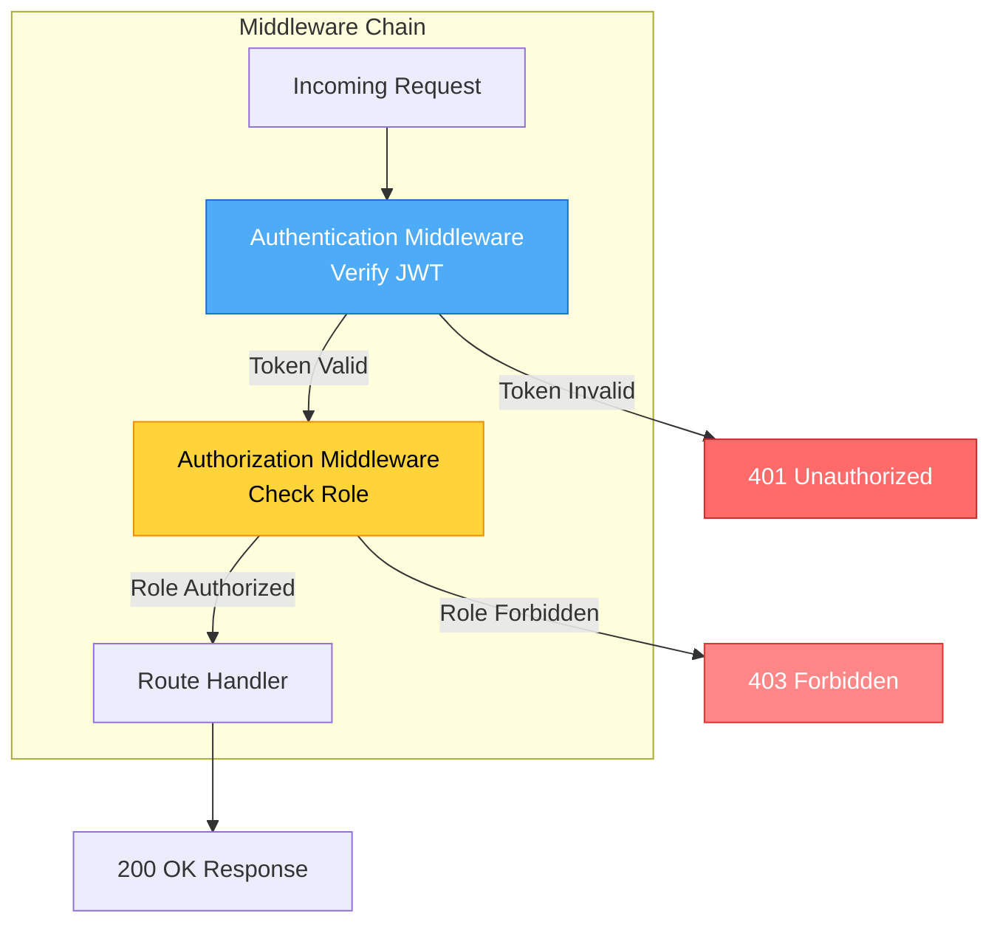
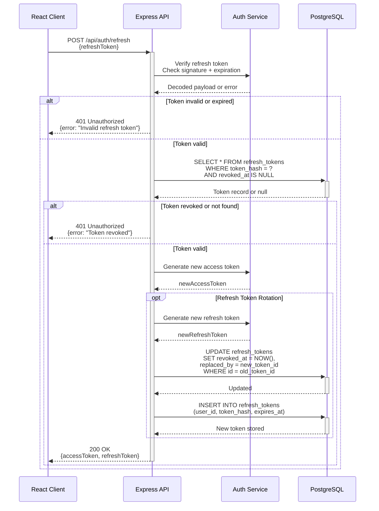

# Year 2: Authentication & Authorization
### *"Protecting the Castle - Real Security Spells"*

**Status**: 📝 Planning Phase
**Estimated Time**: 6-8 hours per stack
**Difficulty**: Intermediate
**Prerequisites**: Year 1 (Core CRUD) complete

---

## Table of Contents

- [Learning Objectives](#learning-objectives)
- [User Stories](#user-stories)
- [Technical Specifications](#technical-specifications)
- [Architecture Changes](#architecture-changes)
- [TDD Test Plan (RED Phase)](#tdd-test-plan-red-phase)
- [Implementation Steps (GREEN Phase)](#implementation-steps-green-phase)
- [Code Examples](#code-examples)
- [Success Criteria](#success-criteria)
- [Time Breakdown](#time-breakdown)

---

## Learning Objectives

By the end of Year 2, you will master:

### Core Concepts
1. **JWT (JSON Web Tokens)** - Token-based authentication
2. **Password Hashing** - bcrypt for secure password storage
3. **Session Management** - Refresh tokens and token rotation
4. **RBAC** - Role-Based Access Control (STUDENT, PREFECT, AUROR)
5. **Middleware Patterns** - Authentication and authorization guards
6. **Security Best Practices** - Token expiration, secure cookies, CORS

### Stack-Specific Skills

#### Gryffindor (React + Express)
- `jsonwebtoken` library for JWT signing/verification
- `bcrypt` for password hashing
- Express middleware composition
- HTTP-only cookies for refresh tokens
- React Context for auth state

#### Slytherin (Angular + .NET)
- ASP.NET Identity framework
- Entity Framework for user management
- JWT Bearer authentication middleware
- Angular Guards and Interceptors
- RxJS for auth state management

#### Ravenclaw (Spring Boot + Java)
- Spring Security configuration
- JWT token filters
- BCryptPasswordEncoder
- Security annotations (@PreAuthorize)
- Spring session management

---

## User Stories

### Epic: User Authentication

#### US-AUTH-001: User Registration
**As a** new student at Hogwarts
**I want to** register for an account
**So that** I can report and track magical incidents

**Acceptance Criteria**:
- System SHALL validate email format (must end with @hogwarts.edu)
- System SHALL require password minimum 8 characters
- System SHALL hash password with bcrypt (cost factor 10)
- System SHALL prevent duplicate email registration
- System SHALL assign default role STUDENT
- System SHALL return JWT access token (15 min expiry)
- System SHALL return refresh token (7 day expiry)
- System SHALL NOT store passwords in plain text

**WHEN** I POST to /api/auth/register with valid credentials
**THEN** I SHALL receive a 201 Created response
**AND** response SHALL contain accessToken and refreshToken
**AND** password SHALL be hashed in database

#### US-AUTH-002: User Login
**As a** registered user
**I want to** log in with email and password
**So that** I can access my account

**Acceptance Criteria**:
- System SHALL verify email exists in database
- System SHALL compare password hash using bcrypt
- System SHALL return 401 for invalid credentials
- System SHALL return JWT tokens on success
- System SHALL log login timestamp
- System SHALL invalidate old refresh tokens (optional)

**WHEN** I POST to /api/auth/login with correct credentials
**THEN** I SHALL receive a 200 OK response
**AND** response SHALL contain accessToken and refreshToken
**AND** accessToken SHALL expire in 15 minutes
**AND** refreshToken SHALL expire in 7 days

#### US-AUTH-003: Token Refresh
**As a** user with an expired access token
**I want to** refresh my session
**So that** I don't have to log in again

**Acceptance Criteria**:
- System SHALL accept valid refresh token
- System SHALL issue new access token
- System SHALL optionally rotate refresh token
- System SHALL return 401 for invalid/expired refresh token
- System SHALL revoke old refresh token after rotation

**WHEN** I POST to /api/auth/refresh with valid refreshToken
**THEN** I SHALL receive new accessToken
**AND** optionally receive new refreshToken (rotation)

#### US-AUTH-004: User Logout
**As a** logged-in user
**I want to** log out
**So that** my session is terminated securely

**Acceptance Criteria**:
- System SHALL invalidate refresh token
- System SHALL remove token from database
- System SHALL return 200 on successful logout
- System SHALL handle already-logged-out gracefully

### Epic: Authorization (RBAC)

#### US-AUTHZ-001: Role-Based Incident Creation
**As an** Auror or Prefect
**I want** only authorized users to create incidents
**So that** incident quality is maintained

**Acceptance Criteria**:
- STUDENT role SHALL create incidents for themselves only
- PREFECT role SHALL create incidents for any student
- AUROR role SHALL create incidents for anyone
- System SHALL return 403 Forbidden for unauthorized actions

**WHEN** a STUDENT attempts to create incident for another user
**THEN** system SHALL return 403 Forbidden

#### US-AUTHZ-002: Role-Based Incident Updates
**As a** Prefect
**I want** to update incidents reported by students
**So that** I can correct inaccuracies

**Acceptance Criteria**:
- STUDENT SHALL update only their own incidents
- PREFECT SHALL update incidents in their house
- AUROR SHALL update any incident
- System SHALL return 403 for unauthorized updates

#### US-AUTHZ-003: Role-Based Incident Resolution
**As an** Auror
**I want** only authorized users to resolve incidents
**So that** incident lifecycle is controlled

**Acceptance Criteria**:
- STUDENT SHALL NOT resolve incidents
- PREFECT SHALL resolve incidents they created
- AUROR SHALL resolve any incident
- System SHALL enforce via middleware

---

## Technical Specifications

### Database Schema Changes

#### New Table: `sessions` (Already exists from Year 1!)
```sql
CREATE TABLE IF NOT EXISTS sessions (
    id UUID PRIMARY KEY DEFAULT gen_random_uuid(),
    user_id UUID NOT NULL REFERENCES users(id) ON DELETE CASCADE,
    refresh_token TEXT NOT NULL UNIQUE,
    expires_at TIMESTAMP WITH TIME ZONE NOT NULL,
    created_at TIMESTAMP WITH TIME ZONE DEFAULT NOW(),
    updated_at TIMESTAMP WITH TIME ZONE DEFAULT NOW(),
    ip_address INET,
    user_agent TEXT
);

CREATE INDEX idx_sessions_user_id ON sessions(user_id);
CREATE INDEX idx_sessions_expires_at ON sessions(expires_at);
```

#### New Table: `refresh_tokens` (Alternative design)
```sql
CREATE TABLE IF NOT EXISTS refresh_tokens (
    id UUID PRIMARY KEY DEFAULT gen_random_uuid(),
    user_id UUID NOT NULL REFERENCES users(id) ON DELETE CASCADE,
    token_hash TEXT NOT NULL UNIQUE,  -- bcrypt hash of token
    expires_at TIMESTAMP WITH TIME ZONE NOT NULL,
    created_at TIMESTAMP WITH TIME ZONE DEFAULT NOW(),
    revoked_at TIMESTAMP WITH TIME ZONE,
    replaced_by UUID REFERENCES refresh_tokens(id)
);
```

#### Update `users` Table
```sql
-- Verify users table has these columns (already present in Year 1 schema):
-- - password_hash TEXT NOT NULL
-- - role user_role NOT NULL DEFAULT 'STUDENT'
-- - last_login TIMESTAMP WITH TIME ZONE
```

### API Endpoints (New)

```
POST   /api/auth/register       # Create new user account
POST   /api/auth/login          # Authenticate and get tokens
POST   /api/auth/refresh        # Refresh access token
POST   /api/auth/logout         # Invalidate refresh token
GET    /api/auth/me             # Get current user profile
PATCH  /api/auth/change-password # Update user password
```

### JWT Token Structure

#### Access Token (Short-lived: 15 minutes)
```json
{
  "header": {
    "alg": "HS256",
    "typ": "JWT"
  },
  "payload": {
    "sub": "user-uuid-here",
    "email": "harry.potter@hogwarts.edu",
    "role": "STUDENT",
    "house": "GRYFFINDOR",
    "iat": 1612137600,
    "exp": 1612138500
  }
}
```

#### Refresh Token (Long-lived: 7 days)
```json
{
  "payload": {
    "sub": "user-uuid-here",
    "type": "refresh",
    "jti": "token-id-uuid",
    "iat": 1612137600,
    "exp": 1612742400
  }
}
```

### Environment Variables (New)

```bash
# JWT Configuration
JWT_SECRET=your-secret-key-min-32-chars
JWT_ACCESS_EXPIRY=15m
JWT_REFRESH_EXPIRY=7d

# Bcrypt Configuration
BCRYPT_ROUNDS=10

# Security
CORS_ORIGIN=http://localhost:3001
NODE_ENV=development
```

---

## Architecture Changes

### Year 1 vs Year 2 Authentication Flow

```mermaid
flowchart TB
    subgraph YEAR1["Year 1: Mock Authentication"]
        Y1_REQ[HTTP Request<br/>Authorization: Bearer token]
        Y1_MOCK[Mock Middleware<br/>Accept any token]
        Y1_USER[Set req.user = Harry Potter]
        Y1_ROUTE[Route Handler]
    end

    subgraph YEAR2["Year 2: Real JWT Authentication"]
        Y2_REQ[HTTP Request<br/>Authorization: Bearer token]
        Y2_EXTRACT[Extract JWT from header]
        Y2_VERIFY[Verify JWT signature<br/>Check expiration]
        Y2_DECODE[Decode payload]
        Y2_LOOKUP[Optional: Lookup user in DB]
        Y2_AUTH[Set req.user from token]
        Y2_ROUTE[Route Handler]
        Y2_REJECT[Return 401 Unauthorized]
    end

    Y1_REQ --> Y1_MOCK --> Y1_USER --> Y1_ROUTE

    Y2_REQ --> Y2_EXTRACT
    Y2_EXTRACT --> Y2_VERIFY
    Y2_VERIFY -->|Valid| Y2_DECODE
    Y2_VERIFY -->|Invalid| Y2_REJECT
    Y2_DECODE --> Y2_LOOKUP
    Y2_LOOKUP --> Y2_AUTH
    Y2_AUTH --> Y2_ROUTE

    style Y1_MOCK fill:#ff6b6b,stroke:#c92a2a,color:#fff
    style Y2_VERIFY fill:#51cf66,stroke:#2f9e44,color:#fff
```



### Registration Flow



### Login Flow



### Protected Route Authorization



### Token Refresh Flow



---

## TDD Test Plan (RED Phase)

### Test File Structure

```
gryffindor/server/tests/
├── auth.test.js              # Authentication endpoints
├── authorization.test.js     # RBAC tests
├── incidents.test.js         # Update existing tests
└── helpers/
    ├── testUsers.js          # Create test users with roles
    └── tokenHelpers.js       # JWT generation helpers
```

### Test Cases: Authentication

#### File: `auth.test.js`

```javascript
describe('POST /api/auth/register', () => {
  // Success Cases
  test('should_register_user_with_valid_credentials', async () => {
    // WHEN: Valid email, password, name
    // THEN: 201 Created, returns user + tokens
    // AND: Password hashed in database
  });

  test('should_assign_default_role_student_automatically', async () => {
    // WHEN: Register without specifying role
    // THEN: User role = STUDENT
  });

  test('should_hash_password_with_bcrypt_securely', async () => {
    // WHEN: Register with password "password123"
    // THEN: Database stores bcrypt hash
    // AND: Hash starts with $2b$10$
  });

  // Validation Cases
  test('should_reject_registration_without_email_field', async () => {
    // WHEN: Missing email
    // THEN: 400 Bad Request
    // AND: Error message specifies missing field
  });

  test('should_reject_registration_with_invalid_email_format', async () => {
    // WHEN: Email = "notanemail"
    // THEN: 400 Bad Request
  });

  test('should_reject_registration_without_hogwarts_email_domain', async () => {
    // WHEN: Email = "user@gmail.com"
    // THEN: 400 Bad Request
    // AND: Error = "Must use @hogwarts.edu email"
  });

  test('should_reject_registration_with_short_password', async () => {
    // WHEN: Password length < 8
    // THEN: 400 Bad Request
  });

  test('should_reject_duplicate_email_registration_attempt', async () => {
    // WHEN: Email already exists
    // THEN: 409 Conflict
  });

  // Security Cases
  test('should_return_jwt_access_token_on_registration', async () => {
    // THEN: Response contains accessToken
    // AND: Token is valid JWT
  });

  test('should_return_refresh_token_on_registration', async () => {
    // THEN: Response contains refreshToken
    // AND: Token stored in database
  });

  test('should_not_return_password_hash_in_response', async () => {
    // THEN: Response does NOT contain password_hash
  });
});

describe('POST /api/auth/login', () => {
  // Success Cases
  test('should_login_user_with_correct_credentials', async () => {
    // GIVEN: User exists with email/password
    // WHEN: POST with correct credentials
    // THEN: 200 OK, returns tokens
  });

  test('should_update_last_login_timestamp_successfully', async () => {
    // WHEN: Login successful
    // THEN: users.last_login updated
  });

  // Failure Cases
  test('should_reject_login_with_incorrect_password', async () => {
    // WHEN: Password wrong
    // THEN: 401 Unauthorized
  });

  test('should_reject_login_with_nonexistent_email', async () => {
    // WHEN: Email not in database
    // THEN: 401 Unauthorized
  });

  test('should_use_constant_time_comparison_for_security', async () => {
    // WHEN: User doesn't exist
    // THEN: Still hash a dummy password (prevent timing attacks)
  });

  // Token Tests
  test('should_generate_access_token_with_user_claims', async () => {
    // THEN: Token payload contains sub, email, role
  });

  test('should_generate_refresh_token_with_long_expiry', async () => {
    // THEN: Refresh token expires in 7 days
  });
});

describe('POST /api/auth/refresh', () => {
  test('should_issue_new_access_token_with_valid_refresh', async () => {
    // GIVEN: Valid refresh token
    // WHEN: POST /api/auth/refresh
    // THEN: New access token returned
  });

  test('should_reject_expired_refresh_token_request', async () => {
    // GIVEN: Expired refresh token
    // THEN: 401 Unauthorized
  });

  test('should_reject_revoked_refresh_token_request', async () => {
    // GIVEN: Token with revoked_at set
    // THEN: 401 Unauthorized
  });

  test('should_rotate_refresh_token_on_refresh_request', async () => {
    // WHEN: Refresh successful
    // THEN: Old token marked as revoked
    // AND: New token issued
  });
});

describe('POST /api/auth/logout', () => {
  test('should_revoke_refresh_token_on_logout', async () => {
    // WHEN: POST /api/auth/logout with refresh token
    // THEN: Token marked as revoked in database
  });

  test('should_return_success_even_if_already_logged_out', async () => {
    // WHEN: Logout twice
    // THEN: Both return 200 OK (idempotent)
  });
});

describe('GET /api/auth/me', () => {
  test('should_return_current_user_profile_with_token', async () => {
    // GIVEN: Valid access token
    // WHEN: GET /api/auth/me
    // THEN: User profile returned
  });

  test('should_reject_request_without_access_token', async () => {
    // WHEN: No Authorization header
    // THEN: 401 Unauthorized
  });
});
```

### Test Cases: Authorization (RBAC)

#### File: `authorization.test.js`

```javascript
describe('Role-Based Access Control (RBAC)', () => {
  let studentToken, prefectToken, aurorToken;

  beforeAll(async () => {
    // Create users with different roles
    studentToken = await createUserTokenByRole('STUDENT');
    prefectToken = await createUserTokenByRole('PREFECT');
    aurorToken = await createUserTokenByRole('AUROR');
  });

  describe('POST /api/incidents (Authorization)', () => {
    test('should_allow_student_to_create_own_incident', async () => {
      // WHEN: STUDENT creates incident for themselves
      // THEN: 201 Created
    });

    test('should_allow_prefect_to_create_any_incident', async () => {
      // WHEN: PREFECT creates incident for student
      // THEN: 201 Created
    });

    test('should_allow_auror_to_create_any_incident', async () => {
      // WHEN: AUROR creates incident
      // THEN: 201 Created
    });
  });

  describe('PUT /api/incidents/:id (Authorization)', () => {
    test('should_allow_student_to_update_own_incident', async () => {
      // GIVEN: STUDENT created incident
      // WHEN: Same student updates it
      // THEN: 200 OK
    });

    test('should_forbid_student_from_updating_others_incident', async () => {
      // GIVEN: Another student's incident
      // WHEN: STUDENT attempts update
      // THEN: 403 Forbidden
    });

    test('should_allow_prefect_to_update_any_incident', async () => {
      // WHEN: PREFECT updates student incident
      // THEN: 200 OK
    });

    test('should_allow_auror_to_update_any_incident', async () => {
      // THEN: 200 OK
    });
  });

  describe('DELETE /api/incidents/:id (Authorization)', () => {
    test('should_forbid_student_from_resolving_incidents', async () => {
      // WHEN: STUDENT attempts DELETE
      // THEN: 403 Forbidden
    });

    test('should_allow_prefect_to_resolve_incidents', async () => {
      // THEN: 200 OK
    });

    test('should_allow_auror_to_resolve_any_incident', async () => {
      // THEN: 200 OK
    });
  });
});
```

### Test Helpers

#### File: `helpers/testUsers.js`

```javascript
// 4-Word Naming Convention Applied
export async function createUserAccountForTesting(email, password, role) {
  // Hash password, insert user, return user object
}

export async function createUserTokenByRole(role) {
  // Create user, generate JWT, return token
}

export async function getUserIdFromEmailAddress(email) {
  // Query database, return user_id
}
```

---

## Implementation Steps (GREEN Phase)

### Step 1: Install Dependencies (Gryffindor)

```bash
cd gryffindor/server
npm install jsonwebtoken bcryptjs
npm install --save-dev @types/jsonwebtoken @types/bcryptjs
```

### Step 2: Create Auth Service (Following 4WNC)

#### File: `gryffindor/server/src/services/authenticationServiceManager.js`

```javascript
import jwt from 'jsonwebtoken';
import bcrypt from 'bcryptjs';
import { executeQueryWithParameters } from '../db/connectionPoolManager.js';

const JWT_SECRET = process.env.JWT_SECRET;
const JWT_ACCESS_EXPIRY = process.env.JWT_ACCESS_EXPIRY || '15m';
const JWT_REFRESH_EXPIRY = process.env.JWT_REFRESH_EXPIRY || '7d';
const BCRYPT_ROUNDS = parseInt(process.env.BCRYPT_ROUNDS || '10');

// ============================================
// Password Hashing Functions
// ============================================

export async function hashPasswordWithBcryptSecurity(plainPassword) {
  return await bcrypt.hash(plainPassword, BCRYPT_ROUNDS);
}

export async function comparePasswordWithStoredHash(plainPassword, hash) {
  return await bcrypt.compare(plainPassword, hash);
}

// ============================================
// JWT Token Generation
// ============================================

export function generateAccessTokenForUser(user) {
  const payload = {
    sub: user.id,
    email: user.email,
    role: user.role,
    house: user.house,
  };

  return jwt.sign(payload, JWT_SECRET, {
    expiresIn: JWT_ACCESS_EXPIRY,
    issuer: 'marauders-map-api',
    audience: 'marauders-map-client',
  });
}

export function generateRefreshTokenForUser(user) {
  const payload = {
    sub: user.id,
    type: 'refresh',
    jti: crypto.randomUUID(), // Unique token ID
  };

  return jwt.sign(payload, JWT_SECRET, {
    expiresIn: JWT_REFRESH_EXPIRY,
  });
}

// ============================================
// JWT Token Verification
// ============================================

export function verifyAccessTokenFromRequest(token) {
  try {
    return jwt.verify(token, JWT_SECRET, {
      issuer: 'marauders-map-api',
      audience: 'marauders-map-client',
    });
  } catch (error) {
    throw new Error('Invalid or expired token');
  }
}

export function verifyRefreshTokenFromRequest(token) {
  try {
    const decoded = jwt.verify(token, JWT_SECRET);
    if (decoded.type !== 'refresh') {
      throw new Error('Not a refresh token');
    }
    return decoded;
  } catch (error) {
    throw new Error('Invalid refresh token');
  }
}

// ============================================
// User Registration Logic
// ============================================

export async function registerUserWithCredentialsSecurely(email, password, name) {
  // Validate email domain
  if (!email.endsWith('@hogwarts.edu')) {
    throw new Error('Must use @hogwarts.edu email address');
  }

  // Validate password strength
  if (password.length < 8) {
    throw new Error('Password must be at least 8 characters');
  }

  // Check if user exists
  const existingUser = await executeQueryWithParameters(
    'SELECT id FROM users WHERE email = $1',
    [email]
  );

  if (existingUser.rows.length > 0) {
    throw new Error('Email already registered');
  }

  // Hash password
  const passwordHash = await hashPasswordWithBcryptSecurity(password);

  // Create user
  const result = await executeQueryWithParameters(
    `INSERT INTO users (email, password_hash, name, role)
     VALUES ($1, $2, $3, 'STUDENT')
     RETURNING id, email, name, role, house, created_at`,
    [email, passwordHash, name]
  );

  return result.rows[0];
}

// ============================================
// User Login Logic
// ============================================

export async function authenticateUserWithEmailPassword(email, password) {
  // Fetch user from database
  const result = await executeQueryWithParameters(
    'SELECT id, email, password_hash, name, role, house FROM users WHERE email = $1',
    [email]
  );

  // User not found - still hash to prevent timing attacks
  if (result.rows.length === 0) {
    await bcrypt.hash('dummy-password', BCRYPT_ROUNDS);
    throw new Error('Invalid credentials');
  }

  const user = result.rows[0];

  // Compare password
  const isValid = await comparePasswordWithStoredHash(password, user.password_hash);

  if (!isValid) {
    throw new Error('Invalid credentials');
  }

  // Update last login
  await executeQueryWithParameters(
    'UPDATE users SET last_login = NOW() WHERE id = $1',
    [user.id]
  );

  // Remove password_hash from returned object
  delete user.password_hash;

  return user;
}

// ============================================
// Refresh Token Storage
// ============================================

export async function storeRefreshTokenInDatabase(userId, tokenHash, expiresAt) {
  await executeQueryWithParameters(
    `INSERT INTO refresh_tokens (user_id, token_hash, expires_at)
     VALUES ($1, $2, $3)`,
    [userId, tokenHash, expiresAt]
  );
}

export async function revokeRefreshTokenInDatabase(tokenHash) {
  await executeQueryWithParameters(
    `UPDATE refresh_tokens
     SET revoked_at = NOW()
     WHERE token_hash = $1`,
    [tokenHash]
  );
}

export async function validateRefreshTokenFromDatabase(tokenHash) {
  const result = await executeQueryWithParameters(
    `SELECT * FROM refresh_tokens
     WHERE token_hash = $1
     AND expires_at > NOW()
     AND revoked_at IS NULL`,
    [tokenHash]
  );

  return result.rows.length > 0;
}
```

### Step 3: Create Auth Routes

#### File: `gryffindor/server/src/routes/authenticationRouteHandler.js`

```javascript
import express from 'express';
import crypto from 'crypto';
import {
  registerUserWithCredentialsSecurely,
  authenticateUserWithEmailPassword,
  generateAccessTokenForUser,
  generateRefreshTokenForUser,
  verifyRefreshTokenFromRequest,
  storeRefreshTokenInDatabase,
  revokeRefreshTokenInDatabase,
  validateRefreshTokenFromDatabase,
  hashPasswordWithBcryptSecurity,
} from '../services/authenticationServiceManager.js';
import { authenticateRequestWithJwtToken } from '../middleware/authenticationMiddlewareHandler.js';

const router = express.Router();

// ============================================
// POST /api/auth/register
// ============================================

router.post('/register', async (req, res) => {
  try {
    const { email, password, name } = req.body;

    // Validate required fields
    if (!email || !password || !name) {
      return res.status(400).json({
        error: 'Missing required fields: email, password, name',
      });
    }

    // Register user
    const user = await registerUserWithCredentialsSecurely(email, password, name);

    // Generate tokens
    const accessToken = generateAccessTokenForUser(user);
    const refreshToken = generateRefreshTokenForUser(user);

    // Store refresh token
    const tokenHash = await hashPasswordWithBcryptSecurity(refreshToken);
    const expiresAt = new Date(Date.now() + 7 * 24 * 60 * 60 * 1000); // 7 days
    await storeRefreshTokenInDatabase(user.id, tokenHash, expiresAt);

    return res.status(201).json({
      user,
      accessToken,
      refreshToken,
    });
  } catch (error) {
    console.error('Registration error:', error);

    if (error.message === 'Must use @hogwarts.edu email address') {
      return res.status(400).json({ error: error.message });
    }
    if (error.message === 'Password must be at least 8 characters') {
      return res.status(400).json({ error: error.message });
    }
    if (error.message === 'Email already registered') {
      return res.status(409).json({ error: error.message });
    }

    return res.status(500).json({ error: 'Internal server error' });
  }
});

// ============================================
// POST /api/auth/login
// ============================================

router.post('/login', async (req, res) => {
  try {
    const { email, password } = req.body;

    if (!email || !password) {
      return res.status(400).json({
        error: 'Missing required fields: email, password',
      });
    }

    // Authenticate user
    const user = await authenticateUserWithEmailPassword(email, password);

    // Generate tokens
    const accessToken = generateAccessTokenForUser(user);
    const refreshToken = generateRefreshTokenForUser(user);

    // Store refresh token
    const tokenHash = await hashPasswordWithBcryptSecurity(refreshToken);
    const expiresAt = new Date(Date.now() + 7 * 24 * 60 * 60 * 1000);
    await storeRefreshTokenInDatabase(user.id, tokenHash, expiresAt);

    return res.status(200).json({
      user,
      accessToken,
      refreshToken,
    });
  } catch (error) {
    console.error('Login error:', error);

    if (error.message === 'Invalid credentials') {
      return res.status(401).json({ error: error.message });
    }

    return res.status(500).json({ error: 'Internal server error' });
  }
});

// ============================================
// POST /api/auth/refresh
// ============================================

router.post('/refresh', async (req, res) => {
  try {
    const { refreshToken } = req.body;

    if (!refreshToken) {
      return res.status(400).json({ error: 'Missing refresh token' });
    }

    // Verify token signature and expiration
    const decoded = verifyRefreshTokenFromRequest(refreshToken);

    // Check if token is in database and not revoked
    const tokenHash = await hashPasswordWithBcryptSecurity(refreshToken);
    const isValid = await validateRefreshTokenFromDatabase(tokenHash);

    if (!isValid) {
      return res.status(401).json({ error: 'Invalid or revoked refresh token' });
    }

    // Fetch user
    const userResult = await executeQueryWithParameters(
      'SELECT id, email, name, role, house FROM users WHERE id = $1',
      [decoded.sub]
    );

    if (userResult.rows.length === 0) {
      return res.status(401).json({ error: 'User not found' });
    }

    const user = userResult.rows[0];

    // Generate new access token
    const accessToken = generateAccessTokenForUser(user);

    // Optional: Rotate refresh token
    const newRefreshToken = generateRefreshTokenForUser(user);
    const newTokenHash = await hashPasswordWithBcryptSecurity(newRefreshToken);

    // Revoke old token
    await revokeRefreshTokenInDatabase(tokenHash);

    // Store new token
    const expiresAt = new Date(Date.now() + 7 * 24 * 60 * 60 * 1000);
    await storeRefreshTokenInDatabase(user.id, newTokenHash, expiresAt);

    return res.status(200).json({
      accessToken,
      refreshToken: newRefreshToken,
    });
  } catch (error) {
    console.error('Refresh error:', error);
    return res.status(401).json({ error: 'Invalid refresh token' });
  }
});

// ============================================
// POST /api/auth/logout
// ============================================

router.post('/logout', async (req, res) => {
  try {
    const { refreshToken } = req.body;

    if (refreshToken) {
      const tokenHash = await hashPasswordWithBcryptSecurity(refreshToken);
      await revokeRefreshTokenInDatabase(tokenHash);
    }

    return res.status(200).json({ message: 'Logged out successfully' });
  } catch (error) {
    console.error('Logout error:', error);
    // Always return success for logout (idempotent)
    return res.status(200).json({ message: 'Logged out successfully' });
  }
});

// ============================================
// GET /api/auth/me
// ============================================

router.get('/me', authenticateRequestWithJwtToken, async (req, res) => {
  try {
    // req.user is set by authentication middleware
    const userResult = await executeQueryWithParameters(
      'SELECT id, email, name, role, house, created_at FROM users WHERE id = $1',
      [req.user.sub]
    );

    if (userResult.rows.length === 0) {
      return res.status(404).json({ error: 'User not found' });
    }

    return res.status(200).json({ user: userResult.rows[0] });
  } catch (error) {
    console.error('Get profile error:', error);
    return res.status(500).json({ error: 'Internal server error' });
  }
});

export default router;
```

### Step 4: Update Authentication Middleware (Real JWT)

#### File: `gryffindor/server/src/middleware/authenticationMiddlewareHandler.js`

```javascript
import { verifyAccessTokenFromRequest } from '../services/authenticationServiceManager.js';

// ============================================
// Authentication Middleware (JWT Verification)
// ============================================

export function authenticateRequestWithJwtToken(req, res, next) {
  try {
    // Extract token from Authorization header
    const authHeader = req.headers.authorization;

    if (!authHeader || !authHeader.startsWith('Bearer ')) {
      return res.status(401).json({
        error: 'Missing or invalid Authorization header',
      });
    }

    const token = authHeader.substring(7); // Remove "Bearer "

    // Verify token
    const decoded = verifyAccessTokenFromRequest(token);

    // Set user on request object
    req.user = decoded;

    next();
  } catch (error) {
    console.error('Authentication error:', error);
    return res.status(401).json({
      error: 'Invalid or expired token',
    });
  }
}

// ============================================
// Authorization Middleware (Role-Based)
// ============================================

export function authorizeUserByRoleLevel(...allowedRoles) {
  return (req, res, next) => {
    if (!req.user) {
      return res.status(401).json({
        error: 'Not authenticated',
      });
    }

    if (!allowedRoles.includes(req.user.role)) {
      return res.status(403).json({
        error: 'Insufficient permissions',
      });
    }

    next();
  };
}

// ============================================
// Resource Ownership Middleware
// ============================================

export function authorizeResourceOwnershipOnly(resourceOwnerIdField = 'reported_by') {
  return async (req, res, next) => {
    try {
      // AUROR can access anything
      if (req.user.role === 'AUROR') {
        return next();
      }

      // Fetch resource from database
      const resourceId = req.params.id;
      const result = await executeQueryWithParameters(
        `SELECT ${resourceOwnerIdField} FROM incidents WHERE id = $1`,
        [resourceId]
      );

      if (result.rows.length === 0) {
        return res.status(404).json({ error: 'Resource not found' });
      }

      const ownerId = result.rows[0][resourceOwnerIdField];

      // STUDENT can only access their own resources
      if (req.user.role === 'STUDENT' && ownerId !== req.user.sub) {
        return res.status(403).json({
          error: 'You can only access your own resources',
        });
      }

      // PREFECT can access resources (policy TBD)
      next();
    } catch (error) {
      console.error('Authorization error:', error);
      return res.status(500).json({ error: 'Internal server error' });
    }
  };
}
```

### Step 5: Update Incidents Routes (Add Authorization)

#### File: `gryffindor/server/src/routes/incidentsRouteHandler.js`

```javascript
// Add authorization to existing routes

import {
  authenticateRequestWithJwtToken,
  authorizeUserByRoleLevel,
  authorizeResourceOwnershipOnly,
} from '../middleware/authenticationMiddlewareHandler.js';

// All routes require authentication
router.use(authenticateRequestWithJwtToken);

// Create incident - all authenticated users
router.post('/', async (req, res) => {
  // Use req.user.sub for reported_by
  // ...existing implementation
});

// Update incident - owner or PREFECT/AUROR
router.put('/:id',
  authorizeResourceOwnershipOnly('reported_by'),
  async (req, res) => {
    // ...existing implementation
  }
);

// Delete (resolve) incident - only PREFECT or AUROR
router.delete('/:id',
  authorizeUserByRoleLevel('PREFECT', 'AUROR'),
  async (req, res) => {
    // ...existing implementation
  }
);
```

### Step 6: Update Environment Variables

```bash
# .env
JWT_SECRET=your-super-secret-key-min-32-characters-long
JWT_ACCESS_EXPIRY=15m
JWT_REFRESH_EXPIRY=7d
BCRYPT_ROUNDS=10
```

### Step 7: Run Tests (Verify GREEN)

```bash
npm test tests/auth.test.js
npm test tests/authorization.test.js
npm test tests/incidents.test.js  # Re-run with new auth
```

---

## Code Examples

### Frontend: React Auth Context

#### File: `gryffindor/client/src/contexts/AuthenticationContextProvider.jsx`

```javascript
import { createContext, useContext, useState, useEffect } from 'react';

const AuthContext = createContext();

export function useAuthenticationContextProvider() {
  return useContext(AuthContext);
}

export function AuthenticationContextProvider({ children }) {
  const [user, setUser] = useState(null);
  const [accessToken, setAccessToken] = useState(
    localStorage.getItem('accessToken')
  );
  const [refreshToken, setRefreshToken] = useState(
    localStorage.getItem('refreshToken')
  );
  const [isLoading, setIsLoading] = useState(true);

  // ============================================
  // Registration Function (4WNC)
  // ============================================

  async function registerUserWithCredentialsForm(email, password, name) {
    const response = await fetch('http://localhost:4001/api/auth/register', {
      method: 'POST',
      headers: { 'Content-Type': 'application/json' },
      body: JSON.stringify({ email, password, name }),
    });

    if (!response.ok) {
      const error = await response.json();
      throw new Error(error.error || 'Registration failed');
    }

    const data = await response.json();

    setUser(data.user);
    setAccessToken(data.accessToken);
    setRefreshToken(data.refreshToken);

    localStorage.setItem('accessToken', data.accessToken);
    localStorage.setItem('refreshToken', data.refreshToken);

    return data.user;
  }

  // ============================================
  // Login Function (4WNC)
  // ============================================

  async function loginUserWithEmailPassword(email, password) {
    const response = await fetch('http://localhost:4001/api/auth/login', {
      method: 'POST',
      headers: { 'Content-Type': 'application/json' },
      body: JSON.stringify({ email, password }),
    });

    if (!response.ok) {
      const error = await response.json();
      throw new Error(error.error || 'Login failed');
    }

    const data = await response.json();

    setUser(data.user);
    setAccessToken(data.accessToken);
    setRefreshToken(data.refreshToken);

    localStorage.setItem('accessToken', data.accessToken);
    localStorage.setItem('refreshToken', data.refreshToken);

    return data.user;
  }

  // ============================================
  // Logout Function (4WNC)
  // ============================================

  async function logoutUserAndClearTokens() {
    try {
      await fetch('http://localhost:4001/api/auth/logout', {
        method: 'POST',
        headers: { 'Content-Type': 'application/json' },
        body: JSON.stringify({ refreshToken }),
      });
    } catch (error) {
      console.error('Logout error:', error);
    }

    setUser(null);
    setAccessToken(null);
    setRefreshToken(null);

    localStorage.removeItem('accessToken');
    localStorage.removeItem('refreshToken');
  }

  // ============================================
  // Refresh Token Function (4WNC)
  // ============================================

  async function refreshAccessTokenFromStorage() {
    try {
      const response = await fetch('http://localhost:4001/api/auth/refresh', {
        method: 'POST',
        headers: { 'Content-Type': 'application/json' },
        body: JSON.stringify({ refreshToken }),
      });

      if (!response.ok) {
        throw new Error('Refresh failed');
      }

      const data = await response.json();

      setAccessToken(data.accessToken);
      if (data.refreshToken) {
        setRefreshToken(data.refreshToken);
        localStorage.setItem('refreshToken', data.refreshToken);
      }
      localStorage.setItem('accessToken', data.accessToken);

      return data.accessToken;
    } catch (error) {
      console.error('Token refresh failed:', error);
      await logoutUserAndClearTokens();
      throw error;
    }
  }

  // ============================================
  // Load User on Mount
  // ============================================

  useEffect(() => {
    async function loadUserProfileFromToken() {
      if (!accessToken) {
        setIsLoading(false);
        return;
      }

      try {
        const response = await fetch('http://localhost:4001/api/auth/me', {
          headers: {
            Authorization: `Bearer ${accessToken}`,
          },
        });

        if (response.ok) {
          const data = await response.json();
          setUser(data.user);
        } else {
          // Try to refresh token
          await refreshAccessTokenFromStorage();
        }
      } catch (error) {
        console.error('Failed to load user:', error);
        await logoutUserAndClearTokens();
      } finally {
        setIsLoading(false);
      }
    }

    loadUserProfileFromToken();
  }, []);

  const value = {
    user,
    accessToken,
    refreshToken,
    isLoading,
    registerUserWithCredentialsForm,
    loginUserWithEmailPassword,
    logoutUserAndClearTokens,
    refreshAccessTokenFromStorage,
  };

  return <AuthContext.Provider value={value}>{children}</AuthContext.Provider>;
}
```

### Frontend: Protected Route Component

```javascript
import { Navigate } from 'react-router-dom';
import { useAuthenticationContextProvider } from '../contexts/AuthenticationContextProvider';

export function ProtectedRouteWithAuthGuard({ children, requiredRole }) {
  const { user, isLoading } = useAuthenticationContextProvider();

  if (isLoading) {
    return <div>Loading...</div>;
  }

  if (!user) {
    return <Navigate to="/login" replace />;
  }

  if (requiredRole && user.role !== requiredRole) {
    return <Navigate to="/forbidden" replace />;
  }

  return children;
}
```

---

## Success Criteria

### Functional Requirements

- [ ] Users can register with @hogwarts.edu email
- [ ] Passwords are hashed with bcrypt (cost factor 10)
- [ ] Users can login with email/password
- [ ] JWT access tokens expire in 15 minutes
- [ ] JWT refresh tokens expire in 7 days
- [ ] Token refresh endpoint works correctly
- [ ] Logout revokes refresh token
- [ ] Students can only modify their own incidents
- [ ] Prefects can modify any incident
- [ ] Aurors have full access
- [ ] Students cannot resolve incidents
- [ ] Prefects and Aurors can resolve incidents

### Non-Functional Requirements

- [ ] All tests passing (auth.test.js, authorization.test.js)
- [ ] 100% of functions follow 4-word naming convention
- [ ] No passwords stored in plain text
- [ ] Timing attack prevention in login
- [ ] JWT secrets in environment variables (not hardcoded)
- [ ] CORS configured correctly
- [ ] Error messages don't leak sensitive info

### Security Checklist

- [ ] JWT_SECRET is 32+ characters
- [ ] Passwords hashed with bcrypt rounds=10
- [ ] Refresh tokens stored as hashes in database
- [ ] Token expiration enforced
- [ ] Invalid tokens return 401
- [ ] Forbidden actions return 403
- [ ] No password_hash in API responses
- [ ] Authorization middleware applied to all protected routes

---

## Time Breakdown

### Gryffindor (React + Express)

| Task | Estimated Time |
|------|----------------|
| Install dependencies | 10 min |
| Write auth tests (RED phase) | 90 min |
| Implement auth service | 60 min |
| Implement auth routes | 45 min |
| Update auth middleware | 30 min |
| Update incidents routes | 30 min |
| Create React auth context | 45 min |
| Create protected routes | 20 min |
| Manual testing & debugging | 60 min |
| Documentation updates | 20 min |
| **Total** | **6.5 hours** |

### Slytherin (Angular + .NET)

| Task | Estimated Time |
|------|----------------|
| ASP.NET Identity setup | 45 min |
| Configure JWT authentication | 60 min |
| Write auth controller tests | 90 min |
| Implement auth controller | 60 min |
| Configure authorization policies | 30 min |
| Update incidents controller | 30 min |
| Create Angular auth service | 45 min |
| Create auth guards | 30 min |
| HTTP interceptor for tokens | 30 min |
| Manual testing | 60 min |
| **Total** | **7.5 hours** |

### Ravenclaw (Spring Boot + Java)

| Task | Estimated Time |
|------|----------------|
| Spring Security dependencies | 15 min |
| Configure security filter chain | 60 min |
| Write auth endpoint tests | 90 min |
| Implement auth controller | 60 min |
| JWT token provider | 45 min |
| Custom authentication filter | 45 min |
| Method-level security | 30 min |
| Update incidents controller | 30 min |
| Manual testing | 60 min |
| **Total** | **7 hours** |

---

## Refactoring Opportunities (REFACTOR Phase)

Once tests are GREEN, consider these improvements:

### Code Quality
- Extract validation logic into separate utility
- Add JSDoc/XML comments to all functions
- Create custom error classes (AuthenticationError, AuthorizationError)
- Add request logging for auth events

### Security Enhancements
- Implement account lockout after N failed attempts
- Add email verification step
- Implement "remember me" functionality
- Add password reset flow
- Store hashed refresh tokens (not plain text)

### Performance
- Add Redis cache for token blacklist
- Implement rate limiting on auth endpoints
- Add database indexes on refresh_tokens table

### Observability
- Add metrics for login success/failure rates
- Log suspicious auth attempts
- Add distributed tracing for auth flow

---

## Common Pitfalls to Avoid

### Pitfall 1: Storing JWT Secret in Code
```javascript
// ❌ WRONG
const JWT_SECRET = 'my-secret-key';

// ✅ RIGHT
const JWT_SECRET = process.env.JWT_SECRET;
if (!JWT_SECRET) {
  throw new Error('JWT_SECRET environment variable not set');
}
```

### Pitfall 2: Not Hashing Passwords
```javascript
// ❌ WRONG
INSERT INTO users (email, password) VALUES ($1, $2)

// ✅ RIGHT
const hash = await bcrypt.hash(password, 10);
INSERT INTO users (email, password_hash) VALUES ($1, $2)
```

### Pitfall 3: Weak Password Requirements
```javascript
// ❌ WRONG
if (password.length > 0) { /* valid */ }

// ✅ RIGHT
if (password.length < 8) {
  throw new Error('Password must be at least 8 characters');
}
// Consider: uppercase, lowercase, number, special char
```

### Pitfall 4: Not Handling Token Expiration
```javascript
// ❌ WRONG
function makeRequest() {
  fetch('/api/data', {
    headers: { Authorization: `Bearer ${accessToken}` }
  });
}

// ✅ RIGHT
async function makeRequestWithTokenRefresh() {
  try {
    return await fetch('/api/data', {
      headers: { Authorization: `Bearer ${accessToken}` }
    });
  } catch (error) {
    if (error.status === 401) {
      await refreshToken();
      return await fetch('/api/data', {
        headers: { Authorization: `Bearer ${newAccessToken}` }
      });
    }
  }
}
```

### Pitfall 5: Returning Password Hash in API
```javascript
// ❌ WRONG
const user = await db.query('SELECT * FROM users WHERE id = $1');
return res.json({ user }); // Includes password_hash!

// ✅ RIGHT
const user = await db.query('SELECT id, email, name, role FROM users WHERE id = $1');
return res.json({ user });
```

---

## Next Steps

After completing Year 2, you'll have:
- ✅ Real JWT authentication
- ✅ Secure password hashing
- ✅ Role-based access control
- ✅ Token refresh mechanism

**Ready for Year 3: Real-Time Features**
- WebSocket connections
- Live incident feed
- Presence indicators
- Push notifications

---

## Resources

### Documentation
- [JWT.io](https://jwt.io/) - JWT debugger and introduction
- [bcrypt](https://www.npmjs.com/package/bcrypt) - Password hashing library
- [OWASP Authentication Cheat Sheet](https://cheatsheetseries.owasp.org/cheatsheets/Authentication_Cheat_Sheet.html)

### Tutorials
- [Node.js JWT Authentication](https://www.digitalocean.com/community/tutorials/nodejs-jwt-expressjs)
- [ASP.NET Core Identity](https://docs.microsoft.com/en-us/aspnet/core/security/authentication/identity)
- [Spring Security JWT](https://www.baeldung.com/spring-security-oauth-jwt)

---

**"Alohomora - The authentication doors are now open!"**

*Built with security, tested with TDD, protected with RBAC* 🔐
