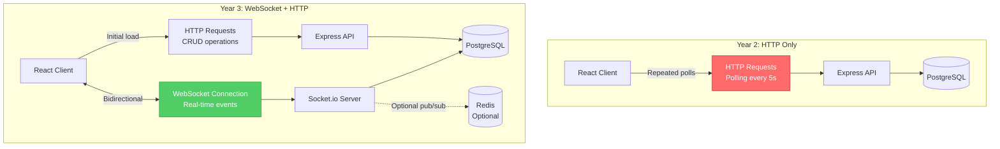
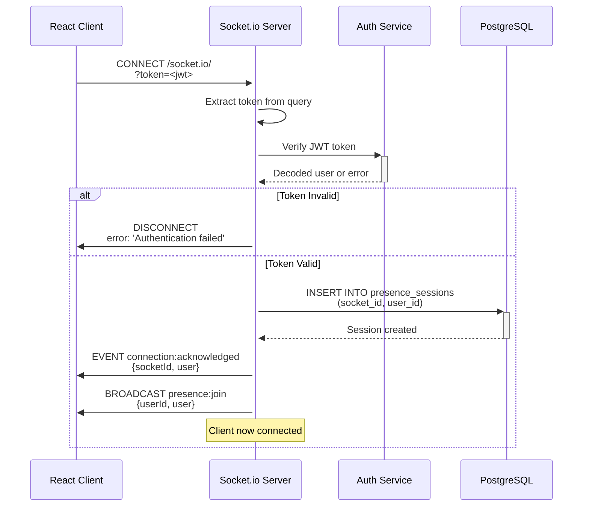
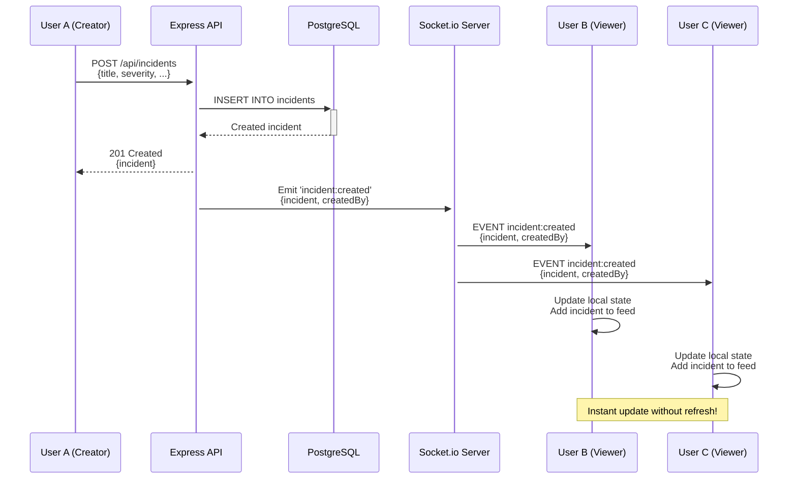
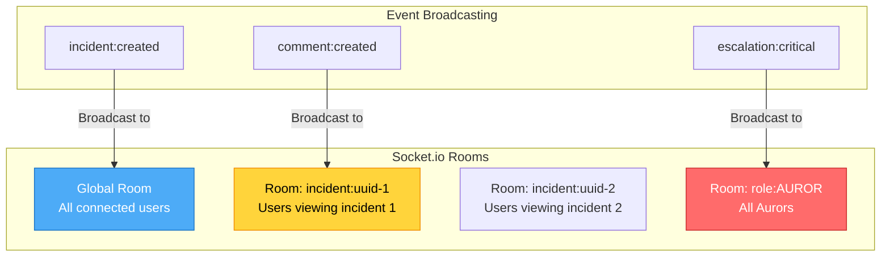
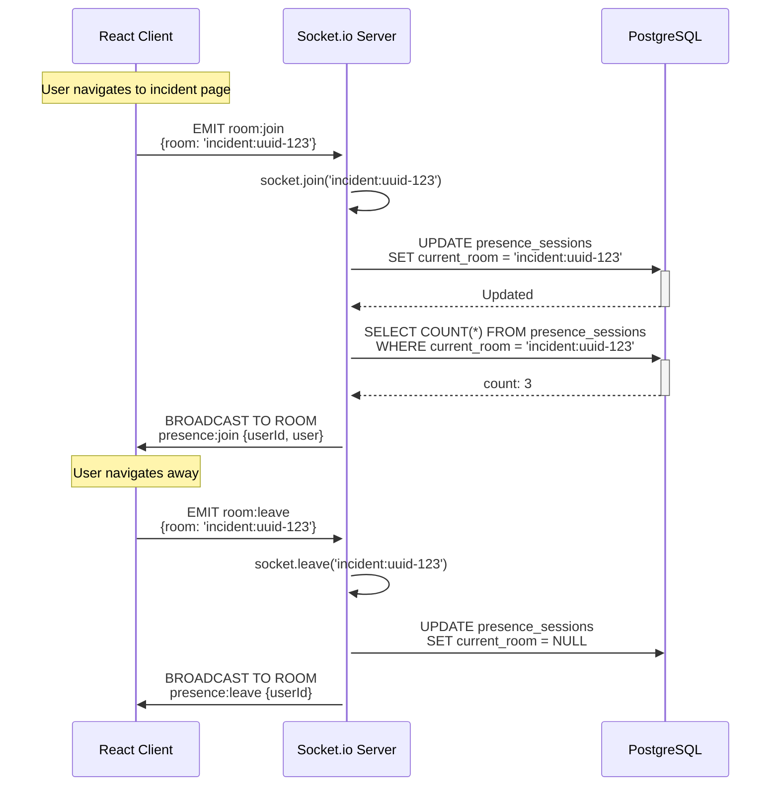
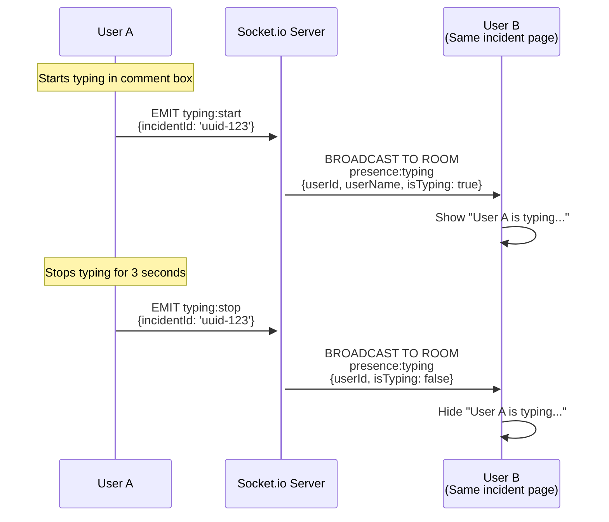

# Year 3: Real-Time Features
### *"Owl Post - Instant Delivery Across the Castle"*

**Status**: 📝 Planning Phase
**Estimated Time**: 8-10 hours per stack
**Difficulty**: Intermediate
**Prerequisites**: Year 1 (CRUD) + Year 2 (Authentication) complete

---

## Table of Contents

- [Learning Objectives](#learning-objectives)
- [User Stories](#user-stories)
- [Technical Specifications](#technical-specifications)
- [Architecture Changes](#architecture-changes)
- [TDD Test Plan (RED Phase)](#tdd-test-plan-red-phase)
- [Implementation Steps (GREEN Phase)](#implementation-steps-green-phase)
- [Code Examples](#code-examples)
- [Success Criteria](#success-criteria)
- [Time Breakdown](#time-breakdown)

---

## Learning Objectives

By the end of Year 3, you will master:

### Core Concepts
1. **WebSocket Protocol** - Bidirectional real-time communication
2. **Event-Driven Architecture** - Pub/Sub patterns
3. **Connection Management** - Handling disconnects, reconnections
4. **Presence Detection** - Online/offline user tracking
5. **Broadcast Patterns** - Room-based messaging
6. **Client-Side State Sync** - Optimistic updates vs. server truth

### Stack-Specific Skills

#### Gryffindor (React + Express)
- Socket.io server and client libraries
- React hooks for WebSocket state (useSocket)
- Event emitters and listeners
- Room-based broadcasting
- Connection authentication

#### Slytherin (Angular + .NET)
- SignalR hubs and connections
- RxJS observables for real-time streams
- Angular services for SignalR
- Strongly-typed hub interfaces
- Connection lifecycle management

#### Ravenclaw (Spring Boot + Java)
- Spring WebSocket with STOMP protocol
- SockJS fallback for older browsers
- Message brokers (in-memory or RabbitMQ)
- @MessageMapping annotations
- Session management for WebSockets

---

## User Stories

### Epic: Real-Time Incident Feed

#### US-REALTIME-001: Live Incident Creation Notifications
**As a** user viewing the incidents dashboard
**I want to** see new incidents appear instantly
**So that** I stay informed without refreshing

**Acceptance Criteria**:
- WHEN a new incident is created by any user
- THEN all connected clients SHALL receive the incident immediately
- AND incident SHALL appear in the feed without page reload
- AND notification sound SHALL play (optional user setting)
- SHALL display "New incident from [User]" toast notification

**WHEN** I create an incident
**THEN** I SHALL see it appear immediately in my own feed
**AND** other users SHALL see it appear in their feeds within 100ms

#### US-REALTIME-002: Live Incident Updates
**As a** user viewing an incident detail page
**I want to** see updates in real-time
**So that** I don't miss important changes

**Acceptance Criteria**:
- WHEN incident severity is escalated
- THEN all viewers SHALL see the change immediately
- WHEN incident status changes to RESOLVED
- THEN incident card SHALL update visually
- WHEN incident description is edited
- THEN watchers SHALL receive notification

#### US-REALTIME-003: Live Comments
**As a** user discussing an incident
**I want to** see new comments appear instantly
**So that** conversations feel natural

**Acceptance Criteria**:
- WHEN another user posts a comment
- THEN I SHALL see it within 100ms
- AND comment SHALL append to the thread
- AND scroll SHALL auto-adjust to new comment
- SHALL show "[User] is typing..." indicator

### Epic: Presence Indicators

#### US-PRESENCE-001: Online User Count
**As a** user
**I want to** see how many Aurors/Prefects are online
**So that** I know if help is available

**Acceptance Criteria**:
- Header SHALL display "5 Aurors online, 12 Prefects online"
- Count SHALL update in real-time
- SHALL show breakdown by role

#### US-PRESENCE-002: User Status Badges
**As a** user
**I want to** see who is currently viewing the same incident
**So that** I can coordinate responses

**Acceptance Criteria**:
- Incident detail page SHALL show avatars of online viewers
- SHALL display "3 users viewing this incident"
- Tooltip SHALL show user names on hover
- Badge SHALL disappear when user navigates away

#### US-PRESENCE-003: "User is typing" Indicator
**As a** user in a comment thread
**I want to** see when someone else is typing
**So that** I don't post conflicting messages

**Acceptance Criteria**:
- SHALL display "Hermione is typing..." below comment box
- Indicator SHALL disappear after 3 seconds of inactivity
- SHALL support multiple simultaneous typers

### Epic: Push Notifications

#### US-NOTIFY-001: Mentioned in Comment
**As a** user
**I want to** be notified when mentioned in a comment
**So that** I can respond quickly

**Acceptance Criteria**:
- WHEN comment contains "@harry.potter"
- THEN Harry SHALL receive real-time notification
- AND notification SHALL link to the comment
- AND notification SHALL persist until dismissed

#### US-NOTIFY-002: Incident Assigned to Me
**As a** Prefect or Auror
**I want to** be notified when an incident is assigned to me
**So that** I can take action immediately

**Acceptance Criteria**:
- WHEN incident assigned to user
- THEN user SHALL receive notification (even if offline)
- AND notification SHALL show incident title and severity
- Online users SHALL see toast notification
- Offline users SHALL see notification on next login

#### US-NOTIFY-003: Incident Escalated
**As an** Auror
**I want to** be notified when incident severity reaches CRITICAL
**So that** I can respond to emergencies

**Acceptance Criteria**:
- WHEN severity changes to CRITICAL
- THEN all online Aurors SHALL receive notification
- AND notification SHALL include sound alert
- AND incident SHALL appear in "Urgent" section

---

## Technical Specifications

### WebSocket Events Specification

#### Server → Client Events

```typescript
// Incident Events
event: 'incident:created'
payload: {
  incident: Incident;
  createdBy: User;
}

event: 'incident:updated'
payload: {
  incidentId: string;
  changes: Partial<Incident>;
  updatedBy: User;
}

event: 'incident:resolved'
payload: {
  incidentId: string;
  resolvedBy: User;
  resolution: string;
}

// Comment Events
event: 'comment:created'
payload: {
  comment: Comment;
  incidentId: string;
  author: User;
}

event: 'comment:deleted'
payload: {
  commentId: string;
  incidentId: string;
}

// Presence Events
event: 'presence:join'
payload: {
  userId: string;
  user: User;
  room?: string;
}

event: 'presence:leave'
payload: {
  userId: string;
  room?: string;
}

event: 'presence:typing'
payload: {
  userId: string;
  userName: string;
  incidentId: string;
  isTyping: boolean;
}

// Notification Events
event: 'notification:new'
payload: {
  id: string;
  type: 'mention' | 'assignment' | 'escalation';
  message: string;
  link: string;
  createdAt: string;
}

// System Events
event: 'connection:acknowledged'
payload: {
  socketId: string;
  user: User;
}

event: 'error'
payload: {
  code: string;
  message: string;
}
```

#### Client → Server Events

```typescript
// Authentication
event: 'authenticate'
payload: {
  token: string;
}

// Room Management
event: 'room:join'
payload: {
  room: string; // e.g., "incident:uuid"
}

event: 'room:leave'
payload: {
  room: string;
}

// Typing Indicators
event: 'typing:start'
payload: {
  incidentId: string;
}

event: 'typing:stop'
payload: {
  incidentId: string;
}

// Notifications
event: 'notification:mark_read'
payload: {
  notificationId: string;
}
```

### Database Schema Changes

#### New Table: `notifications`
```sql
CREATE TABLE IF NOT EXISTS notifications (
    id UUID PRIMARY KEY DEFAULT gen_random_uuid(),
    user_id UUID NOT NULL REFERENCES users(id) ON DELETE CASCADE,
    type VARCHAR(50) NOT NULL, -- 'mention', 'assignment', 'escalation'
    message TEXT NOT NULL,
    link TEXT,
    is_read BOOLEAN DEFAULT FALSE,
    created_at TIMESTAMP WITH TIME ZONE DEFAULT NOW(),
    read_at TIMESTAMP WITH TIME ZONE
);

CREATE INDEX idx_notifications_user_id ON notifications(user_id);
CREATE INDEX idx_notifications_is_read ON notifications(is_read);
CREATE INDEX idx_notifications_created_at ON notifications(created_at DESC);
```

#### New Table: `presence_sessions`
```sql
CREATE TABLE IF NOT EXISTS presence_sessions (
    socket_id VARCHAR(255) PRIMARY KEY,
    user_id UUID NOT NULL REFERENCES users(id) ON DELETE CASCADE,
    connected_at TIMESTAMP WITH TIME ZONE DEFAULT NOW(),
    last_seen TIMESTAMP WITH TIME ZONE DEFAULT NOW(),
    current_room VARCHAR(255)
);

CREATE INDEX idx_presence_user_id ON presence_sessions(user_id);
CREATE INDEX idx_presence_last_seen ON presence_sessions(last_seen);
```

### API Endpoints (New)

```
WebSocket Endpoints (Socket.io):
  CONNECT /socket.io/?token=<jwt>

HTTP Fallback Endpoints:
  GET    /api/notifications           # Get user notifications
  PATCH  /api/notifications/:id/read  # Mark as read
  DELETE /api/notifications/:id       # Dismiss notification
  GET    /api/presence/online         # Get online users
  GET    /api/presence/incident/:id   # Get users viewing incident
```

### Environment Variables (New)

```bash
# WebSocket Configuration
SOCKET_IO_PORT=4001  # Same as HTTP server
SOCKET_IO_CORS_ORIGIN=http://localhost:3001
SOCKET_IO_PING_TIMEOUT=60000
SOCKET_IO_PING_INTERVAL=25000

# Presence Configuration
PRESENCE_TIMEOUT=30000  # 30 seconds
TYPING_TIMEOUT=3000     # 3 seconds
```

---

## Architecture Changes

### Year 2 vs Year 3 Architecture



### Socket.io Connection Flow



### Real-Time Incident Creation



### Room-Based Broadcasting



### Presence Detection Flow



### Typing Indicator Flow



---

## TDD Test Plan (RED Phase)

### Test File Structure

```
gryffindor/server/tests/
├── websocket.test.js           # Socket.io connection tests
├── realtime-incidents.test.js  # Real-time incident events
├── realtime-comments.test.js   # Real-time comment events
├── presence.test.js            # Presence detection
├── notifications.test.js       # Notification system
└── helpers/
    ├── socketTestClient.js     # Socket.io test client
    └── waitForEvent.js         # Helper for async event testing
```

### Test Cases: WebSocket Connection

#### File: `websocket.test.js`

```javascript
describe('Socket.io Connection', () => {
  // Authentication
  test('should_connect_client_with_valid_jwt_token', async () => {
    // GIVEN: Valid JWT token
    // WHEN: Connect with ?token=<jwt>
    // THEN: Connection established
    // AND: Receive connection:acknowledged event
  });

  test('should_reject_connection_without_jwt_token', async () => {
    // WHEN: Connect without token
    // THEN: Connection rejected
  });

  test('should_reject_connection_with_invalid_jwt_token', async () => {
    // WHEN: Connect with expired/invalid token
    // THEN: Connection rejected
  });

  // Connection Lifecycle
  test('should_create_presence_session_on_connect', async () => {
    // WHEN: Client connects
    // THEN: presence_sessions table has new record
  });

  test('should_remove_presence_session_on_disconnect', async () => {
    // WHEN: Client disconnects
    // THEN: presence_sessions record deleted
  });

  test('should_broadcast_presence_join_to_others', async () => {
    // GIVEN: User A connected
    // WHEN: User B connects
    // THEN: User A receives presence:join event
  });

  // Reconnection
  test('should_allow_reconnection_with_same_token', async () => {
    // WHEN: Disconnect and reconnect
    // THEN: Connection successful
  });

  test('should_handle_multiple_connections_per_user', async () => {
    // WHEN: Same user connects from 2 tabs
    // THEN: Both connections maintained
  });
});

describe('Room Management', () => {
  test('should_join_room_when_requested', async () => {
    // WHEN: EMIT room:join {room: 'incident:123'}
    // THEN: Socket added to room
  });

  test('should_leave_room_when_requested', async () => {
    // WHEN: EMIT room:leave {room: 'incident:123'}
    // THEN: Socket removed from room
  });

  test('should_auto_leave_previous_room_when_joining_new', async () => {
    // GIVEN: In room 'incident:123'
    // WHEN: Join 'incident:456'
    // THEN: Left 'incident:123', joined 'incident:456'
  });

  test('should_broadcast_only_to_room_members', async () => {
    // GIVEN: User A in room 'incident:123'
    // GIVEN: User B in room 'incident:456'
    // WHEN: Broadcast to 'incident:123'
    // THEN: Only User A receives event
  });
});
```

### Test Cases: Real-Time Incidents

#### File: `realtime-incidents.test.js`

```javascript
describe('Real-Time Incident Events', () => {
  let socketA, socketB, tokenA, tokenB;

  beforeEach(async () => {
    tokenA = await createUserTokenByRole('STUDENT');
    tokenB = await createUserTokenByRole('STUDENT');

    socketA = await connectSocketWithToken(tokenA);
    socketB = await connectSocketWithToken(tokenB);
  });

  afterEach(() => {
    socketA.disconnect();
    socketB.disconnect();
  });

  // Incident Creation
  test('should_broadcast_incident_created_to_all_clients', async () => {
    // GIVEN: SocketB listening for incident:created
    const eventPromise = waitForEvent(socketB, 'incident:created');

    // WHEN: Create incident via HTTP API
    await fetch('/api/incidents', {
      method: 'POST',
      headers: {
        'Authorization': `Bearer ${tokenA}`,
        'Content-Type': 'application/json'
      },
      body: JSON.stringify({
        title: 'Test Incident',
        severity: 'MISCHIEF'
      })
    });

    // THEN: SocketB receives event within 100ms
    const event = await eventPromise;
    expect(event.incident.title).toBe('Test Incident');
    expect(event.createdBy.email).toContain('hogwarts.edu');
  });

  // Incident Update
  test('should_broadcast_incident_updated_to_room_members', async () => {
    // GIVEN: Both sockets in same room
    socketA.emit('room:join', { room: 'incident:123' });
    socketB.emit('room:join', { room: 'incident:123' });

    const eventPromise = waitForEvent(socketB, 'incident:updated');

    // WHEN: Update incident via HTTP API
    await fetch('/api/incidents/123', {
      method: 'PUT',
      headers: { 'Authorization': `Bearer ${tokenA}` },
      body: JSON.stringify({ severity: 'SERIOUS' })
    });

    // THEN: SocketB receives update
    const event = await eventPromise;
    expect(event.changes.severity).toBe('SERIOUS');
  });

  // Incident Resolution
  test('should_broadcast_incident_resolved_to_all_clients', async () => {
    const eventPromise = waitForEvent(socketB, 'incident:resolved');

    // WHEN: Resolve incident
    await fetch('/api/incidents/123', {
      method: 'DELETE',
      headers: { 'Authorization': `Bearer ${tokenA}` }
    });

    // THEN: All clients notified
    const event = await eventPromise;
    expect(event.incidentId).toBe('123');
  });

  // Latency Test
  test('should_deliver_events_within_100ms_threshold', async () => {
    const startTime = Date.now();

    const eventPromise = waitForEvent(socketB, 'incident:created');

    await createIncident({ title: 'Speed Test' });

    await eventPromise;
    const latency = Date.now() - startTime;

    expect(latency).toBeLessThan(100);
  });
});
```

### Test Cases: Presence Detection

#### File: `presence.test.js`

```javascript
describe('Presence Detection', () => {
  test('should_track_users_in_room_accurately', async () => {
    // GIVEN: 3 users join incident room
    socketA.emit('room:join', { room: 'incident:123' });
    socketB.emit('room:join', { room: 'incident:123' });
    socketC.emit('room:join', { room: 'incident:123' });

    // WHEN: Query presence
    const response = await fetch('/api/presence/incident/123');
    const data = await response.json();

    // THEN: Count = 3
    expect(data.count).toBe(3);
    expect(data.users).toHaveLength(3);
  });

  test('should_decrement_count_when_user_leaves_room', async () => {
    // GIVEN: User in room
    socketA.emit('room:join', { room: 'incident:123' });

    // WHEN: User leaves
    socketA.emit('room:leave', { room: 'incident:123' });

    // THEN: Count = 0
    const response = await fetch('/api/presence/incident/123');
    const data = await response.json();
    expect(data.count).toBe(0);
  });

  test('should_show_typing_indicator_for_3_seconds', async () => {
    // GIVEN: Both in same room
    socketA.emit('room:join', { room: 'incident:123' });
    socketB.emit('room:join', { room: 'incident:123' });

    const typingPromise = waitForEvent(socketB, 'presence:typing');

    // WHEN: User A starts typing
    socketA.emit('typing:start', { incidentId: '123' });

    // THEN: User B sees indicator
    const event = await typingPromise;
    expect(event.isTyping).toBe(true);
    expect(event.userName).toBeDefined();

    // AND: Auto-clears after 3 seconds
    await new Promise(resolve => setTimeout(resolve, 3100));
    // (Implementation should auto-stop)
  });

  test('should_clean_up_presence_on_disconnect', async () => {
    // GIVEN: User connected
    await socketA.connect();

    // WHEN: Disconnect
    socketA.disconnect();

    // Wait for cleanup
    await new Promise(resolve => setTimeout(resolve, 100));

    // THEN: No presence sessions for this user
    const result = await executeQueryWithParameters(
      'SELECT COUNT(*) FROM presence_sessions WHERE user_id = $1',
      [userA.id]
    );
    expect(result.rows[0].count).toBe('0');
  });
});
```

---

## Implementation Steps (GREEN Phase)

### Step 1: Install Dependencies (Gryffindor)

```bash
cd gryffindor/server
npm install socket.io
npm install --save-dev socket.io-client

cd ../client
npm install socket.io-client
```

### Step 2: Create WebSocket Server

#### File: `gryffindor/server/src/websocket/socketServerManager.js`

```javascript
import { Server } from 'socket.io';
import { verifyAccessTokenFromRequest } from '../services/authenticationServiceManager.js';
import { executeQueryWithParameters } from '../db/connectionPoolManager.js';

let io; // Socket.io instance

// ============================================
// Initialize Socket.io Server
// ============================================

export function initializeSocketServerWithAuthentication(httpServer) {
  io = new Server(httpServer, {
    cors: {
      origin: process.env.SOCKET_IO_CORS_ORIGIN || 'http://localhost:3001',
      credentials: true,
    },
    pingTimeout: parseInt(process.env.SOCKET_IO_PING_TIMEOUT || '60000'),
    pingInterval: parseInt(process.env.SOCKET_IO_PING_INTERVAL || '25000'),
  });

  // Authentication middleware
  io.use(authenticateSocketConnectionWithToken);

  // Connection handler
  io.on('connection', handleSocketConnectionWithPresence);

  console.log('✅ Socket.io server initialized');

  return io;
}

// ============================================
// Get Socket.io Instance
// ============================================

export function getSocketServerInstanceSingleton() {
  if (!io) {
    throw new Error('Socket.io server not initialized');
  }
  return io;
}

// ============================================
// Authentication Middleware
// ============================================

async function authenticateSocketConnectionWithToken(socket, next) {
  try {
    const token = socket.handshake.auth.token || socket.handshake.query.token;

    if (!token) {
      return next(new Error('Authentication token required'));
    }

    const decoded = verifyAccessTokenFromRequest(token);
    socket.user = decoded;

    next();
  } catch (error) {
    console.error('Socket authentication failed:', error);
    next(new Error('Authentication failed'));
  }
}

// ============================================
// Connection Handler
// ============================================

async function handleSocketConnectionWithPresence(socket) {
  console.log(`🔌 User connected: ${socket.user.email} (${socket.id})`);

  // Create presence session
  await createPresenceSessionInDatabase(socket);

  // Send acknowledgment
  socket.emit('connection:acknowledged', {
    socketId: socket.id,
    user: socket.user,
  });

  // Broadcast join to others
  socket.broadcast.emit('presence:join', {
    userId: socket.user.sub,
    user: {
      id: socket.user.sub,
      email: socket.user.email,
      name: socket.user.name,
      role: socket.user.role,
    },
  });

  // Register event handlers
  registerSocketEventHandlersForClient(socket);

  // Handle disconnect
  socket.on('disconnect', async () => {
    await handleSocketDisconnectWithCleanup(socket);
  });
}

// ============================================
// Register Event Handlers
// ============================================

function registerSocketEventHandlersForClient(socket) {
  // Room management
  socket.on('room:join', (data) => handleRoomJoinWithPresence(socket, data));
  socket.on('room:leave', (data) => handleRoomLeaveWithCleanup(socket, data));

  // Typing indicators
  socket.on('typing:start', (data) => handleTypingStartBroadcast(socket, data));
  socket.on('typing:stop', (data) => handleTypingStopBroadcast(socket, data));

  // Notifications
  socket.on('notification:mark_read', (data) => handleNotificationMarkAsRead(socket, data));
}

// ============================================
// Room Management
// ============================================

async function handleRoomJoinWithPresence(socket, { room }) {
  // Leave current room if any
  if (socket.currentRoom) {
    socket.leave(socket.currentRoom);
  }

  // Join new room
  socket.join(room);
  socket.currentRoom = room;

  // Update database
  await executeQueryWithParameters(
    'UPDATE presence_sessions SET current_room = $1, last_seen = NOW() WHERE socket_id = $2',
    [room, socket.id]
  );

  // Notify room members
  socket.to(room).emit('presence:join', {
    userId: socket.user.sub,
    room,
  });

  console.log(`📍 User ${socket.user.email} joined room: ${room}`);
}

async function handleRoomLeaveWithCleanup(socket, { room }) {
  socket.leave(room);

  if (socket.currentRoom === room) {
    socket.currentRoom = null;
  }

  await executeQueryWithParameters(
    'UPDATE presence_sessions SET current_room = NULL WHERE socket_id = $1',
    [socket.id]
  );

  socket.to(room).emit('presence:leave', {
    userId: socket.user.sub,
    room,
  });
}

// ============================================
// Typing Indicators
// ============================================

async function handleTypingStartBroadcast(socket, { incidentId }) {
  const room = `incident:${incidentId}`;

  socket.to(room).emit('presence:typing', {
    userId: socket.user.sub,
    userName: socket.user.name || socket.user.email,
    incidentId,
    isTyping: true,
  });

  // Auto-stop after 3 seconds
  if (socket.typingTimeout) {
    clearTimeout(socket.typingTimeout);
  }

  socket.typingTimeout = setTimeout(() => {
    handleTypingStopBroadcast(socket, { incidentId });
  }, 3000);
}

async function handleTypingStopBroadcast(socket, { incidentId }) {
  const room = `incident:${incidentId}`;

  socket.to(room).emit('presence:typing', {
    userId: socket.user.sub,
    incidentId,
    isTyping: false,
  });

  if (socket.typingTimeout) {
    clearTimeout(socket.typingTimeout);
    socket.typingTimeout = null;
  }
}

// ============================================
// Presence Database Operations
// ============================================

async function createPresenceSessionInDatabase(socket) {
  await executeQueryWithParameters(
    `INSERT INTO presence_sessions (socket_id, user_id)
     VALUES ($1, $2)
     ON CONFLICT (socket_id) DO UPDATE
     SET last_seen = NOW()`,
    [socket.id, socket.user.sub]
  );
}

async function handleSocketDisconnectWithCleanup(socket) {
  console.log(`🔌 User disconnected: ${socket.user.email} (${socket.id})`);

  // Remove presence session
  await executeQueryWithParameters(
    'DELETE FROM presence_sessions WHERE socket_id = $1',
    [socket.id]
  );

  // Broadcast leave
  socket.broadcast.emit('presence:leave', {
    userId: socket.user.sub,
  });

  if (socket.typingTimeout) {
    clearTimeout(socket.typingTimeout);
  }
}

// ============================================
// Broadcasting Helper Functions
// ============================================

export function broadcastIncidentCreatedToAllClients(incident, createdBy) {
  const io = getSocketServerInstanceSingleton();
  io.emit('incident:created', { incident, createdBy });
}

export function broadcastIncidentUpdatedToRoom(incidentId, changes, updatedBy) {
  const io = getSocketServerInstanceSingleton();
  const room = `incident:${incidentId}`;
  io.to(room).emit('incident:updated', { incidentId, changes, updatedBy });
}

export function broadcastIncidentResolvedToAllClients(incidentId, resolvedBy) {
  const io = getSocketServerInstanceSingleton();
  io.emit('incident:resolved', { incidentId, resolvedBy });
}

export function broadcastCommentCreatedToRoom(incidentId, comment, author) {
  const io = getSocketServerInstanceSingleton();
  const room = `incident:${incidentId}`;
  io.to(room).emit('comment:created', { incidentId, comment, author });
}

export function sendNotificationToUserSocket(userId, notification) {
  const io = getSocketServerInstanceSingleton();
  // Find all sockets for this user
  io.sockets.sockets.forEach(socket => {
    if (socket.user.sub === userId) {
      socket.emit('notification:new', notification);
    }
  });
}
```

### Step 3: Integrate WebSocket with HTTP Server

#### File: `gryffindor/server/src/server.js`

```javascript
import { initializeSocketServerWithAuthentication } from './websocket/socketServerManager.js';

// ...existing Express setup

const httpServer = app.listen(PORT, () => {
  console.log(`✅ Express server listening on port ${PORT}`);
});

// Initialize Socket.io
initializeSocketServerWithAuthentication(httpServer);

// ...rest of server code
```

### Step 4: Update Incidents Routes (Add Broadcasting)

#### File: `gryffindor/server/src/routes/incidentsRouteHandler.js`

```javascript
import {
  broadcastIncidentCreatedToAllClients,
  broadcastIncidentUpdatedToRoom,
  broadcastIncidentResolvedToAllClients,
} from '../websocket/socketServerManager.js';

// POST /api/incidents
router.post('/', authenticateRequestWithJwtToken, async (req, res) => {
  try {
    // ...existing incident creation logic

    const incident = result.rows[0];

    // Broadcast to all connected clients
    broadcastIncidentCreatedToAllClients(incident, {
      id: req.user.sub,
      email: req.user.email,
      name: req.user.name,
    });

    return res.status(201).json(incident);
  } catch (error) {
    // ...error handling
  }
});

// PUT /api/incidents/:id
router.put('/:id', authenticateRequestWithJwtToken, async (req, res) => {
  try {
    // ...existing update logic

    const updatedIncident = result.rows[0];

    // Broadcast to room members
    broadcastIncidentUpdatedToRoom(
      req.params.id,
      req.body,
      { id: req.user.sub, email: req.user.email }
    );

    return res.status(200).json(updatedIncident);
  } catch (error) {
    // ...error handling
  }
});

// DELETE /api/incidents/:id
router.delete('/:id', authenticateRequestWithJwtToken, async (req, res) => {
  try {
    // ...existing resolution logic

    // Broadcast to all clients
    broadcastIncidentResolvedToAllClients(req.params.id, {
      id: req.user.sub,
      email: req.user.email,
    });

    return res.status(200).json({ message: 'Incident resolved' });
  } catch (error) {
    // ...error handling
  }
});
```

### Step 5: Create React WebSocket Hook

#### File: `gryffindor/client/src/hooks/useSocketConnectionManager.js`

```javascript
import { useEffect, useState } from 'react';
import { io } from 'socket.io-client';
import { useAuthenticationContextProvider } from '../contexts/AuthenticationContextProvider';

export function useSocketConnectionManager() {
  const { accessToken } = useAuthenticationContextProvider();
  const [socket, setSocket] = useState(null);
  const [isConnected, setIsConnected] = useState(false);

  useEffect(() => {
    if (!accessToken) {
      return;
    }

    // Create socket connection
    const socketInstance = io('http://localhost:4001', {
      auth: {
        token: accessToken,
      },
      transports: ['websocket', 'polling'],
    });

    // Connection events
    socketInstance.on('connect', () => {
      console.log('✅ Socket connected:', socketInstance.id);
      setIsConnected(true);
    });

    socketInstance.on('disconnect', () => {
      console.log('❌ Socket disconnected');
      setIsConnected(false);
    });

    socketInstance.on('connection:acknowledged', (data) => {
      console.log('🤝 Connection acknowledged:', data);
    });

    socketInstance.on('connect_error', (error) => {
      console.error('🔴 Connection error:', error.message);
    });

    setSocket(socketInstance);

    // Cleanup
    return () => {
      socketInstance.disconnect();
    };
  }, [accessToken]);

  return { socket, isConnected };
}
```

### Step 6: Create React Real-Time Incidents Hook

#### File: `gryffindor/client/src/hooks/useRealtimeIncidentsListener.js`

```javascript
import { useEffect } from 'react';

export function useRealtimeIncidentsListener(socket, onIncidentCreated, onIncidentUpdated, onIncidentResolved) {
  useEffect(() => {
    if (!socket) return;

    // Listen for incident events
    socket.on('incident:created', (data) => {
      console.log('📬 New incident:', data.incident.title);
      if (onIncidentCreated) {
        onIncidentCreated(data);
      }
    });

    socket.on('incident:updated', (data) => {
      console.log('📝 Incident updated:', data.incidentId);
      if (onIncidentUpdated) {
        onIncidentUpdated(data);
      }
    });

    socket.on('incident:resolved', (data) => {
      console.log('✅ Incident resolved:', data.incidentId);
      if (onIncidentResolved) {
        onIncidentResolved(data);
      }
    });

    // Cleanup
    return () => {
      socket.off('incident:created');
      socket.off('incident:updated');
      socket.off('incident:resolved');
    };
  }, [socket, onIncidentCreated, onIncidentUpdated, onIncidentResolved]);
}
```

### Step 7: Implement Presence in React Component

#### File: `gryffindor/client/src/components/IncidentDetailWithPresence.jsx`

```javascript
import { useEffect, useState } from 'react';
import { useParams } from 'react-router-dom';
import { useSocketConnectionManager } from '../hooks/useSocketConnectionManager';

export function IncidentDetailWithPresence() {
  const { id } = useParams();
  const { socket } = useSocketConnectionManager();
  const [viewersCount, setViewersCount] = useState(0);
  const [viewers, setViewers] = useState([]);
  const [typingUsers, setTypingUsers] = useState([]);

  useEffect(() => {
    if (!socket) return;

    // Join incident room
    socket.emit('room:join', { room: `incident:${id}` });

    // Listen for presence events
    socket.on('presence:join', ({ userId, user, room }) => {
      if (room === `incident:${id}`) {
        setViewers(prev => [...prev, user]);
        setViewersCount(prev => prev + 1);
      }
    });

    socket.on('presence:leave', ({ userId, room }) => {
      if (room === `incident:${id}`) {
        setViewers(prev => prev.filter(u => u.id !== userId));
        setViewersCount(prev => Math.max(0, prev - 1));
      }
    });

    socket.on('presence:typing', ({ userId, userName, isTyping }) => {
      if (isTyping) {
        setTypingUsers(prev => [...new Set([...prev, userName])]);
      } else {
        setTypingUsers(prev => prev.filter(name => name !== userName));
      }
    });

    // Cleanup
    return () => {
      socket.emit('room:leave', { room: `incident:${id}` });
      socket.off('presence:join');
      socket.off('presence:leave');
      socket.off('presence:typing');
    };
  }, [socket, id]);

  const handleCommentInputChange = () => {
    if (socket) {
      socket.emit('typing:start', { incidentId: id });
    }
  };

  return (
    <div>
      <div className="presence-indicator">
        {viewersCount} {viewersCount === 1 ? 'person' : 'people'} viewing
      </div>

      {/* Incident details */}

      <div className="comment-section">
        {typingUsers.length > 0 && (
          <div className="typing-indicator">
            {typingUsers.join(', ')} {typingUsers.length === 1 ? 'is' : 'are'} typing...
          </div>
        )}

        <textarea onChange={handleCommentInputChange} />
      </div>
    </div>
  );
}
```

---

## Success Criteria

### Functional Requirements

- [ ] WebSocket connections established successfully
- [ ] JWT authentication works for Socket.io
- [ ] New incidents appear instantly for all users
- [ ] Incident updates broadcast to room members
- [ ] Comments appear in real-time
- [ ] Presence count accurate within 1 second
- [ ] Typing indicators appear/disappear correctly
- [ ] Notifications delivered instantly to online users
- [ ] Connection survives brief network interruptions
- [ ] Multiple tabs for same user work correctly

### Non-Functional Requirements

- [ ] Event delivery latency < 100ms (p95)
- [ ] All tests passing (websocket, realtime, presence)
- [ ] 100% of functions follow 4-word naming convention
- [ ] Socket.io rooms cleaned up on disconnect
- [ ] No memory leaks from event listeners
- [ ] Graceful degradation if WebSocket unavailable

### Performance Benchmarks

- [ ] 100 concurrent connections supported
- [ ] Event broadcast to 100 clients < 50ms
- [ ] Typing indicator debounced (3 second timeout)
- [ ] Presence session cleanup < 1 second

---

## Time Breakdown

### Gryffindor (React + Express)

| Task | Estimated Time |
|------|----------------|
| Install Socket.io dependencies | 10 min |
| Write WebSocket tests (RED) | 120 min |
| Implement Socket.io server | 90 min |
| Add authentication middleware | 30 min |
| Implement room management | 45 min |
| Implement typing indicators | 30 min |
| Update incidents routes (broadcasting) | 45 min |
| Create React hooks (useSocket) | 60 min |
| Implement presence UI | 45 min |
| Manual testing & debugging | 90 min |
| **Total** | **9 hours** |

---

## Common Pitfalls to Avoid

### Pitfall 1: Memory Leaks from Event Listeners

```javascript
// ❌ WRONG - Listener never removed
useEffect(() => {
  socket.on('incident:created', handleIncident);
}, [socket]);

// ✅ RIGHT - Cleanup in return
useEffect(() => {
  socket.on('incident:created', handleIncident);
  return () => {
    socket.off('incident:created', handleIncident);
  };
}, [socket]);
```

### Pitfall 2: Broadcasting to Self

```javascript
// ❌ WRONG - Creator also receives event
io.emit('incident:created', incident);

// ✅ RIGHT - Use socket.broadcast
socket.broadcast.emit('incident:created', incident);
```

### Pitfall 3: Not Handling Reconnection

```javascript
// ✅ Add reconnection logic
socket.on('reconnect', () => {
  // Re-join rooms
  if (currentRoom) {
    socket.emit('room:join', { room: currentRoom });
  }
  // Refresh data
  refetchIncidents();
});
```

---

**"The Marauder's Map now updates in real-time - mischief managed instantly!"**

*Built with Socket.io, tested with TDD, delivered in real-time* ⚡
