# Year 4: Search & Filters
### *"Finding Needles in Magical Haystacks"*

**Status**: 📝 Planning Phase
**Estimated Time**: 6-8 hours per stack
**Difficulty**: Intermediate
**Prerequisites**: Years 1-3 complete

---

## Table of Contents

- [Learning Objectives](#learning-objectives)
- [User Stories](#user-stories)
- [Technical Specifications](#technical-specifications)
- [Architecture Changes](#architecture-changes)
- [TDD Test Plan (RED Phase)](#tdd-test-plan-red-phase)
- [Implementation Steps (GREEN Phase)](#implementation-steps-green-phase)
- [Code Examples](#code-examples)
- [Success Criteria](#success-criteria)
- [Time Breakdown](#time-breakdown)

---

## Learning Objectives

By the end of Year 4, you will master:

### Core Concepts
1. **Full-Text Search** - PostgreSQL tsvector and GIN indexes
2. **Query Optimization** - EXPLAIN ANALYZE and index strategies
3. **Pagination** - Cursor-based vs offset-based pagination
4. **Advanced Filtering** - Multi-criteria queries with complex logic
5. **Faceted Search** - Count results by category
6. **Search Ranking** - Relevance scoring with ts_rank
7. **Debouncing** - Prevent excessive API calls during typing

### Stack-Specific Skills

#### Gryffindor (React + Express)
- Query string parameter parsing
- React Query for caching search results
- Debounced search input hooks
- URL state synchronization
- Dynamic WHERE clause building

#### Slytherin (Angular + .NET)
- LINQ dynamic query composition
- Entity Framework Core advanced queries
- Angular reactive forms with operators
- RxJS debounceTime and distinctUntilChanged
- C# expression trees for dynamic filters

#### Ravenclaw (Spring Boot + Java)
- JPA Criteria API for dynamic queries
- Spring Data JPA Specifications
- QueryDSL for type-safe queries
- @RequestParam validation
- Pageable and Page abstractions

---

## User Stories

### Epic: Full-Text Search

#### US-SEARCH-001: Search Incidents by Keyword
**As a** user investigating patterns
**I want to** search incidents by keywords
**So that** I can find related magical mishaps quickly

**Acceptance Criteria**:
- WHEN I type "Polyjuice" in search box
- THEN system SHALL search title, description, and location fields
- AND results SHALL highlight matching terms
- AND search SHALL be case-insensitive
- AND SHALL support partial word matching (e.g., "Poly" matches "Polyjuice")
- SHALL return results within 200ms (p95)

**Performance Contract**:
```sql
-- Search query MUST use GIN index
-- EXPLAIN ANALYZE should show "Index Scan using idx_incidents_search_vector"
-- Query time < 50ms for database with 10,000 incidents
```

#### US-SEARCH-002: Search Results Ranked by Relevance
**As a** user
**I want** most relevant results first
**So that** I find what I'm looking for quickly

**Acceptance Criteria**:
- Results SHALL be ordered by relevance score
- Title matches SHALL rank higher than description matches
- Exact matches SHALL rank higher than partial matches
- Recent incidents SHALL have slight ranking boost

### Epic: Advanced Filtering

#### US-FILTER-001: Filter by Multiple Criteria
**As a** Prefect
**I want to** filter incidents by severity, location, and status
**So that** I can focus on specific categories

**Acceptance Criteria**:
- SHALL support combining filters (AND logic)
- Severity filter: MISCHIEF, SERIOUS, SEVERE, CRITICAL
- Location filter: Any combination of castle locations
- Status filter: OPEN, INVESTIGATING, RESOLVED
- Date range filter: incidents reported between two dates
- Reporter filter: Show only incidents by specific user

**WHEN** I filter by SEVERE + FORBIDDEN_FOREST + OPEN
**THEN** SHALL return only severe, open incidents in Forbidden Forest
**AND** SHALL show count of matching incidents

#### US-FILTER-002: Save Filter Presets
**As a** power user
**I want to** save my frequently used filters
**So that** I don't have to recreate them

**Acceptance Criteria**:
- SHALL save filter combinations with a name
- SHALL load saved filters with one click
- SHALL persist filters in localStorage (client-side)
- Optional: Save to database for cross-device sync

### Epic: Pagination

#### US-PAGINATION-001: Paginate Search Results
**As a** user viewing many results
**I want** results split into pages
**So that** the interface remains performant

**Acceptance Criteria**:
- Default page size: 20 incidents
- SHALL support page sizes: 10, 20, 50, 100
- SHALL show total count and current page
- SHALL provide "Next" and "Previous" navigation
- URL SHALL reflect current page (e.g., ?page=2)

**Performance Requirements**:
- Page load time < 100ms
- Database query uses LIMIT and OFFSET efficiently
- Total count query optimized separately

#### US-PAGINATION-002: Infinite Scroll (Alternative)
**As a** mobile user
**I want** incidents to load as I scroll
**So that** browsing is seamless

**Acceptance Criteria**:
- Load 20 incidents initially
- Load next 20 when scrolling near bottom (threshold: 200px)
- Show loading spinner while fetching
- Stop loading when all results fetched
- Cursor-based pagination for consistency

### Epic: Faceted Search

#### US-FACETS-001: Show Result Counts by Category
**As a** user exploring data
**I want to** see how many results exist per category
**So that** I can refine my search intelligently

**Acceptance Criteria**:
```
Search: "potion"
Results: 45 incidents

Filters:
  Severity:
    MISCHIEF (12)
    SERIOUS (20)
    SEVERE (10)
    CRITICAL (3)

  Location:
    DUNGEONS (15)
    POTIONS_CLASSROOM (18)
    HOSPITAL_WING (8)
    OTHER (4)

  Status:
    OPEN (30)
    INVESTIGATING (10)
    RESOLVED (5)
```

---

## Technical Specifications

### Database Schema Changes

#### Update `incidents` Table (Already has full-text search)
```sql
-- Verify these exist from Year 1:
-- Column: search_vector (tsvector)
-- Index: idx_incidents_search_vector (GIN index)
-- Trigger: trigger_update_search_vector

-- Add ranking weights (optional enhancement)
ALTER TABLE incidents
ADD COLUMN IF NOT EXISTS search_rank REAL;

-- Function to update search rank based on recency + matches
CREATE OR REPLACE FUNCTION calculate_search_rank_score(
  query tsquery,
  search_vec tsvector,
  reported_date timestamp
)
RETURNS REAL AS $$
  SELECT
    ts_rank(search_vec, query) * 1.0 +
    (EXTRACT(EPOCH FROM (NOW() - reported_date)) / 86400.0) * 0.01
$$ LANGUAGE SQL IMMUTABLE;
```

#### New Table: `saved_searches` (Optional)
```sql
CREATE TABLE IF NOT EXISTS saved_searches (
    id UUID PRIMARY KEY DEFAULT gen_random_uuid(),
    user_id UUID NOT NULL REFERENCES users(id) ON DELETE CASCADE,
    name VARCHAR(255) NOT NULL,
    filters JSONB NOT NULL,  -- Store filter criteria as JSON
    created_at TIMESTAMP WITH TIME ZONE DEFAULT NOW()
);

CREATE INDEX idx_saved_searches_user_id ON saved_searches(user_id);
```

### API Endpoints (Enhanced)

```
GET /api/incidents?q=<query>&severity=<>&location=<>&status=<>&page=<>&limit=<>
  - Full-text search with filters
  - Returns: { incidents: [], total: number, page: number, totalPages: number }

GET /api/incidents/search/facets?q=<query>
  - Get result counts by category
  - Returns: { facets: { severity: {...}, location: {...}, status: {...} } }

GET /api/incidents/autocomplete?q=<partial>
  - Autocomplete suggestions
  - Returns: { suggestions: string[] }

POST   /api/saved-searches
  - Save filter preset
  - Body: { name: string, filters: object }

GET    /api/saved-searches
  - Get user's saved searches

DELETE /api/saved-searches/:id
  - Delete saved search
```

### Query Parameters Specification

```typescript
interface IncidentSearchParams {
  // Full-text search
  q?: string;  // Search query

  // Filters
  severity?: 'MISCHIEF' | 'SERIOUS' | 'SEVERE' | 'CRITICAL' | 'MISCHIEF,SERIOUS';
  location?: string;  // Comma-separated locations
  status?: 'OPEN' | 'INVESTIGATING' | 'RESOLVED';
  reported_by?: string;  // User ID
  date_from?: string;  // ISO date
  date_to?: string;    // ISO date

  // Sorting
  sort_by?: 'relevance' | 'date' | 'severity';
  sort_order?: 'asc' | 'desc';

  // Pagination
  page?: number;      // Default: 1
  limit?: number;     // Default: 20, max: 100

  // Cursor-based pagination (alternative)
  cursor?: string;    // Opaque cursor token
}
```

---

## Architecture Changes

### Search Query Flow


### Filter Combination Logic

```mermaid
flowchart TB
    subgraph FILTERS["Dynamic Query Building"]
        BASE[Base Query:<br/>SELECT * FROM incidents]

        Q{Has search<br/>query?}
        SEV{Has severity<br/>filter?}
        LOC{Has location<br/>filter?}
        STATUS{Has status<br/>filter?}
        DATE{Has date<br/>range?}

        BASE --> Q

        Q -->|Yes| SEARCH[WHERE search_vector @@ to_tsquery(?)]
        Q -->|No| SEV

        SEARCH --> SEV

        SEV -->|Yes| SEV_FILTER[AND severity IN (?)]
        SEV -->|No| LOC

        SEV_FILTER --> LOC

        LOC -->|Yes| LOC_FILTER[AND location IN (?)]
        LOC -->|No| STATUS

        LOC_FILTER --> STATUS

        STATUS -->|Yes| STATUS_FILTER[AND status = ?]
        STATUS -->|No| DATE

        STATUS_FILTER --> DATE

        DATE -->|Yes| DATE_FILTER[AND reported_at BETWEEN ? AND ?]
        DATE -->|No| FINAL

        DATE_FILTER --> FINAL

        FINAL[ORDER BY relevance DESC<br/>LIMIT ? OFFSET ?]
    end

    style BASE fill:#4dabf7,stroke:#1971c2,color:#fff
    style FINAL fill:#51cf66,stroke:#2f9e44,color:#fff
```

### Pagination Strategies Comparison

```mermaid
flowchart LR
    subgraph OFFSET["Offset-Based Pagination"]
        O1[Page 1:<br/>LIMIT 20 OFFSET 0]
        O2[Page 2:<br/>LIMIT 20 OFFSET 20]
        O3[Page 3:<br/>LIMIT 20 OFFSET 40]
    end

    subgraph CURSOR["Cursor-Based Pagination"]
        C1[First 20:<br/>WHERE id > '0'<br/>ORDER BY id LIMIT 20]
        C2[Next 20:<br/>WHERE id > last_id<br/>ORDER BY id LIMIT 20]
        C3[Next 20:<br/>WHERE id > last_id<br/>ORDER BY id LIMIT 20]
    end

    subgraph COMPARISON["Trade-offs"]
        OFFSET_PRO["✅ Simple URL (?page=2)<br/>✅ Jump to any page<br/>❌ Slow for large offsets<br/>❌ Inconsistent with new data"]

        CURSOR_PRO["✅ Fast for any position<br/>✅ Consistent results<br/>❌ Can't jump to page<br/>❌ Complex cursor encoding"]
    end

    O1 --> O2 --> O3
    C1 --> C2 --> C3

    style OFFSET_PRO fill:#fff3bf,stroke:#f08c00,color:#000
    style CURSOR_PRO fill:#d3f9d8,stroke:#2f9e44,color:#000
```



---

## TDD Test Plan (RED Phase)

### Test File Structure

```
gryffindor/server/tests/
├── search.test.js              # Full-text search tests
├── filters.test.js             # Advanced filtering tests
├── pagination.test.js          # Pagination tests
├── facets.test.js              # Faceted search tests
└── performance/
    └── search-benchmark.test.js
```

### Test Cases: Full-Text Search

#### File: `search.test.js`

```javascript
describe('Full-Text Search', () => {
  beforeEach(async () => {
    // Seed database with test incidents containing specific keywords
    await seedIncidentsForSearchTesting();
  });

  // Basic Search
  test('should_search_incidents_by_title_keyword', async () => {
    // GIVEN: Incident with title "Polyjuice Potion Mishap"
    // WHEN: Search query = "Polyjuice"
    // THEN: Returns matching incident
  });

  test('should_search_incidents_by_description_keyword', async () => {
    // GIVEN: Incident with description containing "Forbidden Forest"
    // WHEN: Search query = "Forbidden"
    // THEN: Returns matching incident
  });

  test('should_perform_case_insensitive_search_always', async () => {
    // WHEN: Search "polyjuice" (lowercase)
    // THEN: Matches "Polyjuice" (capitalized)
  });

  test('should_support_partial_word_matching', async () => {
    // WHEN: Search "poly"
    // THEN: Matches "Polyjuice"
  });

  test('should_support_multi_word_search_queries', async () => {
    // WHEN: Search "Forbidden Forest night"
    // THEN: Returns incidents containing all three words
  });

  // Ranking
  test('should_rank_title_matches_higher_than_description', async () => {
    // GIVEN: Incident A with "Potion" in title
    // GIVEN: Incident B with "Potion" in description
    // WHEN: Search "Potion"
    // THEN: Incident A appears first
  });

  test('should_rank_exact_matches_higher_than_partial', async () => {
    // GIVEN: Incident with exact title "Potion Mishap"
    // GIVEN: Incident with title "Potion Explosion Mishap Report"
    // WHEN: Search "Potion Mishap"
    // THEN: Exact match ranked first
  });

  test('should_boost_recent_incidents_in_ranking', async () => {
    // GIVEN: Incident A from yesterday with score 0.5
    // GIVEN: Incident B from 1 year ago with score 0.5
    // THEN: Incident A ranked higher (recency boost)
  });

  // Performance
  test('should_complete_search_within_200ms_threshold', async () => {
    // GIVEN: Database with 10,000 incidents
    // WHEN: Perform search query
    // THEN: Response time < 200ms
  });

  test('should_use_gin_index_for_search', async () => {
    // WHEN: Run EXPLAIN ANALYZE on search query
    // THEN: Query plan shows "Index Scan using idx_incidents_search_vector"
  });

  // Edge Cases
  test('should_return_empty_array_for_no_matches', async () => {
    // WHEN: Search "NonexistentKeyword123"
    // THEN: Returns { incidents: [], total: 0 }
  });

  test('should_handle_special_characters_in_query', async () => {
    // WHEN: Search with "O'Brien's"
    // THEN: Does not cause SQL error
  });

  test('should_sanitize_query_to_prevent_sql_injection', async () => {
    // WHEN: Search with "'; DROP TABLE incidents; --"
    // THEN: Returns safe empty results (no SQL execution)
  });
});

describe('Search Highlighting', () => {
  test('should_return_highlighted_snippets_with_matches', async () => {
    // WHEN: Search "potion"
    // THEN: Response includes highlighted snippet:
    //   "...unauthorized <mark>potion</mark> brewing in..."
  });
});
```

### Test Cases: Advanced Filtering

#### File: `filters.test.js`

```javascript
describe('Advanced Filtering', () => {
  // Single Filter
  test('should_filter_incidents_by_single_severity', async () => {
    // WHEN: GET /api/incidents?severity=CRITICAL
    // THEN: Returns only CRITICAL incidents
  });

  test('should_filter_incidents_by_single_location', async () => {
    // WHEN: GET /api/incidents?location=DUNGEONS
    // THEN: Returns only DUNGEONS incidents
  });

  test('should_filter_incidents_by_status_open', async () => {
    // WHEN: GET /api/incidents?status=OPEN
    // THEN: Returns only OPEN incidents
  });

  // Multiple Filters (AND logic)
  test('should_combine_severity_and_location_filters', async () => {
    // WHEN: GET /api/incidents?severity=SEVERE&location=FORBIDDEN_FOREST
    // THEN: Returns incidents matching BOTH criteria
  });

  test('should_combine_all_filter_types_together', async () => {
    // WHEN: ?severity=CRITICAL&location=DUNGEONS&status=OPEN
    // THEN: Returns incidents matching ALL three
  });

  // Multi-Value Filters
  test('should_filter_by_multiple_severity_values', async () => {
    // WHEN: ?severity=SERIOUS,SEVERE,CRITICAL
    // THEN: Returns incidents with ANY of these severities
  });

  test('should_filter_by_multiple_location_values', async () => {
    // WHEN: ?location=DUNGEONS,FORBIDDEN_FOREST
    // THEN: Returns incidents from either location
  });

  // Date Range Filter
  test('should_filter_incidents_by_date_range', async () => {
    // WHEN: ?date_from=2024-01-01&date_to=2024-01-31
    // THEN: Returns incidents reported in January 2024
  });

  test('should_filter_with_date_from_only', async () => {
    // WHEN: ?date_from=2024-01-01
    // THEN: Returns incidents from Jan 1st onwards
  });

  test('should_filter_with_date_to_only', async () => {
    // WHEN: ?date_to=2024-01-31
    // THEN: Returns incidents before Feb 1st
  });

  // Reporter Filter
  test('should_filter_incidents_by_reporter_user_id', async () => {
    // WHEN: ?reported_by=<user_id>
    // THEN: Returns only incidents by that user
  });

  // Search + Filters Combined
  test('should_combine_search_with_filters_correctly', async () => {
    // WHEN: ?q=potion&severity=CRITICAL&location=DUNGEONS
    // THEN: Returns incidents matching search AND filters
  });

  // Validation
  test('should_reject_invalid_severity_value_gracefully', async () => {
    // WHEN: ?severity=INVALID
    // THEN: 400 Bad Request with error message
  });

  test('should_reject_invalid_date_format_gracefully', async () => {
    // WHEN: ?date_from=not-a-date
    // THEN: 400 Bad Request
  });
});
```

### Test Cases: Pagination

#### File: `pagination.test.js`

```javascript
describe('Offset-Based Pagination', () => {
  beforeEach(async () => {
    // Seed 100 test incidents
    await seedExactlyNIncidentsForTesting(100);
  });

  test('should_return_first_page_with_default_limit', async () => {
    // WHEN: GET /api/incidents (no params)
    // THEN: Returns first 20 incidents
    // AND: Response includes { page: 1, limit: 20, total: 100, totalPages: 5 }
  });

  test('should_return_second_page_with_correct_offset', async () => {
    // WHEN: GET /api/incidents?page=2
    // THEN: Returns incidents 21-40
  });

  test('should_respect_custom_limit_parameter', async () => {
    // WHEN: GET /api/incidents?limit=50
    // THEN: Returns 50 incidents
  });

  test('should_enforce_maximum_limit_of_100', async () => {
    // WHEN: GET /api/incidents?limit=500
    // THEN: Returns max 100 incidents
  });

  test('should_return_empty_array_for_page_beyond_total', async () => {
    // WHEN: GET /api/incidents?page=999
    // THEN: Returns { incidents: [], total: 100, page: 999 }
  });

  test('should_calculate_total_pages_correctly', async () => {
    // GIVEN: 100 total incidents, limit 20
    // THEN: totalPages = 5
  });

  test('should_maintain_pagination_across_filtered_results', async () => {
    // WHEN: GET /api/incidents?severity=CRITICAL&page=2&limit=10
    // THEN: Pagination applies to filtered subset
  });

  // Performance
  test('should_fetch_page_within_100ms_threshold', async () => {
    // WHEN: Fetch any page
    // THEN: Response time < 100ms
  });
});

describe('Cursor-Based Pagination', () => {
  test('should_return_first_batch_without_cursor', async () => {
    // WHEN: GET /api/incidents/cursor
    // THEN: Returns 20 incidents + nextCursor
  });

  test('should_return_next_batch_with_cursor_token', async () => {
    // GIVEN: nextCursor from previous request
    // WHEN: GET /api/incidents/cursor?cursor=<token>
    // THEN: Returns next 20 incidents
  });

  test('should_return_null_cursor_at_end_of_results', async () => {
    // WHEN: Fetch last batch
    // THEN: nextCursor = null
  });

  test('should_maintain_consistent_results_despite_new_data', async () => {
    // GIVEN: Fetched first page with cursor
    // WHEN: New incident created
    // AND: Fetch next page with same cursor
    // THEN: Results exclude the new incident (consistency)
  });
});
```

### Test Cases: Faceted Search

#### File: `facets.test.js`

```javascript
describe('Faceted Search Counts', () => {
  test('should_return_count_by_severity_facets', async () => {
    // WHEN: GET /api/incidents/search/facets?q=potion
    // THEN: Returns {
    //   severity: {
    //     MISCHIEF: 10,
    //     SERIOUS: 5,
    //     SEVERE: 2,
    //     CRITICAL: 1
    //   }
    // }
  });

  test('should_return_count_by_location_facets', async () => {
    // THEN: location: { DUNGEONS: 8, POTIONS_CLASSROOM: 10 }
  });

  test('should_return_count_by_status_facets', async () => {
    // THEN: status: { OPEN: 12, INVESTIGATING: 4, RESOLVED: 2 }
  });

  test('should_update_facets_when_filters_applied', async () => {
    // WHEN: ?q=potion&severity=CRITICAL
    // THEN: Location facets reflect only CRITICAL incidents
  });

  test('should_perform_facet_calculation_efficiently', async () => {
    // GIVEN: 10,000 incidents
    // WHEN: Calculate facets
    // THEN: Query time < 100ms
  });
});
```

---

## Implementation Steps (GREEN Phase)

### Step 1: Implement Search Service

#### File: `gryffindor/server/src/services/searchServiceManager.js`

```javascript
import { executeQueryWithParameters } from '../db/connectionPoolManager.js';

// ============================================
// Full-Text Search with Ranking
// ============================================

export async function searchIncidentsWithFullTextQuery(searchQuery, filters = {}, pagination = {}) {
  const {
    severity,
    location,
    status,
    reported_by,
    date_from,
    date_to,
    sort_by = 'relevance',
    sort_order = 'desc',
  } = filters;

  const {
    page = 1,
    limit = 20,
  } = pagination;

  const offset = (page - 1) * Math.min(limit, 100);
  const safeLimit = Math.min(limit, 100);

  // Build dynamic WHERE clause
  const whereClauses = [];
  const params = [];
  let paramIndex = 1;

  // Full-text search
  if (searchQuery && searchQuery.trim()) {
    whereClauses.push(`search_vector @@ plainto_tsquery('english', $${paramIndex})`);
    params.push(searchQuery);
    paramIndex++;
  }

  // Severity filter (supports multiple values)
  if (severity) {
    const severities = severity.split(',').map(s => s.trim());
    whereClauses.push(`severity = ANY($${paramIndex})`);
    params.push(severities);
    paramIndex++;
  }

  // Location filter
  if (location) {
    const locations = location.split(',').map(l => l.trim());
    whereClauses.push(`location = ANY($${paramIndex})`);
    params.push(locations);
    paramIndex++;
  }

  // Status filter
  if (status) {
    whereClauses.push(`status = $${paramIndex}`);
    params.push(status);
    paramIndex++;
  }

  // Reporter filter
  if (reported_by) {
    whereClauses.push(`reported_by = $${paramIndex}`);
    params.push(reported_by);
    paramIndex++;
  }

  // Date range filters
  if (date_from) {
    whereClauses.push(`reported_at >= $${paramIndex}`);
    params.push(date_from);
    paramIndex++;
  }

  if (date_to) {
    whereClauses.push(`reported_at <= $${paramIndex}`);
    params.push(date_to);
    paramIndex++;
  }

  const whereClause = whereClauses.length > 0
    ? `WHERE ${whereClauses.join(' AND ')}`
    : '';

  // Build ORDER BY clause
  let orderByClause;
  if (searchQuery && sort_by === 'relevance') {
    orderByClause = `ORDER BY ts_rank(search_vector, plainto_tsquery('english', $1)) DESC`;
  } else if (sort_by === 'date') {
    orderByClause = `ORDER BY reported_at ${sort_order.toUpperCase()}`;
  } else if (sort_by === 'severity') {
    orderByClause = `ORDER BY
      CASE severity
        WHEN 'CRITICAL' THEN 4
        WHEN 'SEVERE' THEN 3
        WHEN 'SERIOUS' THEN 2
        WHEN 'MISCHIEF' THEN 1
      END ${sort_order.toUpperCase()}`;
  } else {
    orderByClause = `ORDER BY reported_at DESC`;
  }

  // Count query
  const countQuery = `
    SELECT COUNT(*) as total
    FROM incidents
    ${whereClause}
  `;

  // Data query
  const dataQuery = `
    SELECT
      id,
      title,
      description,
      severity,
      location,
      status,
      reported_by,
      reported_at,
      updated_at,
      ${searchQuery ? `ts_rank(search_vector, plainto_tsquery('english', $1)) as relevance_score` : '0 as relevance_score'}
    FROM incidents
    ${whereClause}
    ${orderByClause}
    LIMIT $${paramIndex} OFFSET $${paramIndex + 1}
  `;

  params.push(safeLimit, offset);

  // Execute both queries
  const [countResult, dataResult] = await Promise.all([
    executeQueryWithParameters(countQuery, searchQuery ? [searchQuery, ...params.slice(1, -2)] : params.slice(0, -2)),
    executeQueryWithParameters(dataQuery, params),
  ]);

  const total = parseInt(countResult.rows[0].total);
  const totalPages = Math.ceil(total / safeLimit);

  return {
    incidents: dataResult.rows,
    pagination: {
      page,
      limit: safeLimit,
      total,
      totalPages,
    },
  };
}

// ============================================
// Faceted Search Counts
// ============================================

export async function calculateSearchFacetCounts(searchQuery, filters = {}) {
  const whereClauses = [];
  const params = [];
  let paramIndex = 1;

  // Apply same filters as main search
  if (searchQuery && searchQuery.trim()) {
    whereClauses.push(`search_vector @@ plainto_tsquery('english', $${paramIndex})`);
    params.push(searchQuery);
    paramIndex++;
  }

  // Apply existing filters (exclude the facet dimension we're counting)
  // Implementation similar to searchIncidentsWithFullTextQuery

  const whereClause = whereClauses.length > 0 ? `WHERE ${whereClauses.join(' AND ')}` : '';

  const facetQuery = `
    SELECT
      jsonb_build_object(
        'severity', (
          SELECT jsonb_object_agg(severity, count)
          FROM (
            SELECT severity, COUNT(*) as count
            FROM incidents
            ${whereClause}
            GROUP BY severity
          ) s
        ),
        'location', (
          SELECT jsonb_object_agg(location, count)
          FROM (
            SELECT location, COUNT(*) as count
            FROM incidents
            ${whereClause}
            GROUP BY location
          ) l
        ),
        'status', (
          SELECT jsonb_object_agg(status, count)
          FROM (
            SELECT status, COUNT(*) as count
            FROM incidents
            ${whereClause}
            GROUP BY status
          ) st
        )
      ) as facets
  `;

  const result = await executeQueryWithParameters(facetQuery, params);

  return result.rows[0].facets;
}

// ============================================
// Autocomplete Suggestions
// ============================================

export async function getSearchAutocompleteSuggestions(partialQuery, limit = 10) {
  const query = `
    SELECT DISTINCT
      ts_lexize('english_stem', word) as suggestion
    FROM (
      SELECT unnest(string_to_array(title || ' ' || description, ' ')) as word
      FROM incidents
    ) words
    WHERE word ILIKE $1
    LIMIT $2
  `;

  const result = await executeQueryWithParameters(query, [`${partialQuery}%`, limit]);

  return result.rows.map(row => row.suggestion).filter(Boolean);
}

// ============================================
// Highlight Search Matches
// ============================================

export function highlightSearchMatchesInText(text, searchQuery) {
  if (!searchQuery) return text;

  const words = searchQuery.split(/\s+/);
  let highlighted = text;

  words.forEach(word => {
    const regex = new RegExp(`(${word})`, 'gi');
    highlighted = highlighted.replace(regex, '<mark>$1</mark>');
  });

  return highlighted;
}
```

### Step 2: Create Search Route Handler

#### File: `gryffindor/server/src/routes/searchRouteHandler.js`

```javascript
import express from 'express';
import {
  searchIncidentsWithFullTextQuery,
  calculateSearchFacetCounts,
  getSearchAutocompleteSuggestions,
} from '../services/searchServiceManager.js';
import { authenticateRequestWithJwtToken } from '../middleware/authenticationMiddlewareHandler.js';

const router = express.Router();

// ============================================
// GET /api/incidents (Enhanced with Search)
// ============================================

router.get('/', authenticateRequestWithJwtToken, async (req, res) => {
  try {
    const {
      q,
      severity,
      location,
      status,
      reported_by,
      date_from,
      date_to,
      sort_by,
      sort_order,
      page,
      limit,
    } = req.query;

    const result = await searchIncidentsWithFullTextQuery(
      q,
      { severity, location, status, reported_by, date_from, date_to, sort_by, sort_order },
      { page: parseInt(page) || 1, limit: parseInt(limit) || 20 }
    );

    return res.status(200).json(result);
  } catch (error) {
    console.error('Search error:', error);
    return res.status(500).json({ error: 'Search failed' });
  }
});

// ============================================
// GET /api/incidents/search/facets
// ============================================

router.get('/search/facets', authenticateRequestWithJwtToken, async (req, res) => {
  try {
    const { q, severity, location, status } = req.query;

    const facets = await calculateSearchFacetCounts(q, { severity, location, status });

    return res.status(200).json({ facets });
  } catch (error) {
    console.error('Facets error:', error);
    return res.status(500).json({ error: 'Failed to calculate facets' });
  }
});

// ============================================
// GET /api/incidents/autocomplete
// ============================================

router.get('/autocomplete', authenticateRequestWithJwtToken, async (req, res) => {
  try {
    const { q } = req.query;

    if (!q || q.length < 2) {
      return res.status(200).json({ suggestions: [] });
    }

    const suggestions = await getSearchAutocompleteSuggestions(q);

    return res.status(200).json({ suggestions });
  } catch (error) {
    console.error('Autocomplete error:', error);
    return res.status(500).json({ error: 'Autocomplete failed' });
  }
});

export default router;
```

### Step 3: Create React Search Hook with Debouncing

#### File: `gryffindor/client/src/hooks/useDebouncedSearchQuery.js`

```javascript
import { useState, useEffect } from 'react';
import { useQuery } from '@tanstack/react-query';

export function useDebouncedSearchQuery(initialQuery = '', debounceMs = 300) {
  const [searchQuery, setSearchQuery] = useState(initialQuery);
  const [debouncedQuery, setDebouncedQuery] = useState(initialQuery);

  useEffect(() => {
    const timer = setTimeout(() => {
      setDebouncedQuery(searchQuery);
    }, debounceMs);

    return () => clearTimeout(timer);
  }, [searchQuery, debounceMs]);

  return {
    searchQuery,
    setSearchQuery,
    debouncedQuery,
  };
}

export function useIncidentSearchWithFilters(filters = {}) {
  const { debouncedQuery } = useDebouncedSearchQuery(filters.q || '');

  return useQuery({
    queryKey: ['incidents', 'search', { ...filters, q: debouncedQuery }],
    queryFn: async () => {
      const params = new URLSearchParams({
        ...filters,
        q: debouncedQuery,
      });

      const response = await fetch(`/api/incidents?${params}`, {
        headers: {
          Authorization: `Bearer ${localStorage.getItem('accessToken')}`,
        },
      });

      if (!response.ok) {
        throw new Error('Search failed');
      }

      return response.json();
    },
    enabled: debouncedQuery.length >= 2 || Object.keys(filters).length > 1,
    staleTime: 5 * 60 * 1000, // 5 minutes
  });
}
```

### Step 4: Create Search UI Component

#### File: `gryffindor/client/src/components/IncidentSearchWithFilters.jsx`

```javascript
import { useState } from 'react';
import { useIncidentSearchWithFilters, useDebouncedSearchQuery } from '../hooks/useDebouncedSearchQuery';

export function IncidentSearchWithFilters() {
  const { searchQuery, setSearchQuery, debouncedQuery } = useDebouncedSearchQuery();
  const [filters, setFilters] = useState({
    severity: '',
    location: '',
    status: '',
  });

  const { data, isLoading, error } = useIncidentSearchWithFilters({
    q: debouncedQuery,
    ...filters,
  });

  const handleFilterChange = (key, value) => {
    setFilters(prev => ({ ...prev, [key]: value }));
  };

  return (
    <div className="search-container">
      <input
        type="text"
        value={searchQuery}
        onChange={(e) => setSearchQuery(e.target.value)}
        placeholder="Search incidents..."
        className="search-input"
      />

      <div className="filters">
        <select
          value={filters.severity}
          onChange={(e) => handleFilterChange('severity', e.target.value)}
        >
          <option value="">All Severities</option>
          <option value="MISCHIEF">Mischief</option>
          <option value="SERIOUS">Serious</option>
          <option value="SEVERE">Severe</option>
          <option value="CRITICAL">Critical</option>
        </select>

        <select
          value={filters.location}
          onChange={(e) => handleFilterChange('location', e.target.value)}
        >
          <option value="">All Locations</option>
          <option value="GREAT_HALL">Great Hall</option>
          <option value="DUNGEONS">Dungeons</option>
          <option value="FORBIDDEN_FOREST">Forbidden Forest</option>
        </select>

        <select
          value={filters.status}
          onChange={(e) => handleFilterChange('status', e.target.value)}
        >
          <option value="">All Statuses</option>
          <option value="OPEN">Open</option>
          <option value="INVESTIGATING">Investigating</option>
          <option value="RESOLVED">Resolved</option>
        </select>
      </div>

      {isLoading && <div>Searching...</div>}
      {error && <div>Error: {error.message}</div>}

      {data && (
        <div className="results">
          <div className="results-summary">
            Found {data.pagination.total} incidents
            (Page {data.pagination.page} of {data.pagination.totalPages})
          </div>

          <div className="incidents-list">
            {data.incidents.map(incident => (
              <div key={incident.id} className="incident-card">
                <h3>{incident.title}</h3>
                <p>{incident.description}</p>
                <span className={`severity ${incident.severity}`}>
                  {incident.severity}
                </span>
              </div>
            ))}
          </div>

          <div className="pagination">
            {/* Pagination controls */}
          </div>
        </div>
      )}
    </div>
  );
}
```

---

## Success Criteria

### Functional Requirements

- [ ] Full-text search works across title and description
- [ ] Search is case-insensitive
- [ ] Partial word matching works
- [ ] Results ranked by relevance
- [ ] Multiple filters can be combined (AND logic)
- [ ] Pagination works correctly
- [ ] Faceted search shows accurate counts
- [ ] Debouncing prevents excessive API calls
- [ ] URL reflects search state

### Performance Requirements

- [ ] Search query completes in < 200ms (p95)
- [ ] GIN index used for full-text search
- [ ] Page load time < 100ms
- [ ] Facet calculation < 100ms
- [ ] Autocomplete responds in < 50ms

### Code Quality

- [ ] All tests passing
- [ ] 100% of functions follow 4-word naming convention
- [ ] SQL injection prevention verified
- [ ] Input validation on all query parameters

---

## Time Breakdown

| Task | Estimated Time |
|------|----------------|
| Write search tests (RED) | 90 min |
| Implement search service | 75 min |
| Implement filter logic | 60 min |
| Add pagination | 45 min |
| Create faceted search | 45 min |
| React hooks (debouncing) | 45 min |
| Search UI components | 60 min |
| Performance optimization | 45 min |
| Manual testing | 45 min |
| **Total** | **7.5 hours** |

---

**"Finding magical incidents has never been this easy - Accio relevant results!"**

*Built with PostgreSQL full-text search, optimized with indexes, delivered with React Query* 🔍
