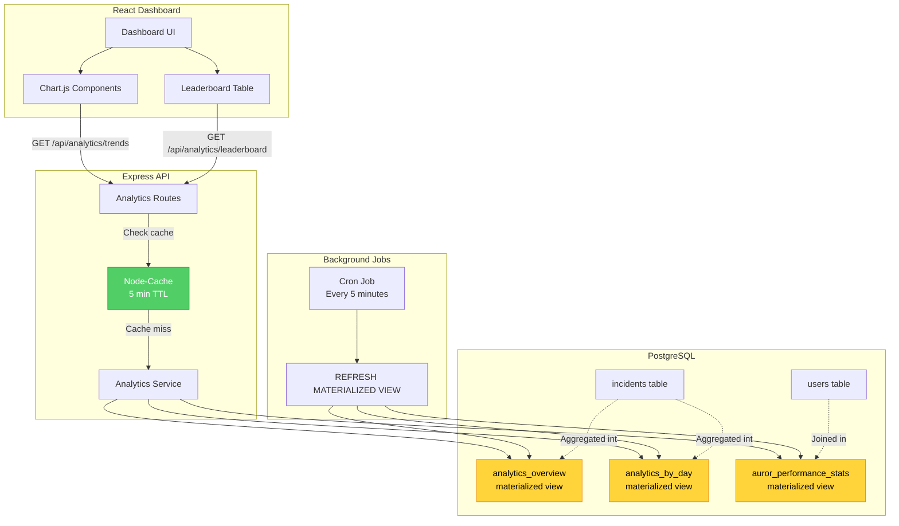
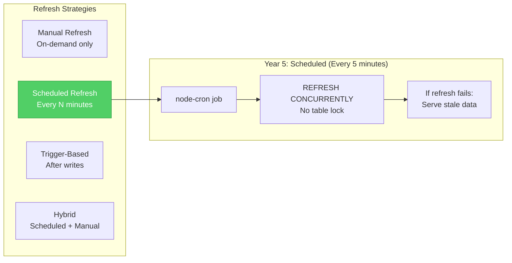
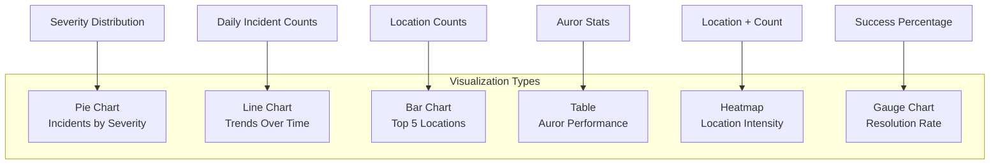

# Year 5: Analytics Dashboard
### *"Seeing Patterns in Magical Chaos"*

**Status**: 📝 Planning Phase
**Estimated Time**: 8-10 hours per stack
**Difficulty**: Advanced
**Prerequisites**: Years 1-4 complete

---

## Table of Contents

- [Learning Objectives](#learning-objectives)
- [User Stories](#user-stories)
- [Technical Specifications](#technical-specifications)
- [Architecture Changes](#architecture-changes)
- [TDD Test Plan (RED Phase)](#tdd-test-plan-red-phase)
- [Implementation Steps (GREEN Phase)](#implementation-steps-green-phase)
- [Code Examples](#code-examples)
- [Success Criteria](#success-criteria)
- [Time Breakdown](#time-breakdown)

---

## Learning Objectives

By the end of Year 5, you will master:

### Core Concepts
1. **Aggregate Queries** - COUNT, SUM, AVG, GROUP BY
2. **Materialized Views** - Pre-computed aggregations for performance
3. **Window Functions** - ROW_NUMBER, RANK, running totals
4. **Time-Series Analysis** - Trend detection over time
5. **Data Visualization** - Chart.js integration
6. **Report Generation** - CSV/PDF export
7. **Query Performance** - EXPLAIN ANALYZE and optimization

### Stack-Specific Skills

#### Gryffindor (React + Express)
- Chart.js or Recharts for visualization
- Aggregation pipelines in SQL
- CSV generation with fast-csv
- React memo for expensive computations
- Custom hooks for analytics data

#### Slytherin (Angular + .NET)
- Angular Charts (ng2-charts)
- LINQ aggregation methods
- Entity Framework GroupBy
- C# record types for DTOs
- SignalR for live dashboard updates

#### Ravenclaw (Spring Boot + Java)
- Spring Data JPA @Query annotations
- JPA Tuple for projection queries
- Thymeleaf chart integration
- Scheduled jobs for materialized view refresh
- Stream API for data transformations

---

## User Stories

### Epic: Dashboard Overview

#### US-ANALYTICS-001: View Dashboard Summary
**As a** Ministry official
**I want to** see key metrics at a glance
**So that** I understand the current state of incidents

**Acceptance Criteria**:
```
Dashboard SHALL display:
  - Total incidents (all time)
  - Open incidents (current)
  - Average resolution time
  - Incidents by severity (pie chart)
  - Incidents over time (line chart, last 30 days)
  - Top 5 locations (bar chart)
  - Active Aurors count
```

**Performance Contract**:
- Dashboard loads in < 500ms
- Uses materialized view for aggregations
- Real-time updates via WebSocket (optional)

#### US-ANALYTICS-002: Incident Trends Over Time
**As a** data analyst
**I want to** see incident trends over different time periods
**So that** I can identify patterns

**Acceptance Criteria**:
- Line chart showing incidents per day/week/month
- Ability to filter by severity
- Ability to filter by location
- Compare current period vs previous period
- Show percentage change (↑ 15% vs last month)

### Epic: Performance Leaderboards

#### US-ANALYTICS-003: Auror Performance Leaderboard
**As a** Head Auror
**I want to** see which Aurors resolve incidents fastest
**So that** I can recognize top performers

**Acceptance Criteria**:
```
Leaderboard SHALL show:
  1. Auror Name
  2. Incidents Resolved (count)
  3. Average Resolution Time
  4. Success Rate (%)
  5. Last 7 Days Activity

Sorted by: Incidents Resolved (default)
Filters: Time period (7d, 30d, 90d, all time)
```

#### US-ANALYTICS-004: House Competition Stats
**As a** student
**I want to** see which house reports the most incidents
**So that** I can encourage my housemates

**Acceptance Criteria**:
- Bar chart: Incidents by house
- Pie chart: Severity distribution per house
- Trophy icon for house with most responsible reporting

### Epic: Detailed Reports

#### US-ANALYTICS-005: Export Analytics Report (CSV)
**As a** Ministry official
**I want to** export analytics data to CSV
**So that** I can analyze in Excel

**Acceptance Criteria**:
- Export button on dashboard
- CSV includes: date, severity, location, status, resolution_time
- Filename: `incidents-report-{date}.csv`
- Downloads immediately (no email)

#### US-ANALYTICS-006: Incident Heatmap by Location
**As a** security officer
**I want to** see which locations have the most incidents
**So that** I can allocate patrols effectively

**Acceptance Criteria**:
- Heatmap visualization (color intensity = incident count)
- Filter by date range
- Filter by severity
- Click location to see incident details

---

## Technical Specifications

### Database Schema Changes

#### New Materialized View: `analytics_overview`
```sql
CREATE MATERIALIZED VIEW analytics_overview AS
SELECT
  COUNT(*) as total_incidents,
  COUNT(*) FILTER (WHERE status = 'OPEN') as open_incidents,
  COUNT(*) FILTER (WHERE status = 'RESOLVED') as resolved_incidents,
  COUNT(*) FILTER (WHERE severity = 'CRITICAL') as critical_count,
  COUNT(*) FILTER (WHERE severity = 'SEVERE') as severe_count,
  COUNT(*) FILTER (WHERE severity = 'SERIOUS') as serious_count,
  COUNT(*) FILTER (WHERE severity = 'MISCHIEF') as mischief_count,
  AVG(
    EXTRACT(EPOCH FROM (resolved_at - reported_at)) / 3600
  ) FILTER (WHERE resolved_at IS NOT NULL) as avg_resolution_hours,
  NOW() as refreshed_at
FROM incidents;

CREATE UNIQUE INDEX idx_analytics_overview_refresh ON analytics_overview(refreshed_at);

-- Refresh function
CREATE OR REPLACE FUNCTION refresh_analytics_overview_materialized()
RETURNS void AS $$
BEGIN
  REFRESH MATERIALIZED VIEW CONCURRENTLY analytics_overview;
END;
$$ LANGUAGE plpgsql;
```

#### New Materialized View: `analytics_by_day`
```sql
CREATE MATERIALIZED VIEW analytics_by_day AS
SELECT
  DATE(reported_at) as incident_date,
  COUNT(*) as incident_count,
  COUNT(*) FILTER (WHERE severity = 'CRITICAL') as critical_count,
  COUNT(*) FILTER (WHERE severity = 'SEVERE') as severe_count,
  COUNT(*) FILTER (WHERE severity = 'SERIOUS') as serious_count,
  COUNT(*) FILTER (WHERE severity = 'MISCHIEF') as mischief_count,
  COUNT(*) FILTER (WHERE status = 'RESOLVED') as resolved_count
FROM incidents
WHERE reported_at > NOW() - INTERVAL '90 days'
GROUP BY DATE(reported_at)
ORDER BY incident_date DESC;

CREATE UNIQUE INDEX idx_analytics_by_day_date ON analytics_by_day(incident_date);
```

#### New Table: `auror_performance_stats`
```sql
CREATE MATERIALIZED VIEW auror_performance_stats AS
SELECT
  u.id as auror_id,
  u.name as auror_name,
  u.house,
  COUNT(i.id) as incidents_resolved,
  AVG(
    EXTRACT(EPOCH FROM (i.resolved_at - i.reported_at)) / 3600
  ) as avg_resolution_hours,
  COUNT(i.id) FILTER (WHERE i.resolved_at > NOW() - INTERVAL '7 days') as resolved_last_7_days,
  COUNT(i.id) FILTER (WHERE i.resolved_at > NOW() - INTERVAL '30 days') as resolved_last_30_days
FROM users u
LEFT JOIN incidents i ON i.resolved_by = u.id AND i.status = 'RESOLVED'
WHERE u.role IN ('AUROR', 'PREFECT')
GROUP BY u.id, u.name, u.house
ORDER BY incidents_resolved DESC;

CREATE UNIQUE INDEX idx_auror_performance_auror_id ON auror_performance_stats(auror_id);
```

### API Endpoints (New)

```
GET /api/analytics/overview
  - Dashboard summary statistics
  - Returns: { total, open, avgResolution, bySeverity, byLocation }

GET /api/analytics/trends?period=<7d|30d|90d>&groupBy=<day|week|month>
  - Time-series data for charts
  - Returns: [{ date, count, severity_breakdown }]

GET /api/analytics/leaderboard/aurors?timeframe=<7d|30d|all>
  - Auror performance rankings
  - Returns: [{ aurorId, name, resolved, avgTime, rank }]

GET /api/analytics/leaderboard/houses
  - House competition stats
  - Returns: [{ house, incidentCount, resolvedCount }]

GET /api/analytics/heatmap/locations?date_from=<>&date_to=<>
  - Incident counts by location
  - Returns: [{ location, count, percentage }]

GET /api/analytics/export/csv?date_from=<>&date_to=<>
  - Export incidents as CSV
  - Returns: CSV file download
```

---

## Architecture Changes

### Analytics Data Flow



### Materialized View Refresh Strategy



### Chart Types by Data



---

## TDD Test Plan (RED Phase)

### Test File Structure

```
gryffindor/server/tests/
├── analytics-overview.test.js
├── analytics-trends.test.js
├── analytics-leaderboard.test.js
├── analytics-export.test.js
└── materialized-views.test.js
```

### Test Cases: Analytics Overview

#### File: `analytics-overview.test.js`

```javascript
describe('GET /api/analytics/overview', () => {
  beforeEach(async () => {
    // Seed known data
    await seedAnalyticsTestData();
    await refreshMaterializedViewsForTesting();
  });

  test('should_return_total_incident_count_accurately', async () => {
    // GIVEN: 50 incidents in database
    // WHEN: GET /api/analytics/overview
    // THEN: response.total === 50
  });

  test('should_return_open_incidents_count_correctly', async () => {
    // GIVEN: 30 OPEN, 20 RESOLVED incidents
    // THEN: response.open === 30
  });

  test('should_calculate_average_resolution_time_hours', async () => {
    // GIVEN: Incidents with resolution times: 2h, 4h, 6h
    // THEN: response.avgResolutionHours === 4.0
  });

  test('should_breakdown_incidents_by_severity_counts', async () => {
    // THEN: response.bySeverity = {
    //   CRITICAL: 5,
    //   SEVERE: 10,
    //   SERIOUS: 20,
    //   MISCHIEF: 15
    // }
  });

  test('should_breakdown_incidents_by_location_counts', async () => {
    // THEN: response.byLocation = { DUNGEONS: 12, ... }
  });

  test('should_use_materialized_view_for_performance', async () => {
    // WHEN: Run EXPLAIN ANALYZE
    // THEN: Query uses 'analytics_overview' materialized view
  });

  test('should_complete_query_within_100ms_threshold', async () => {
    const start = Date.now();
    await request(app).get('/api/analytics/overview');
    const elapsed = Date.now() - start;
    expect(elapsed).toBeLessThan(100);
  });
});
```

### Test Cases: Trends

```javascript
describe('GET /api/analytics/trends', () => {
  test('should_return_daily_incident_counts_for_7d', async () => {
    // WHEN: ?period=7d&groupBy=day
    // THEN: Returns 7 data points (one per day)
  });

  test('should_group_by_week_when_requested', async () => {
    // WHEN: ?period=30d&groupBy=week
    // THEN: Returns ~4 data points
  });

  test('should_include_severity_breakdown_per_period', async () => {
    // THEN: Each data point has { date, total, CRITICAL, SEVERE, ... }
  });

  test('should_calculate_percentage_change_vs_previous_period', async () => {
    // GIVEN: Current week: 50 incidents, Last week: 40 incidents
    // THEN: response.change = "+25%"
  });
});
```

### Test Cases: Leaderboard

```javascript
describe('GET /api/analytics/leaderboard/aurors', () => {
  test('should_rank_aurors_by_incidents_resolved', async () => {
    // GIVEN: Auror A: 50 resolved, Auror B: 30 resolved
    // THEN: Auror A is rank 1, Auror B is rank 2
  });

  test('should_calculate_average_resolution_time_per_auror', async () => {
    // THEN: Each auror has avgResolutionHours field
  });

  test('should_filter_leaderboard_by_timeframe_7d', async () => {
    // WHEN: ?timeframe=7d
    // THEN: Only counts incidents resolved in last 7 days
  });

  test('should_exclude_students_from_leaderboard_results', async () => {
    // THEN: Only AUROR and PREFECT roles included
  });
});
```

### Test Cases: CSV Export

```javascript
describe('GET /api/analytics/export/csv', () => {
  test('should_generate_csv_with_correct_headers', async () => {
    const response = await request(app)
      .get('/api/analytics/export/csv');

    const lines = response.text.split('\n');
    expect(lines[0]).toContain('id,title,severity,location,status');
  });

  test('should_include_all_incidents_in_date_range', async () => {
    // WHEN: ?date_from=2024-01-01&date_to=2024-01-31
    // THEN: CSV contains only incidents from January
  });

  test('should_set_content_disposition_header_for_download', async () => {
    const response = await request(app).get('/api/analytics/export/csv');
    expect(response.headers['content-disposition']).toMatch(/attachment/);
    expect(response.headers['content-type']).toBe('text/csv');
  });

  test('should_escape_commas_in_csv_fields', async () => {
    // GIVEN: Incident title contains comma: "Potion, exploded"
    // THEN: CSV field properly quoted: "Potion, exploded"
  });
});
```

---

## Implementation Steps (GREEN Phase)

### Step 1: Create Analytics Service

#### File: `gryffindor/server/src/services/analyticsServiceManager.js`

```javascript
import { executeQueryWithParameters } from '../db/connectionPoolManager.js';

// ============================================
// Dashboard Overview
// ============================================

export async function fetchDashboardOverviewStatistics() {
  const query = `
    SELECT
      total_incidents,
      open_incidents,
      resolved_incidents,
      critical_count,
      severe_count,
      serious_count,
      mischief_count,
      ROUND(avg_resolution_hours::numeric, 2) as avg_resolution_hours,
      refreshed_at
    FROM analytics_overview
  `;

  const result = await executeQueryWithParameters(query, []);

  if (result.rows.length === 0) {
    // Materialized view not refreshed yet, calculate on-the-fly
    return await calculateOverviewStatisticsRealtime();
  }

  const stats = result.rows[0];

  return {
    total: stats.total_incidents,
    open: stats.open_incidents,
    resolved: stats.resolved_incidents,
    avgResolutionHours: parseFloat(stats.avg_resolution_hours),
    bySeverity: {
      CRITICAL: stats.critical_count,
      SEVERE: stats.severe_count,
      SERIOUS: stats.serious_count,
      MISCHIEF: stats.mischief_count,
    },
    refreshedAt: stats.refreshed_at,
  };
}

async function calculateOverviewStatisticsRealtime() {
  // Fallback: real-time calculation if materialized view unavailable
  const query = `
    SELECT
      COUNT(*) as total,
      COUNT(*) FILTER (WHERE status = 'OPEN') as open,
      COUNT(*) FILTER (WHERE status = 'RESOLVED') as resolved,
      AVG(
        EXTRACT(EPOCH FROM (resolved_at - reported_at)) / 3600
      ) FILTER (WHERE resolved_at IS NOT NULL) as avg_hours
    FROM incidents
  `;

  const result = await executeQueryWithParameters(query, []);
  // ... transform to same format
}

// ============================================
// Trends Over Time
// ============================================

export async function fetchIncidentTrendsOverTime(period = '30d', groupBy = 'day') {
  const periodDays = parseInt(period);
  const intervalMap = {
    day: '1 day',
    week: '7 days',
    month: '30 days',
  };

  const query = `
    SELECT
      incident_date,
      incident_count,
      critical_count,
      severe_count,
      serious_count,
      mischief_count,
      resolved_count
    FROM analytics_by_day
    WHERE incident_date >= NOW() - INTERVAL '${periodDays} days'
    ORDER BY incident_date ASC
  `;

  const result = await executeQueryWithParameters(query, []);

  return result.rows.map(row => ({
    date: row.incident_date,
    total: row.incident_count,
    bySeverity: {
      CRITICAL: row.critical_count,
      SEVERE: row.severe_count,
      SERIOUS: row.serious_count,
      MISCHIEF: row.mischief_count,
    },
    resolved: row.resolved_count,
  }));
}

// ============================================
// Leaderboard: Auror Performance
// ============================================

export async function fetchAurorPerformanceLeaderboard(timeframe = 'all') {
  const timeframeColumn = {
    '7d': 'resolved_last_7_days',
    '30d': 'resolved_last_30_days',
    'all': 'incidents_resolved',
  }[timeframe] || 'incidents_resolved';

  const query = `
    SELECT
      auror_id,
      auror_name,
      house,
      ${timeframeColumn} as incidents_resolved,
      ROUND(avg_resolution_hours::numeric, 2) as avg_resolution_hours,
      ROW_NUMBER() OVER (ORDER BY ${timeframeColumn} DESC) as rank
    FROM auror_performance_stats
    WHERE ${timeframeColumn} > 0
    ORDER BY rank ASC
    LIMIT 20
  `;

  const result = await executeQueryWithParameters(query, []);

  return result.rows.map(row => ({
    rank: row.rank,
    aurorId: row.auror_id,
    name: row.auror_name,
    house: row.house,
    incidentsResolved: row.incidents_resolved,
    avgResolutionHours: parseFloat(row.avg_resolution_hours),
  }));
}

// ============================================
// Leaderboard: House Competition
// ============================================

export async function fetchHouseCompetitionStatistics() {
  const query = `
    SELECT
      u.house,
      COUNT(i.id) as incident_count,
      COUNT(i.id) FILTER (WHERE i.status = 'RESOLVED') as resolved_count,
      COUNT(i.id) FILTER (WHERE i.severity = 'CRITICAL') as critical_count
    FROM users u
    LEFT JOIN incidents i ON i.reported_by = u.id
    WHERE u.house IS NOT NULL
    GROUP BY u.house
    ORDER BY incident_count DESC
  `;

  const result = await executeQueryWithParameters(query, []);

  return result.rows.map(row => ({
    house: row.house,
    incidentCount: row.incident_count,
    resolvedCount: row.resolved_count,
    criticalCount: row.critical_count,
    resolutionRate: row.incident_count > 0
      ? Math.round((row.resolved_count / row.incident_count) * 100)
      : 0,
  }));
}

// ============================================
// Location Heatmap
// ============================================

export async function fetchLocationHeatmapData(dateFrom, dateTo) {
  const query = `
    SELECT
      location,
      COUNT(*) as incident_count,
      ROUND((COUNT(*) * 100.0 / SUM(COUNT(*)) OVER ())::numeric, 2) as percentage
    FROM incidents
    WHERE reported_at BETWEEN $1 AND $2
    GROUP BY location
    ORDER BY incident_count DESC
  `;

  const result = await executeQueryWithParameters(query, [dateFrom, dateTo]);

  return result.rows.map(row => ({
    location: row.location,
    count: row.incident_count,
    percentage: parseFloat(row.percentage),
  }));
}

// ============================================
// CSV Export
// ============================================

export async function generateIncidentReportCsvExport(dateFrom, dateTo) {
  const query = `
    SELECT
      i.id,
      i.title,
      i.description,
      i.severity,
      i.location,
      i.status,
      u.name as reported_by_name,
      i.reported_at,
      i.resolved_at,
      EXTRACT(EPOCH FROM (i.resolved_at - i.reported_at)) / 3600 as resolution_hours
    FROM incidents i
    JOIN users u ON u.id = i.reported_by
    WHERE i.reported_at BETWEEN $1 AND $2
    ORDER BY i.reported_at DESC
  `;

  const result = await executeQueryWithParameters(query, [dateFrom, dateTo]);
  return result.rows;
}

// ============================================
// Materialized View Refresh
// ============================================

export async function refreshAllMaterializedViewsNow() {
  await executeQueryWithParameters('REFRESH MATERIALIZED VIEW CONCURRENTLY analytics_overview', []);
  await executeQueryWithParameters('REFRESH MATERIALIZED VIEW CONCURRENTLY analytics_by_day', []);
  await executeQueryWithParameters('REFRESH MATERIALIZED VIEW CONCURRENTLY auror_performance_stats', []);
  console.log('✅ Materialized views refreshed');
}
```

### Step 2: Create Analytics Routes

#### File: `gryffindor/server/src/routes/analyticsRouteHandler.js`

```javascript
import express from 'express';
import {
  fetchDashboardOverviewStatistics,
  fetchIncidentTrendsOverTime,
  fetchAurorPerformanceLeaderboard,
  fetchHouseCompetitionStatistics,
  fetchLocationHeatmapData,
  generateIncidentReportCsvExport,
} from '../services/analyticsServiceManager.js';
import { authenticateRequestWithJwtToken } from '../middleware/authenticationMiddlewareHandler.js';
import { Parser } from 'json2csv';

const router = express.Router();

// Cache middleware (5 minutes)
const cache = {};
function cacheMiddlewareForAnalyticsData(ttlSeconds = 300) {
  return (req, res, next) => {
    const key = req.originalUrl;
    if (cache[key] && cache[key].expires > Date.now()) {
      return res.json(cache[key].data);
    }
    const originalJson = res.json.bind(res);
    res.json = (data) => {
      cache[key] = {
        data,
        expires: Date.now() + ttlSeconds * 1000,
      };
      return originalJson(data);
    };
    next();
  };
}

// ============================================
// GET /api/analytics/overview
// ============================================

router.get('/overview',
  authenticateRequestWithJwtToken,
  cacheMiddlewareForAnalyticsData(300),
  async (req, res) => {
    try {
      const overview = await fetchDashboardOverviewStatistics();
      return res.status(200).json(overview);
    } catch (error) {
      console.error('Analytics overview error:', error);
      return res.status(500).json({ error: 'Failed to fetch analytics' });
    }
  }
);

// ============================================
// GET /api/analytics/trends
// ============================================

router.get('/trends',
  authenticateRequestWithJwtToken,
  cacheMiddlewareForAnalyticsData(300),
  async (req, res) => {
    try {
      const { period = '30d', groupBy = 'day' } = req.query;
      const trends = await fetchIncidentTrendsOverTime(period, groupBy);
      return res.status(200).json({ trends });
    } catch (error) {
      console.error('Trends error:', error);
      return res.status(500).json({ error: 'Failed to fetch trends' });
    }
  }
);

// ============================================
// GET /api/analytics/leaderboard/aurors
// ============================================

router.get('/leaderboard/aurors',
  authenticateRequestWithJwtToken,
  cacheMiddlewareForAnalyticsData(300),
  async (req, res) => {
    try {
      const { timeframe = 'all' } = req.query;
      const leaderboard = await fetchAurorPerformanceLeaderboard(timeframe);
      return res.status(200).json({ leaderboard });
    } catch (error) {
      console.error('Leaderboard error:', error);
      return res.status(500).json({ error: 'Failed to fetch leaderboard' });
    }
  }
);

// ============================================
// GET /api/analytics/export/csv
// ============================================

router.get('/export/csv',
  authenticateRequestWithJwtToken,
  async (req, res) => {
    try {
      const { date_from, date_to } = req.query;
      const data = await generateIncidentReportCsvExport(
        date_from || '2000-01-01',
        date_to || '2099-12-31'
      );

      const fields = ['id', 'title', 'severity', 'location', 'status', 'reported_by_name', 'reported_at', 'resolved_at', 'resolution_hours'];
      const json2csvParser = new Parser({ fields });
      const csv = json2csvParser.parse(data);

      res.setHeader('Content-Type', 'text/csv');
      res.setHeader('Content-Disposition', `attachment; filename=incidents-report-${Date.now()}.csv`);

      return res.status(200).send(csv);
    } catch (error) {
      console.error('CSV export error:', error);
      return res.status(500).json({ error: 'Failed to export CSV' });
    }
  }
);

export default router;
```

### Step 3: Setup Materialized View Refresh Job

#### File: `gryffindor/server/src/jobs/refreshMaterializedViewsJob.js`

```javascript
import cron from 'node-cron';
import { refreshAllMaterializedViewsNow } from '../services/analyticsServiceManager.js';

export function startMaterializedViewRefreshSchedule() {
  // Refresh every 5 minutes
  cron.schedule('*/5 * * * *', async () => {
    console.log('🔄 Refreshing materialized views...');
    try {
      await refreshAllMaterializedViewsNow();
    } catch (error) {
      console.error('❌ Materialized view refresh failed:', error);
    }
  });

  console.log('✅ Materialized view refresh job scheduled (every 5 minutes)');
}
```

### Step 4: Create React Dashboard Component

#### File: `gryffindor/client/src/components/AnalyticsDashboard.jsx`

```javascript
import { useQuery } from '@tanstack/react-query';
import { Line, Pie, Bar } from 'react-chartjs-2';
import {
  Chart as ChartJS,
  CategoryScale,
  LinearScale,
  PointElement,
  LineElement,
  ArcElement,
  BarElement,
  Title,
  Tooltip,
  Legend,
} from 'chart.js';

ChartJS.register(
  CategoryScale,
  LinearScale,
  PointElement,
  LineElement,
  ArcElement,
  BarElement,
  Title,
  Tooltip,
  Legend
);

export function AnalyticsDashboard() {
  const { data: overview } = useQuery({
    queryKey: ['analytics', 'overview'],
    queryFn: async () => {
      const response = await fetch('/api/analytics/overview', {
        headers: { Authorization: `Bearer ${localStorage.getItem('accessToken')}` },
      });
      return response.json();
    },
    refetchInterval: 5 * 60 * 1000, // Refresh every 5 minutes
  });

  const { data: trendsData } = useQuery({
    queryKey: ['analytics', 'trends', '30d'],
    queryFn: async () => {
      const response = await fetch('/api/analytics/trends?period=30d&groupBy=day', {
        headers: { Authorization: `Bearer ${localStorage.getItem('accessToken')}` },
      });
      return response.json();
    },
  });

  if (!overview || !trendsData) {
    return <div>Loading dashboard...</div>;
  }

  const trendChartData = {
    labels: trendsData.trends.map(t => t.date),
    datasets: [
      {
        label: 'Total Incidents',
        data: trendsData.trends.map(t => t.total),
        borderColor: 'rgb(75, 192, 192)',
        tension: 0.1,
      },
    ],
  };

  const severityPieData = {
    labels: ['Critical', 'Severe', 'Serious', 'Mischief'],
    datasets: [
      {
        data: [
          overview.bySeverity.CRITICAL,
          overview.bySeverity.SEVERE,
          overview.bySeverity.SERIOUS,
          overview.bySeverity.MISCHIEF,
        ],
        backgroundColor: ['#ff6b6b', '#ff8787', '#ffa94d', '#ffe066'],
      },
    ],
  };

  return (
    <div className="analytics-dashboard">
      <h1>Analytics Dashboard</h1>

      <div className="stats-grid">
        <div className="stat-card">
          <h3>Total Incidents</h3>
          <div className="stat-value">{overview.total}</div>
        </div>

        <div className="stat-card">
          <h3>Open Incidents</h3>
          <div className="stat-value">{overview.open}</div>
        </div>

        <div className="stat-card">
          <h3>Avg Resolution Time</h3>
          <div className="stat-value">{overview.avgResolutionHours.toFixed(1)}h</div>
        </div>

        <div className="stat-card">
          <h3>Resolved</h3>
          <div className="stat-value">{overview.resolved}</div>
        </div>
      </div>

      <div className="charts-grid">
        <div className="chart-card">
          <h2>Incidents Over Time (30 Days)</h2>
          <Line data={trendChartData} />
        </div>

        <div className="chart-card">
          <h2>Incidents by Severity</h2>
          <Pie data={severityPieData} />
        </div>
      </div>

      <div className="export-section">
        <button onClick={() => window.open('/api/analytics/export/csv', '_blank')}>
          Export to CSV
        </button>
      </div>
    </div>
  );
}
```

---

## Success Criteria

### Functional Requirements

- [ ] Dashboard loads in < 500ms
- [ ] All aggregate queries accurate
- [ ] Materialized views refresh every 5 minutes
- [ ] Charts render correctly
- [ ] CSV export works with all data
- [ ] Leaderboard ranks correctly
- [ ] Trends show last 30 days
- [ ] Real-time updates (optional)

### Performance Requirements

- [ ] Overview query < 100ms
- [ ] Trends query < 200ms
- [ ] Leaderboard query < 150ms
- [ ] CSV export < 2s for 10k incidents
- [ ] Materialized view refresh < 5s

### Code Quality

- [ ] All tests passing
- [ ] 100% of functions follow 4-word naming convention
- [ ] Caching implemented (5 min TTL)
- [ ] Error handling on all endpoints

---

## Time Breakdown

| Task | Estimated Time |
|------|----------------|
| Create materialized views | 60 min |
| Write analytics tests (RED) | 90 min |
| Implement analytics service | 90 min |
| Create analytics routes | 45 min |
| Setup cron jobs | 30 min |
| Install Chart.js | 15 min |
| Create dashboard UI | 90 min |
| Create chart components | 60 min |
| CSV export implementation | 45 min |
| Manual testing & refinement | 60 min |
| **Total** | **9.5 hours** |

---

**"The data reveals all - analytics magic at your fingertips!"**

*Built with PostgreSQL materialized views, visualized with Chart.js, refreshed with node-cron* 📊
