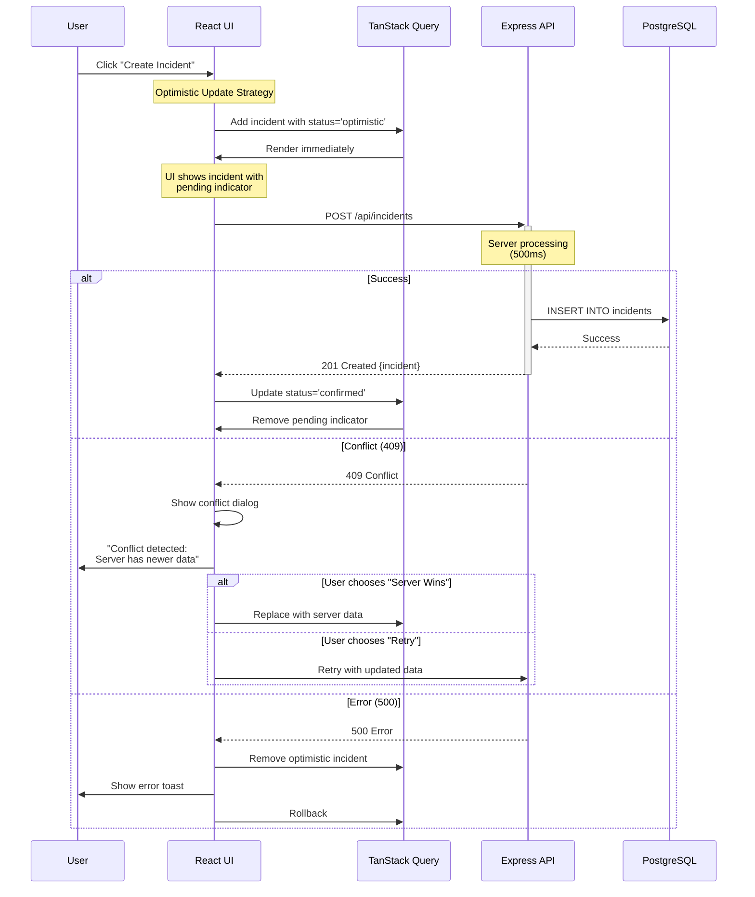
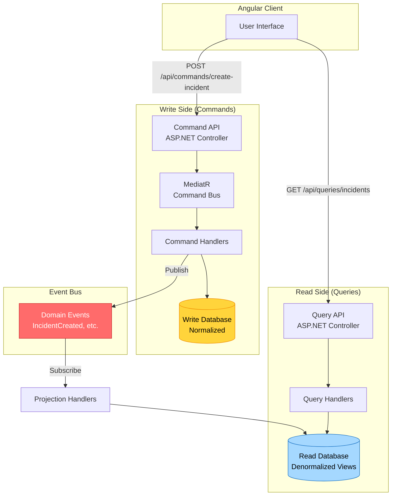
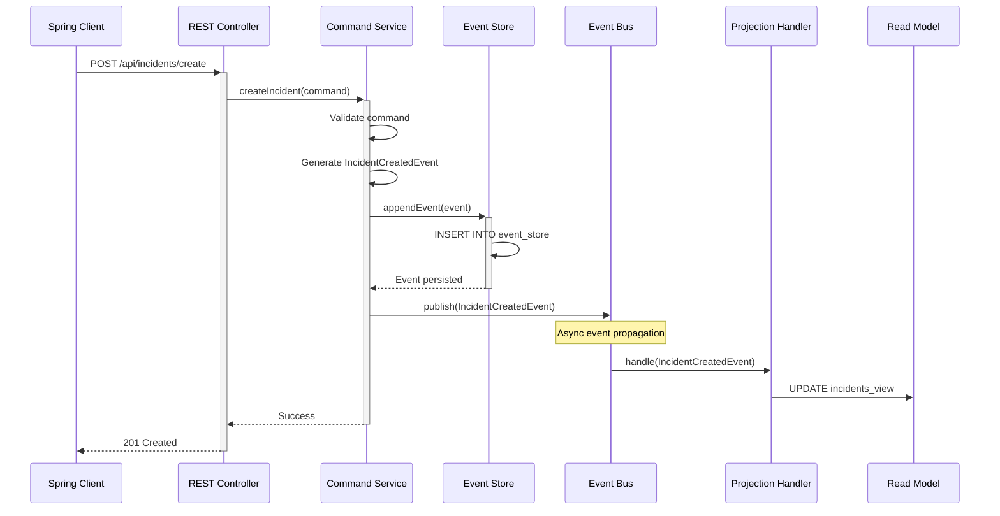
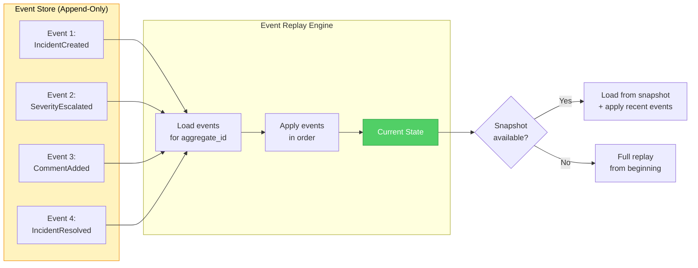

# Year 6: Advanced Patterns
### *"The Magic Behind the Magic"*

**Status**: Planning Phase
**Difficulty**: Advanced
**Prerequisites**: Years 1-5 complete (Year 3.5 Iggy streaming strongly recommended)

> **Note**: Year 3.5 introduced Iggy as the event streaming backbone. Year 6 builds
> directly on top of it: Ravenclaw's Event Sourcing uses Iggy as the event store,
> and Slytherin's CQRS uses Iggy as the event bus connecting the write and read sides.

---

## Table of Contents

- [Learning Objectives](#learning-objectives)
- [User Stories](#user-stories)
- [Technical Specifications](#technical-specifications)
- [Architecture Changes](#architecture-changes)
- [Implementation by House](#implementation-by-house)
- [Code Examples](#code-examples)
- [Success Criteria](#success-criteria)
- [Time Breakdown](#time-breakdown)

---

## Learning Objectives

By the end of Year 6, you will master:

### Core Concepts (House-Specific)
1. **Optimistic Updates** (Gryffindor) - Instant UI feedback
2. **CQRS Pattern** (Slytherin) - Command Query Responsibility Segregation
3. **Event Sourcing** (Ravenclaw) - Append-only event log
4. **Performance Optimization** - Query optimization, caching strategies
5. **Concurrency Patterns** - Handling conflicts gracefully
6. **Design Patterns** - Factory, Strategy, Repository
7. **Advanced TypeScript** - Generics, utility types, decorators

### House-Specific Focus

#### Gryffindor: Optimistic Updates
- Instant UI feedback before server response
- Conflict resolution strategies
- Rollback mechanisms
- TanStack Query mutations with optimistic updates
- WebSocket state synchronization

#### Slytherin: CQRS (Command Query Responsibility Segregation)
- Separate read and write models
- Command handlers
- Query handlers
- MediatR pattern in .NET
- Event-driven architecture

#### Ravenclaw: Event Sourcing
- Append-only event store
- Event replay for state reconstruction
- Snapshots for performance
- Temporal queries (state at any point in time)
- Domain events pattern

---

## User Stories

### Epic: Optimistic Updates (Gryffindor)

#### US-OPTIMISTIC-001: Instant Incident Creation
**As a** Gryffindor user
**I want** incident creation to feel instant
**So that** the interface is responsive

**Acceptance Criteria**:
- WHEN I submit an incident form
- THEN incident SHALL appear immediately in the list
- AND incident SHALL have a "pending" visual indicator
- AND if server rejects, incident SHALL be removed with error message
- AND if server accepts, indicator SHALL change to "confirmed"

**Performance Contract**:
- UI update: < 16ms (one frame)
- Server round-trip: < 500ms
- Conflict resolution: automatic retry up to 3 times

#### US-OPTIMISTIC-002: Instant Severity Updates
**As a** Prefect
**I want** severity changes to apply immediately
**So that** I can escalate incidents quickly

**Acceptance Criteria**:
- WHEN I change severity from SERIOUS to CRITICAL
- THEN UI SHALL update immediately
- AND if server responds with conflict (concurrent edit)
- THEN SHALL show "Conflict detected" dialog
- AND SHALL allow choosing: Keep mine / Use theirs / Merge

### Epic: CQRS (Slytherin)

#### US-CQRS-001: Separate Read/Write Models
**As a** Slytherin developer
**I want** read and write operations separated
**So that** we can optimize each independently

**Acceptance Criteria**:
- Write Model: Normalized incident entity for commands
- Read Model: Denormalized view with all joined data
- Commands: CreateIncident, UpdateSeverity, ResolveIncident
- Queries: GetIncidents, GetIncidentById, SearchIncidents
- EventBus connects Command → Event → Query Model Update

#### US-CQRS-002: Command Validation
**As a** system
**I want** commands validated before execution
**So that** invalid state changes are prevented

**Acceptance Criteria**:
- Command handlers validate business rules
- Validation failures return Result<T, Error>
- No database queries in command validators (use in-memory state)

### Epic: Event Sourcing (Ravenclaw)

#### US-EVENTSOURCING-001: Event Store for All Changes
**As a** Ravenclaw developer
**I want** every state change recorded as an event
**So that** we have a complete audit trail

**Acceptance Criteria**:
```
Events:
  - IncidentCreated
  - SeverityEscalated
  - IncidentAssigned
  - CommentAdded
  - IncidentResolved

Event Store:
  - event_id (UUID)
  - aggregate_id (incident_id)
  - event_type (string)
  - event_data (JSONB)
  - created_at (timestamp)
  - version (integer)
```

#### US-EVENTSOURCING-002: Rebuild State from Events
**As a** system administrator
**I want to** replay events to rebuild state
**So that** I can recover from corruption

**Acceptance Criteria**:
- WHEN I call `rebuildFromEvents(incidentId)`
- THEN system SHALL replay all events in order
- AND reconstruct current state
- SHALL support snapshots every 100 events for performance

#### US-EVENTSOURCING-003: Time Travel Queries
**As an** investigator
**I want to** see incident state at any point in time
**So that** I can understand how it evolved

**Acceptance Criteria**:
- WHEN I query `getStateAsOf(incidentId, '2024-01-15 14:30:00')`
- THEN system SHALL replay events up to that timestamp
- AND return incident state as it was at that moment

---

## Technical Specifications

### Gryffindor: Optimistic Update Architecture

#### Client-Side State Machine
```typescript
type IncidentStatus = 'pending' | 'optimistic' | 'confirmed' | 'error';

interface OptimisticIncident extends Incident {
  _optimisticId?: string;
  _status: IncidentStatus;
  _retryCount?: number;
}
```

#### Conflict Resolution Strategy
```typescript
enum ConflictStrategy {
  SERVER_WINS = 'server_wins',    // Discard local changes
  CLIENT_WINS = 'client_wins',    // Force overwrite server
  MANUAL_MERGE = 'manual_merge',  // Show merge dialog
  RETRY = 'retry',                 // Retry with exponential backoff
}
```

### Slytherin: CQRS Architecture

#### Command Model (Write Side)
```csharp
// Commands
public record CreateIncidentCommand(
    string Title,
    string Description,
    Severity Severity,
    Location Location,
    Guid ReportedBy
);

public record UpdateIncidentSeverityCommand(
    Guid IncidentId,
    Severity NewSeverity,
    Guid UpdatedBy
);

// Command Handlers
public class CreateIncidentHandler : IRequestHandler<CreateIncidentCommand, Result<Guid>>
{
    public async Task<Result<Guid>> Handle(CreateIncidentCommand command, CancellationToken ct)
    {
        // Validate
        // Execute
        // Publish event
    }
}
```

#### Query Model (Read Side)
```csharp
// Queries
public record GetIncidentsQuery(
    int Page,
    int PageSize,
    Severity? Severity
);

// Query Handlers
public class GetIncidentsHandler : IRequestHandler<GetIncidentsQuery, List<IncidentDto>>
{
    public async Task<List<IncidentDto>> Handle(GetIncidentsQuery query, CancellationToken ct)
    {
        // Read from denormalized view
    }
}
```

### Ravenclaw: Event Sourcing Architecture

#### Event Store Schema
```sql
CREATE TABLE event_store (
    event_id UUID PRIMARY KEY DEFAULT gen_random_uuid(),
    aggregate_id UUID NOT NULL,
    aggregate_type VARCHAR(255) NOT NULL,
    event_type VARCHAR(255) NOT NULL,
    event_data JSONB NOT NULL,
    metadata JSONB,
    version INTEGER NOT NULL,
    created_at TIMESTAMP WITH TIME ZONE DEFAULT NOW(),
    UNIQUE (aggregate_id, version)
);

CREATE INDEX idx_event_store_aggregate ON event_store(aggregate_id, version);
CREATE INDEX idx_event_store_type ON event_store(event_type);
CREATE INDEX idx_event_store_created ON event_store(created_at);
```

#### Event Types
```java
// Base Event
@JsonTypeInfo(use = JsonTypeInfo.Id.NAME, property = "@type")
@JsonSubTypes({
    @JsonSubTypes.Type(value = IncidentCreatedEvent.class, name = "IncidentCreated"),
    @JsonSubTypes.Type(value = SeverityEscalatedEvent.class, name = "SeverityEscalated"),
    @JsonSubTypes.Type(value = IncidentResolvedEvent.class, name = "IncidentResolved")
})
public abstract class IncidentEvent {
    private UUID aggregateId;
    private Instant occurredAt;
    private UUID causedBy;
}

public class IncidentCreatedEvent extends IncidentEvent {
    private String title;
    private String description;
    private Severity severity;
    private Location location;
}

public class SeverityEscalatedEvent extends IncidentEvent {
    private Severity oldSeverity;
    private Severity newSeverity;
    private String reason;
}
```

#### Snapshot Schema
```sql
CREATE TABLE incident_snapshots (
    snapshot_id UUID PRIMARY KEY DEFAULT gen_random_uuid(),
    incident_id UUID NOT NULL,
    version INTEGER NOT NULL,
    state JSONB NOT NULL,
    created_at TIMESTAMP WITH TIME ZONE DEFAULT NOW(),
    UNIQUE (incident_id, version)
);

-- Strategy: Create snapshot every 100 events
```

---

## Architecture Changes

### Gryffindor: Optimistic Update Flow



### Slytherin: CQRS Architecture



### Ravenclaw: Event Sourcing Flow



### Event Replay for State Reconstruction



---

## Implementation by House

### Gryffindor: Optimistic Updates Implementation

#### Step 1: TanStack Query Mutation with Optimistic Update

```typescript
// hooks/useOptimisticIncidentMutation.ts

import { useMutation, useQueryClient } from '@tanstack/react-query';
import { v4 as uuidv4 } from 'uuid';

export function useOptimisticIncidentMutation() {
  const queryClient = useQueryClient();

  return useMutation({
    mutationFn: async (newIncident: CreateIncidentDto) => {
      const response = await fetch('/api/incidents', {
        method: 'POST',
        headers: {
          'Content-Type': 'application/json',
          'Authorization': `Bearer ${localStorage.getItem('accessToken')}`,
        },
        body: JSON.stringify(newIncident),
      });

      if (!response.ok) {
        throw new Error('Failed to create incident');
      }

      return response.json();
    },

    // ============================================
    // Optimistic Update: Apply immediately
    // ============================================
    onMutate: async (newIncident) => {
      // Cancel any outgoing refetches
      await queryClient.cancelQueries({ queryKey: ['incidents'] });

      // Snapshot the previous value
      const previousIncidents = queryClient.getQueryData(['incidents']);

      // Optimistically update to the new value
      const optimisticIncident = {
        id: uuidv4(), // Temporary ID
        ...newIncident,
        _status: 'optimistic' as const,
        _optimisticId: uuidv4(),
        reported_at: new Date().toISOString(),
        status: 'OPEN',
      };

      queryClient.setQueryData(['incidents'], (old: any) => ({
        ...old,
        incidents: [optimisticIncident, ...(old?.incidents || [])],
      }));

      // Return context with snapshot
      return { previousIncidents, optimisticIncident };
    },

    // ============================================
    // On Success: Replace optimistic with real
    // ============================================
    onSuccess: (serverIncident, variables, context) => {
      queryClient.setQueryData(['incidents'], (old: any) => ({
        ...old,
        incidents: old.incidents.map((inc: any) =>
          inc._optimisticId === context.optimisticIncident._optimisticId
            ? { ...serverIncident, _status: 'confirmed' }
            : inc
        ),
      }));

      // Remove temporary optimistic ID after 2 seconds
      setTimeout(() => {
        queryClient.setQueryData(['incidents'], (old: any) => ({
          ...old,
          incidents: old.incidents.map((inc: any) =>
            inc.id === serverIncident.id
              ? { ...inc, _status: undefined, _optimisticId: undefined }
              : inc
          ),
        }));
      }, 2000);
    },

    // ============================================
    // On Error: Rollback
    // ============================================
    onError: (error, variables, context) => {
      // Rollback to previous value
      if (context?.previousIncidents) {
        queryClient.setQueryData(['incidents'], context.previousIncidents);
      }

      // Show error notification
      toast.error('Failed to create incident. Please try again.');
    },

    // ============================================
    // Always refetch after mutation settles
    // ============================================
    onSettled: () => {
      queryClient.invalidateQueries({ queryKey: ['incidents'] });
    },
  });
}
```

#### Step 2: React Component with Optimistic UI

```typescript
// components/IncidentListWithOptimisticUpdates.tsx

export function IncidentListWithOptimisticUpdates() {
  const { data } = useQuery(['incidents'], fetchIncidents);
  const createMutation = useOptimisticIncidentMutation();

  const handleCreate = (formData: CreateIncidentDto) => {
    createMutation.mutate(formData);
  };

  return (
    <div>
      <CreateIncidentForm onSubmit={handleCreate} />

      <div className="incidents-list">
        {data?.incidents.map((incident) => (
          <IncidentCard
            key={incident._optimisticId || incident.id}
            incident={incident}
            isOptimistic={incident._status === 'optimistic'}
            isConfirmed={incident._status === 'confirmed'}
          />
        ))}
      </div>
    </div>
  );
}

function IncidentCard({ incident, isOptimistic, isConfirmed }: Props) {
  return (
    <div className={`incident-card ${isOptimistic ? 'optimistic' : ''}`}>
      <h3>{incident.title}</h3>
      {isOptimistic && (
        <span className="badge badge-pending">
          ⏳ Saving...
        </span>
      )}
      {isConfirmed && (
        <span className="badge badge-confirmed">
          ✅ Confirmed
        </span>
      )}
    </div>
  );
}
```

### Slytherin: CQRS Implementation

#### Step 1: Define Commands and Queries

```csharp
// Application/Commands/CreateIncidentCommand.cs

using MediatR;

namespace MaraudersMap.Application.Commands
{
    public record CreateIncidentCommand(
        string Title,
        string Description,
        Severity Severity,
        Location Location,
        Guid ReportedBy
    ) : IRequest<Result<Guid>>;
}

// Application/Handlers/CreateIncidentHandler.cs

using MediatR;

namespace MaraudersMap.Application.Handlers
{
    public class CreateIncidentHandler
        : IRequestHandler<CreateIncidentCommand, Result<Guid>>
    {
        private readonly IIncidentRepository _repository;
        private readonly IEventBus _eventBus;

        public CreateIncidentHandler(
            IIncidentRepository repository,
            IEventBus eventBus)
        {
            _repository = repository;
            _eventBus = eventBus;
        }

        public async Task<Result<Guid>> Handle(
            CreateIncidentCommand command,
            CancellationToken cancellationToken)
        {
            // Validate
            if (string.IsNullOrWhiteSpace(command.Title))
            {
                return Result.Failure<Guid>("Title is required");
            }

            // Create domain entity
            var incident = Incident.Create(
                command.Title,
                command.Description,
                command.Severity,
                command.Location,
                command.ReportedBy
            );

            // Persist to write model
            await _repository.AddAsync(incident, cancellationToken);
            await _repository.SaveChangesAsync(cancellationToken);

            // Publish domain event
            await _eventBus.PublishAsync(
                new IncidentCreatedEvent(incident.Id, incident),
                cancellationToken
            );

            return Result.Success(incident.Id);
        }
    }
}
```

#### Step 2: Query Side

```csharp
// Application/Queries/GetIncidentsQuery.cs

public record GetIncidentsQuery(
    int Page,
    int PageSize,
    Severity? Severity,
    string? SearchQuery
) : IRequest<PagedResult<IncidentDto>>;

// Application/Handlers/GetIncidentsHandler.cs

public class GetIncidentsHandler
    : IRequestHandler<GetIncidentsQuery, PagedResult<IncidentDto>>
{
    private readonly IIncidentReadRepository _readRepository;

    public async Task<PagedResult<IncidentDto>> Handle(
        GetIncidentsQuery query,
        CancellationToken cancellationToken)
    {
        // Query denormalized read model
        var incidents = await _readRepository.GetPagedAsync(
            query.Page,
            query.PageSize,
            query.Severity,
            query.SearchQuery,
            cancellationToken
        );

        return incidents;
    }
}
```

#### Step 3: Event Bus and Projections

```csharp
// Infrastructure/EventBus/InMemoryEventBus.cs

public class InMemoryEventBus : IEventBus
{
    private readonly IServiceProvider _serviceProvider;

    public async Task PublishAsync<TEvent>(TEvent @event, CancellationToken ct)
        where TEvent : IDomainEvent
    {
        var handlers = _serviceProvider.GetServices<IEventHandler<TEvent>>();

        foreach (var handler in handlers)
        {
            await handler.HandleAsync(@event, ct);
        }
    }
}

// Application/EventHandlers/IncidentCreatedProjection.cs

public class IncidentCreatedProjection : IEventHandler<IncidentCreatedEvent>
{
    private readonly IIncidentReadRepository _readRepository;

    public async Task HandleAsync(IncidentCreatedEvent @event, CancellationToken ct)
    {
        // Update read model
        var dto = new IncidentDto
        {
            Id = @event.AggregateId,
            Title = @event.Title,
            Description = @event.Description,
            Severity = @event.Severity,
            // ... denormalized data with joins
        };

        await _readRepository.AddAsync(dto, ct);
    }
}
```

### Ravenclaw: Event Sourcing Implementation

#### Step 1: Event Store Repository

```java
// domain/EventStore.java

@Repository
public class EventStoreRepository {

    @Autowired
    private JdbcTemplate jdbcTemplate;

    @Autowired
    private ObjectMapper objectMapper;

    public void appendEvent(IncidentEvent event, UUID aggregateId) {
        String sql = """
            INSERT INTO event_store
            (aggregate_id, aggregate_type, event_type, event_data, version)
            VALUES (?, 'Incident', ?, ?::jsonb, (
                SELECT COALESCE(MAX(version), 0) + 1
                FROM event_store
                WHERE aggregate_id = ?
            ))
        """;

        try {
            String eventData = objectMapper.writeValueAsString(event);

            jdbcTemplate.update(sql,
                aggregateId,
                event.getClass().getSimpleName(),
                eventData,
                aggregateId
            );
        } catch (JsonProcessingException e) {
            throw new RuntimeException("Failed to serialize event", e);
        }
    }

    public List<IncidentEvent> getEventsForAggregate(UUID aggregateId) {
        String sql = """
            SELECT event_type, event_data
            FROM event_store
            WHERE aggregate_id = ?
            ORDER BY version ASC
        """;

        return jdbcTemplate.query(sql, (rs, rowNum) -> {
            String eventType = rs.getString("event_type");
            String eventData = rs.getString("event_data");

            try {
                Class<?> eventClass = Class.forName(
                    "com.hogwarts.events." + eventType
                );
                return (IncidentEvent) objectMapper.readValue(
                    eventData,
                    eventClass
                );
            } catch (Exception e) {
                throw new RuntimeException("Failed to deserialize event", e);
            }
        }, aggregateId);
    }
}
```

#### Step 2: Aggregate Reconstruction

```java
// domain/Incident.java

@Entity
public class Incident {
    @Id
    private UUID id;

    private String title;
    private Severity severity;
    private IncidentStatus status;

    // Event sourcing: Rebuild from events
    public static Incident fromEvents(List<IncidentEvent> events) {
        Incident incident = new Incident();

        for (IncidentEvent event : events) {
            incident.apply(event);
        }

        return incident;
    }

    private void apply(IncidentEvent event) {
        switch (event) {
            case IncidentCreatedEvent e -> {
                this.id = e.getAggregateId();
                this.title = e.getTitle();
                this.severity = e.getSeverity();
                this.status = IncidentStatus.OPEN;
            }
            case SeverityEscalatedEvent e -> {
                this.severity = e.getNewSeverity();
            }
            case IncidentResolvedEvent e -> {
                this.status = IncidentStatus.RESOLVED;
            }
            default -> throw new IllegalArgumentException(
                "Unknown event type: " + event.getClass()
            );
        }
    }
}
```

#### Step 3: Time Travel Queries

```java
// service/IncidentQueryService.java

@Service
public class IncidentQueryService {

    @Autowired
    private EventStoreRepository eventStore;

    public Incident getIncidentAsOf(UUID incidentId, Instant timestamp) {
        // Get all events up to timestamp
        List<IncidentEvent> events = eventStore.getEventsForAggregate(incidentId)
            .stream()
            .filter(e -> e.getOccurredAt().isBefore(timestamp))
            .toList();

        // Rebuild state
        return Incident.fromEvents(events);
    }

    public List<Incident> getAllIncidentsAsOf(Instant timestamp) {
        // Get all aggregate IDs
        List<UUID> aggregateIds = eventStore.getAllAggregateIds();

        return aggregateIds.stream()
            .map(id -> getIncidentAsOf(id, timestamp))
            .toList();
    }
}
```

---

## Success Criteria

### Gryffindor
- [ ] Optimistic updates feel instant (< 16ms UI update)
- [ ] Conflict resolution dialog works
- [ ] Rollback on error works correctly
- [ ] No race conditions with concurrent mutations

### Slytherin
- [ ] Commands and queries fully separated
- [ ] MediatR pipeline working
- [ ] Event bus propagates events
- [ ] Read model updates asynchronously

### Ravenclaw
- [ ] All state changes recorded as events
- [ ] Event replay reconstructs state correctly
- [ ] Time travel queries work
- [ ] Snapshots improve performance

---

## Time Breakdown

| House | Task | Time |
|-------|------|------|
| **Gryffindor** | Optimistic mutations | 10 hours |
| **Slytherin** | CQRS implementation | 12 hours |
| **Ravenclaw** | Event sourcing | 12 hours |

---

**"Advanced patterns unlock new levels of magical software engineering!"**

*Each house demonstrates enterprise-grade architectural patterns* 🏗️
