# The Marauder's Map - Backend Layer Architecture

**Version**: v0.0.1 (Year 1: Gryffindor Wing)
**Analysis Tool**: Parseltongue v1.4.3

---

## Backend Architecture Layers

The Gryffindor backend follows a clean layered architecture with clear separation of concerns.

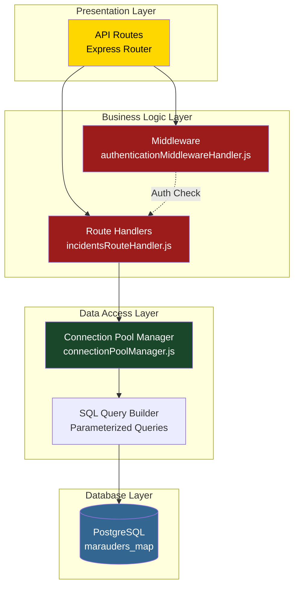
```mermaid
graph TB
    subgraph "Presentation Layer"
        API[API Routes<br/>Express Router]
    end

    subgraph "Business Logic Layer"
        Routes[Route Handlers<br/>incidentsRouteHandler.js]
        Middleware[Middleware<br/>authenticationMiddlewareHandler.js]
    end

    subgraph "Data Access Layer"
        Pool[Connection Pool Manager<br/>connectionPoolManager.js]
        Queries[SQL Query Builder<br/>Parameterized Queries]
    end

    subgraph "Database Layer"
        PG[(PostgreSQL<br/>marauders_map)]
    end

    API --> Routes
    API --> Middleware
    Routes --> Pool
    Pool --> Queries
    Queries --> PG
    Middleware -.Auth Check.-> Routes

    style API fill:#ffd700,color:#000
    style Routes fill:#9c1c1c,color:#fff
    style Middleware fill:#9c1c1c,color:#fff
    style Pool fill:#1a472a,color:#fff
    style PG fill:#336791,color:#fff
```

---

## File Structure and Dependencies

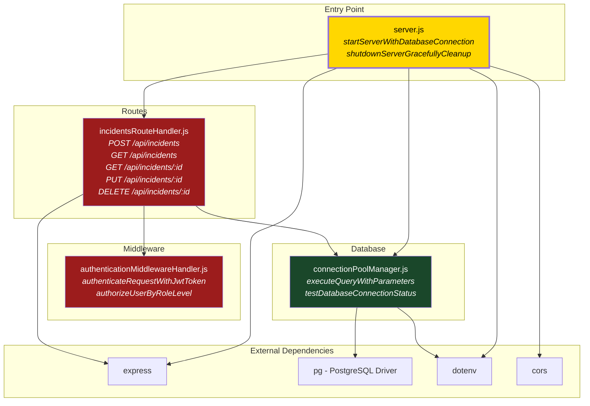
```mermaid
graph TD
    subgraph "Entry Point"
        SERVER[server.js<br/><i>startServerWithDatabaseConnection</i><br/><i>shutdownServerGracefullyCleanup</i>]
    end

    subgraph "Routes"
        INCIDENTS[incidentsRouteHandler.js<br/><i>POST /api/incidents</i><br/><i>GET /api/incidents</i><br/><i>GET /api/incidents/:id</i><br/><i>PUT /api/incidents/:id</i><br/><i>DELETE /api/incidents/:id</i>]
    end

    subgraph "Middleware"
        AUTH[authenticationMiddlewareHandler.js<br/><i>authenticateRequestWithJwtToken</i><br/><i>authorizeUserByRoleLevel</i>]
    end

    subgraph "Database"
        POOL[connectionPoolManager.js<br/><i>executeQueryWithParameters</i><br/><i>testDatabaseConnectionStatus</i>]
    end

    subgraph "External Dependencies"
        EXPRESS[express]
        PG[pg - PostgreSQL Driver]
        DOTENV[dotenv]
        CORS[cors]
    end

    SERVER --> EXPRESS
    SERVER --> CORS
    SERVER --> DOTENV
    SERVER --> INCIDENTS
    SERVER --> POOL

    INCIDENTS --> EXPRESS
    INCIDENTS --> AUTH
    INCIDENTS --> POOL

    POOL --> PG
    POOL --> DOTENV

    style SERVER fill:#ffd700,color:#000,stroke-width:3px
    style INCIDENTS fill:#9c1c1c,color:#fff
    style AUTH fill:#9c1c1c,color:#fff
    style POOL fill:#1a472a,color:#fff
```

---

## Layer 1: Entry Point (server.js)

### Purpose
Bootstrap the Express application, configure middleware, and handle graceful shutdown.

### Key Functions (4WNC)

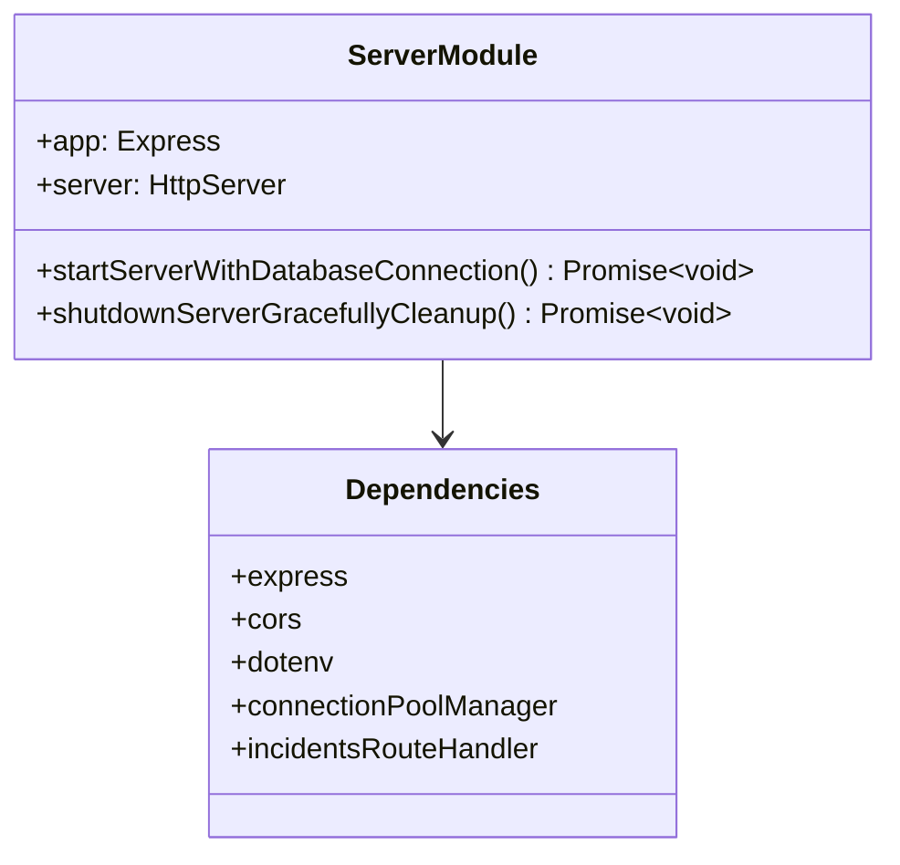
```mermaid
classDiagram
    class ServerModule {
        +app: Express
        +server: HttpServer
        +startServerWithDatabaseConnection() Promise~void~
        +shutdownServerGracefullyCleanup() Promise~void~
    }

    class Dependencies {
        +express
        +cors
        +dotenv
        +connectionPoolManager
        +incidentsRouteHandler
    }

    ServerModule --> Dependencies
```

### Function Flow

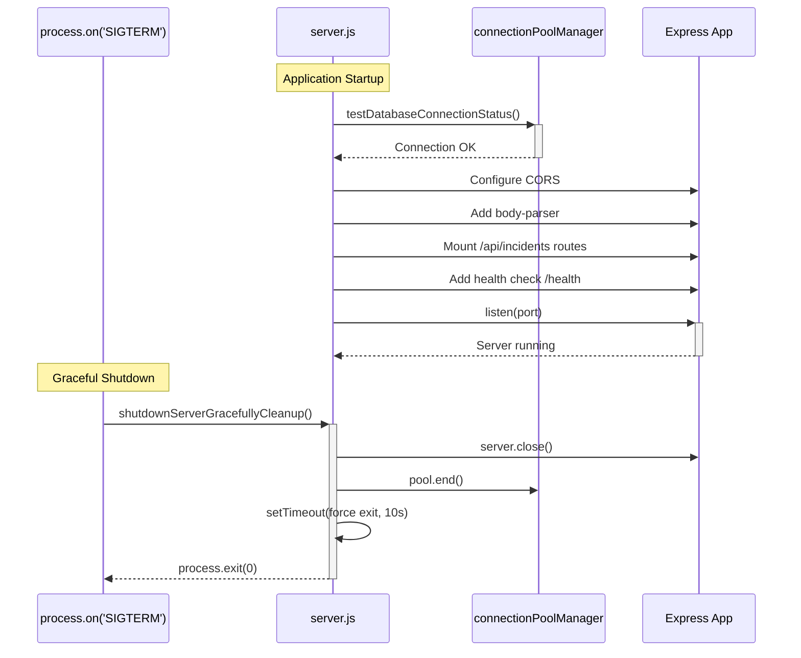
```mermaid
sequenceDiagram
    participant Main as process.on('SIGTERM')
    participant Server as server.js
    participant DB as connectionPoolManager
    participant Express as Express App

    Note over Server: Application Startup
    Server->>+DB: testDatabaseConnectionStatus()
    DB-->>-Server: Connection OK

    Server->>Express: Configure CORS
    Server->>Express: Add body-parser
    Server->>Express: Mount /api/incidents routes
    Server->>Express: Add health check /health

    Server->>+Express: listen(port)
    Express-->>-Server: Server running

    Note over Main: Graceful Shutdown
    Main->>+Server: shutdownServerGracefullyCleanup()
    Server->>Express: server.close()
    Server->>DB: pool.end()
    Server->>Server: setTimeout(force exit, 10s)
    Server-->>-Main: process.exit(0)
```

### Code Responsibilities

| Responsibility | Implementation |
|----------------|----------------|
| **Database Connection** | Test connection before starting server |
| **Middleware Configuration** | CORS, body-parser, request logging |
| **Route Mounting** | `/api/incidents` → incidentsRouteHandler |
| **Health Check** | `GET /health` → `{ status: 'ok' }` |
| **Graceful Shutdown** | SIGTERM/SIGINT handlers |
| **Error Handling** | Global error handler |

---

## Layer 2: Route Handlers (incidentsRouteHandler.js)

### Purpose
Define REST API endpoints for incidents resource, implement business logic, validate requests.

### API Endpoints

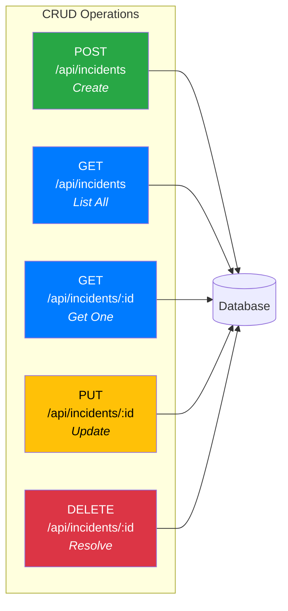
```mermaid
graph LR
    subgraph "CRUD Operations"
        POST[POST<br/>/api/incidents<br/><i>Create</i>]
        GET_LIST[GET<br/>/api/incidents<br/><i>List All</i>]
        GET_ONE[GET<br/>/api/incidents/:id<br/><i>Get One</i>]
        PUT[PUT<br/>/api/incidents/:id<br/><i>Update</i>]
        DELETE[DELETE<br/>/api/incidents/:id<br/><i>Resolve</i>]
    end

    POST --> DB[(Database)]
    GET_LIST --> DB
    GET_ONE --> DB
    PUT --> DB
    DELETE --> DB

    style POST fill:#28a745,color:#fff
    style GET_LIST fill:#007bff,color:#fff
    style GET_ONE fill:#007bff,color:#fff
    style PUT fill:#ffc107,color:#000
    style DELETE fill:#dc3545,color:#fff
```

### Helper Functions (4WNC)

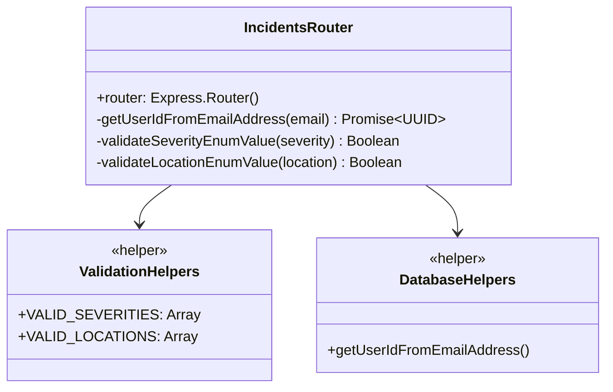
```mermaid
classDiagram
    class IncidentsRouter {
        +router: Express.Router()
        -getUserIdFromEmailAddress(email) Promise~UUID~
        -validateSeverityEnumValue(severity) Boolean
        -validateLocationEnumValue(location) Boolean
    }

    class ValidationHelpers {
        <<helper>>
        +VALID_SEVERITIES: Array
        +VALID_LOCATIONS: Array
    }

    class DatabaseHelpers {
        <<helper>>
        +getUserIdFromEmailAddress()
    }

    IncidentsRouter --> ValidationHelpers
    IncidentsRouter --> DatabaseHelpers
```

### Request/Response Flow

```mermaid
sequenceDiagram
    participant Client
    participant Auth as Auth Middleware
    participant Handler as Route Handler
    participant Validator as Validation Functions
    participant DB as Database Pool

    Client->>+Auth: POST /api/incidents<br/>{ title, severity, location }
    Auth->>Auth: Check Bearer token
    Auth-->>Handler: req.user = { email, role }

    Handler->>+Validator: validateSeverityEnumValue(severity)
    Validator-->>-Handler: true/false

    Handler->>+Validator: validateLocationEnumValue(location)
    Validator-->>-Handler: true/false

    alt Validation Failed
        Handler-->>Client: 400 Bad Request
    end

    Handler->>+DB: getUserIdFromEmailAddress(email)
    DB-->>-Handler: user_id

    Handler->>+DB: INSERT INTO incidents...
    DB-->>-Handler: Created incident row

    Handler-->>-Client: 201 Created<br/>{ id, title, ... }
```

### Validation Rules

| Field | Validation | Default |
|-------|-----------|---------|
| **title** | Required, non-empty string | - |
| **description** | Optional string | null |
| **severity** | Enum: MISCHIEF, SUSPICIOUS, DANGEROUS, UNFORGIVABLE | MISCHIEF |
| **location** | Enum: HOGWARTS, HOGSMEADE, etc. | - |
| **Authorization** | Bearer token required | - |

---

## Layer 3: Middleware (authenticationMiddlewareHandler.js)

### Purpose
Authenticate requests using JWT tokens (mocked in Year 1), authorize users based on roles.

### Middleware Functions

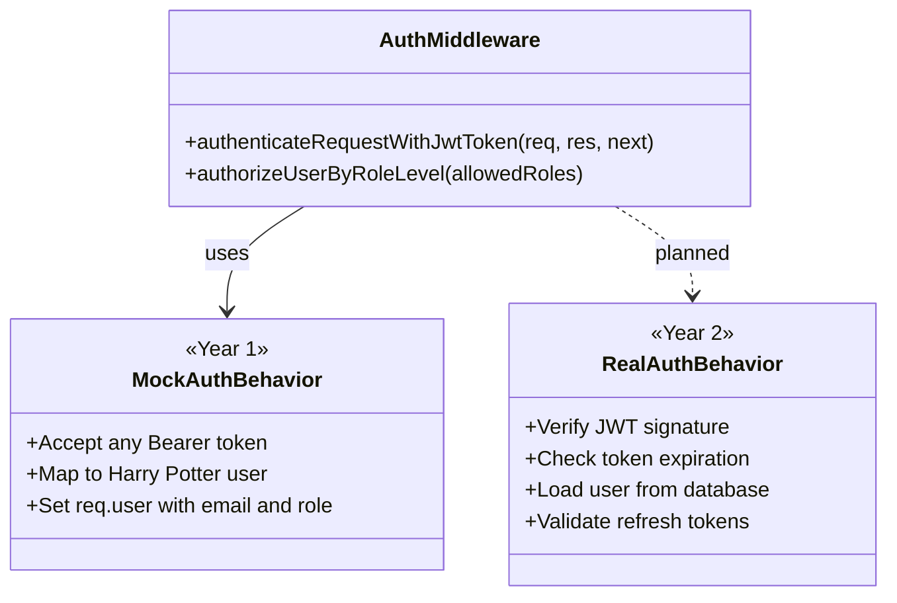
```mermaid
classDiagram
    class AuthMiddleware {
        +authenticateRequestWithJwtToken(req, res, next)
        +authorizeUserByRoleLevel(allowedRoles)
    }

    class MockAuthBehavior {
        <<Year 1>>
        +Accept any Bearer token
        +Map to Harry Potter user
        +Set req.user with email and role
    }

    class RealAuthBehavior {
        <<Year 2>>
        +Verify JWT signature
        +Check token expiration
        +Load user from database
        +Validate refresh tokens
    }

    AuthMiddleware --> MockAuthBehavior : uses
    AuthMiddleware ..> RealAuthBehavior : planned
```

### Authentication Flow (Year 1)

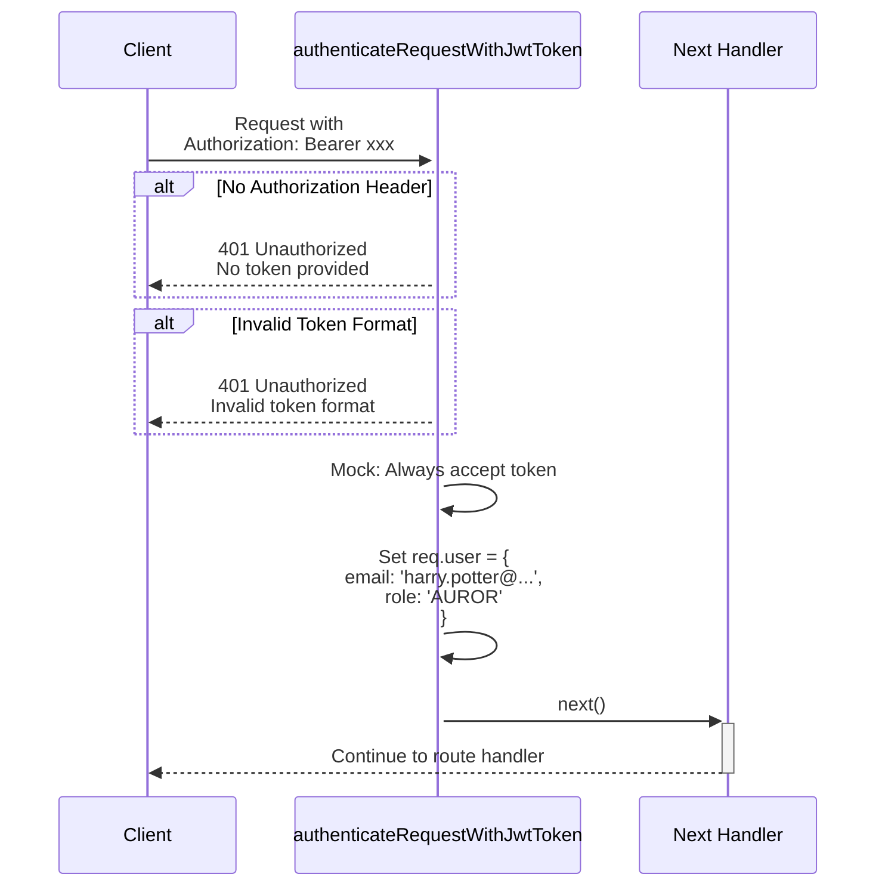
```mermaid
sequenceDiagram
    participant Client
    participant Auth as authenticateRequestWithJwtToken
    participant Next as Next Handler

    Client->>+Auth: Request with<br/>Authorization: Bearer xxx

    alt No Authorization Header
        Auth-->>Client: 401 Unauthorized<br/>No token provided
    end

    alt Invalid Token Format
        Auth-->>Client: 401 Unauthorized<br/>Invalid token format
    end

    Auth->>Auth: Mock: Always accept token
    Auth->>Auth: Set req.user = {<br/>  email: 'harry.potter@...',<br/>  role: 'AUROR'<br/>}

    Auth->>+Next: next()
    Next-->>-Client: Continue to route handler
```

### Authorization Flow

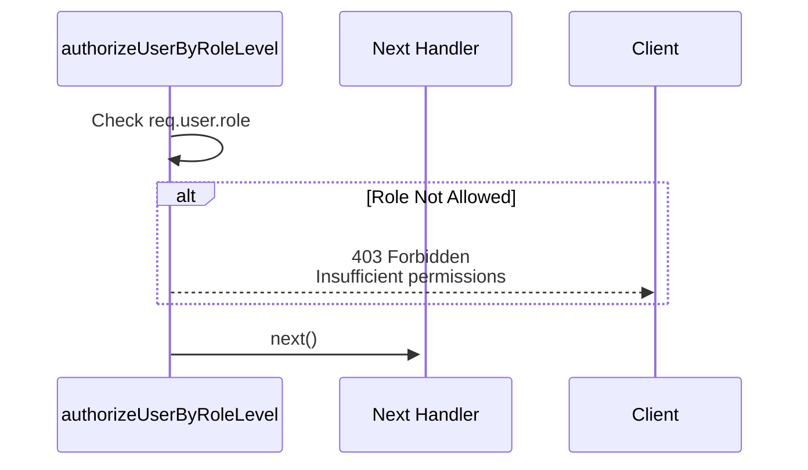
```mermaid
sequenceDiagram
    participant Auth as authorizeUserByRoleLevel
    participant Next as Next Handler

    Auth->>Auth: Check req.user.role

    alt Role Not Allowed
        Auth-->>Client: 403 Forbidden<br/>Insufficient permissions
    end

    Auth->>+Next: next()
```

### Role Hierarchy

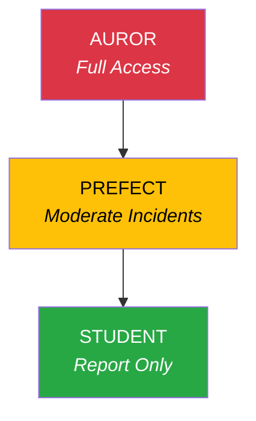
```mermaid
graph TD
    AUROR[AUROR<br/><i>Full Access</i>]
    PREFECT[PREFECT<br/><i>Moderate Incidents</i>]
    STUDENT[STUDENT<br/><i>Report Only</i>]

    AUROR --> PREFECT
    PREFECT --> STUDENT

    style AUROR fill:#dc3545,color:#fff
    style PREFECT fill:#ffc107,color:#000
    style STUDENT fill:#28a745,color:#fff
```

---

## Layer 4: Data Access (connectionPoolManager.js)

### Purpose
Manage PostgreSQL connection pool, execute parameterized queries, provide database health checks.

### Connection Pool Configuration

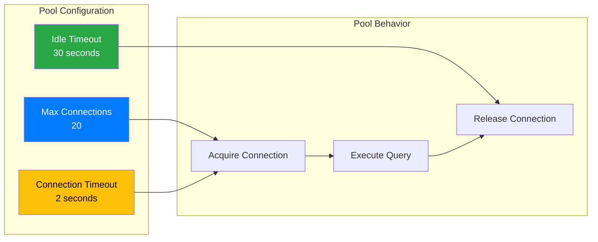
```mermaid
graph LR
    subgraph "Pool Configuration"
        MAX[Max Connections<br/>20]
        IDLE[Idle Timeout<br/>30 seconds]
        CONN[Connection Timeout<br/>2 seconds]
    end

    subgraph "Pool Behavior"
        ACQUIRE[Acquire Connection]
        EXECUTE[Execute Query]
        RELEASE[Release Connection]
    end

    MAX --> ACQUIRE
    IDLE --> RELEASE
    CONN --> ACQUIRE

    ACQUIRE --> EXECUTE
    EXECUTE --> RELEASE

    style MAX fill:#007bff,color:#fff
    style IDLE fill:#28a745,color:#fff
    style CONN fill:#ffc107,color:#000
```

### Key Functions

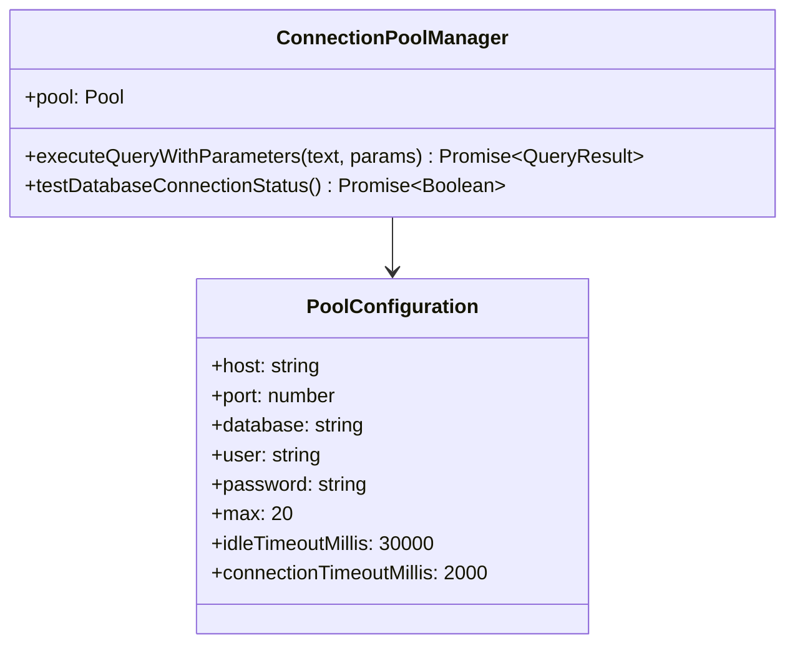
```mermaid
classDiagram
    class ConnectionPoolManager {
        +pool: Pool
        +executeQueryWithParameters(text, params) Promise~QueryResult~
        +testDatabaseConnectionStatus() Promise~Boolean~
    }

    class PoolConfiguration {
        +host: string
        +port: number
        +database: string
        +user: string
        +password: string
        +max: 20
        +idleTimeoutMillis: 30000
        +connectionTimeoutMillis: 2000
    }

    ConnectionPoolManager --> PoolConfiguration
```

### Query Execution Flow

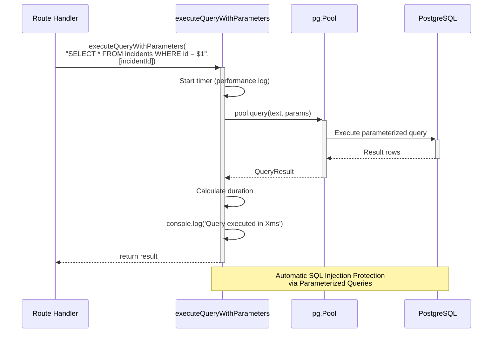
```mermaid
sequenceDiagram
    participant Handler as Route Handler
    participant Pool as executeQueryWithParameters
    participant PG as pg.Pool
    participant DB as PostgreSQL

    Handler->>+Pool: executeQueryWithParameters(<br/>"SELECT * FROM incidents WHERE id = $1",<br/>[incidentId])

    Pool->>Pool: Start timer (performance log)

    Pool->>+PG: pool.query(text, params)
    PG->>+DB: Execute parameterized query
    DB-->>-PG: Result rows
    PG-->>-Pool: QueryResult

    Pool->>Pool: Calculate duration
    Pool->>Pool: console.log('Query executed in Xms')

    Pool-->>-Handler: return result

    Note over Pool,DB: Automatic SQL Injection Protection<br/>via Parameterized Queries
```

### Error Handling

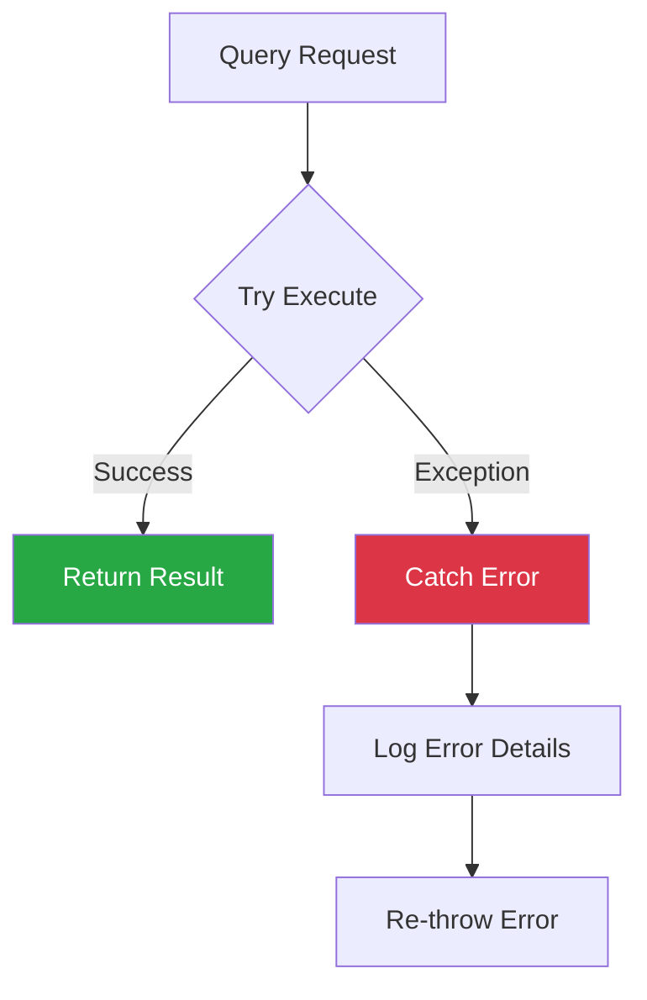
```mermaid
graph TD
    START[Query Request]
    TRY{Try Execute}
    SUCCESS[Return Result]
    ERROR[Catch Error]
    LOG[Log Error Details]
    THROW[Re-throw Error]

    START --> TRY
    TRY -->|Success| SUCCESS
    TRY -->|Exception| ERROR
    ERROR --> LOG
    LOG --> THROW

    style ERROR fill:#dc3545,color:#fff
    style SUCCESS fill:#28a745,color:#fff
```

---

## Cross-Cutting Concerns

### Logging Strategy

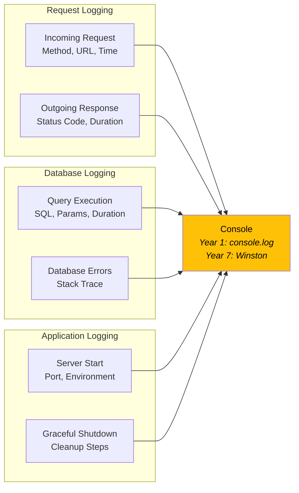
```mermaid
graph LR
    subgraph "Request Logging"
        REQ_IN[Incoming Request<br/>Method, URL, Time]
        REQ_OUT[Outgoing Response<br/>Status Code, Duration]
    end

    subgraph "Database Logging"
        DB_QUERY[Query Execution<br/>SQL, Params, Duration]
        DB_ERROR[Database Errors<br/>Stack Trace]
    end

    subgraph "Application Logging"
        APP_START[Server Start<br/>Port, Environment]
        APP_SHUTDOWN[Graceful Shutdown<br/>Cleanup Steps]
    end

    REQ_IN --> Console
    REQ_OUT --> Console
    DB_QUERY --> Console
    DB_ERROR --> Console
    APP_START --> Console
    APP_SHUTDOWN --> Console

    Console[Console<br/><i>Year 1: console.log</i><br/><i>Year 7: Winston</i>]

    style Console fill:#ffc107,color:#000
```

### Error Handling Strategy

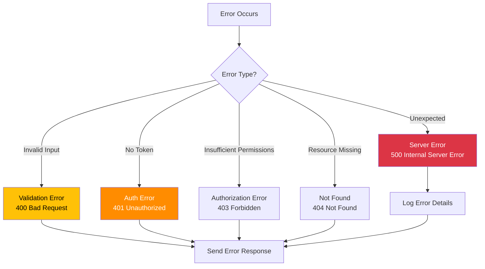
```mermaid
graph TD
    ERROR[Error Occurs]
    TYPE{Error Type?}

    VALIDATION[Validation Error<br/>400 Bad Request]
    AUTH[Auth Error<br/>401 Unauthorized]
    FORBIDDEN[Authorization Error<br/>403 Forbidden]
    NOTFOUND[Not Found<br/>404 Not Found]
    SERVER[Server Error<br/>500 Internal Server Error]

    RESPONSE[Send Error Response]
    LOG[Log Error Details]

    ERROR --> TYPE
    TYPE -->|Invalid Input| VALIDATION
    TYPE -->|No Token| AUTH
    TYPE -->|Insufficient Permissions| FORBIDDEN
    TYPE -->|Resource Missing| NOTFOUND
    TYPE -->|Unexpected| SERVER

    VALIDATION --> RESPONSE
    AUTH --> RESPONSE
    FORBIDDEN --> RESPONSE
    NOTFOUND --> RESPONSE
    SERVER --> LOG
    LOG --> RESPONSE

    style SERVER fill:#dc3545,color:#fff
    style VALIDATION fill:#ffc107,color:#000
    style AUTH fill:#ff8c00,color:#fff
```

---

## Dependency Graph (Parseltongue Analysis)

### Module Dependencies

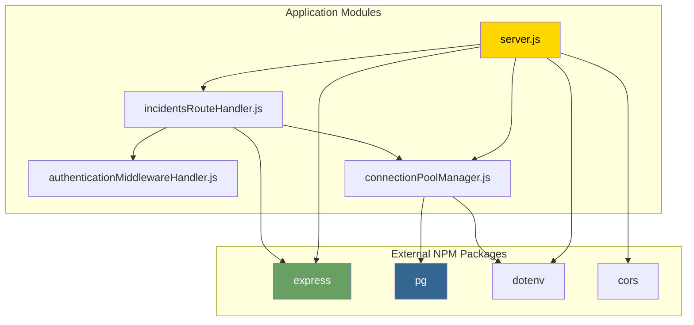
```mermaid
graph TD
    subgraph "External NPM Packages"
        NPM_EXPRESS[express]
        NPM_PG[pg]
        NPM_DOTENV[dotenv]
        NPM_CORS[cors]
    end

    subgraph "Application Modules"
        SERVER[server.js]
        INCIDENTS[incidentsRouteHandler.js]
        AUTH[authenticationMiddlewareHandler.js]
        POOL[connectionPoolManager.js]
    end

    SERVER --> NPM_EXPRESS
    SERVER --> NPM_CORS
    SERVER --> NPM_DOTENV
    SERVER --> INCIDENTS
    SERVER --> POOL

    INCIDENTS --> NPM_EXPRESS
    INCIDENTS --> AUTH
    INCIDENTS --> POOL

    POOL --> NPM_PG
    POOL --> NPM_DOTENV

    style NPM_EXPRESS fill:#68a063,color:#fff
    style NPM_PG fill:#336791,color:#fff
    style SERVER fill:#ffd700,color:#000
```

### Function Call Graph

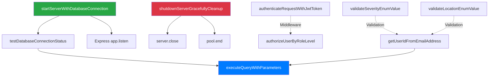
```mermaid
graph TD
    START[startServerWithDatabaseConnection]
    TEST[testDatabaseConnectionStatus]
    LISTEN[Express app.listen]
    QUERY[executeQueryWithParameters]

    SHUTDOWN[shutdownServerGracefullyCleanup]
    CLOSE[server.close]
    END_POOL[pool.end]

    AUTH[authenticateRequestWithJwtToken]
    AUTHORIZE[authorizeUserByRoleLevel]

    GET_USER[getUserIdFromEmailAddress]
    VALIDATE_SEV[validateSeverityEnumValue]
    VALIDATE_LOC[validateLocationEnumValue]

    START --> TEST
    TEST --> QUERY
    START --> LISTEN

    SHUTDOWN --> CLOSE
    SHUTDOWN --> END_POOL

    AUTH -.Middleware.-> AUTHORIZE

    GET_USER --> QUERY
    VALIDATE_SEV -.Validation.-> GET_USER
    VALIDATE_LOC -.Validation.-> GET_USER

    style START fill:#28a745,color:#fff
    style SHUTDOWN fill:#dc3545,color:#fff
    style QUERY fill:#007bff,color:#fff
```

---

## Performance Considerations

### Connection Pool Sizing

```
Formula: connections = ((core_count * 2) + effective_spindle_count)

For development (4 cores, SSD):
  = (4 * 2) + 1 = 9 connections (recommended)

Current setting: 20 connections (headroom for testing)
```

### Query Optimization

| Operation | Strategy | Index Used |
|-----------|----------|------------|
| **List incidents** | WHERE + ORDER BY | severity_idx, reported_at_idx |
| **Get by ID** | Primary key lookup | incidents_pkey |
| **Search** | Full-text search | incidents_search_idx (GIN) |
| **User lookup** | Email index | users_email_key (UNIQUE) |

---

## Testing Strategy

### Test Pyramid

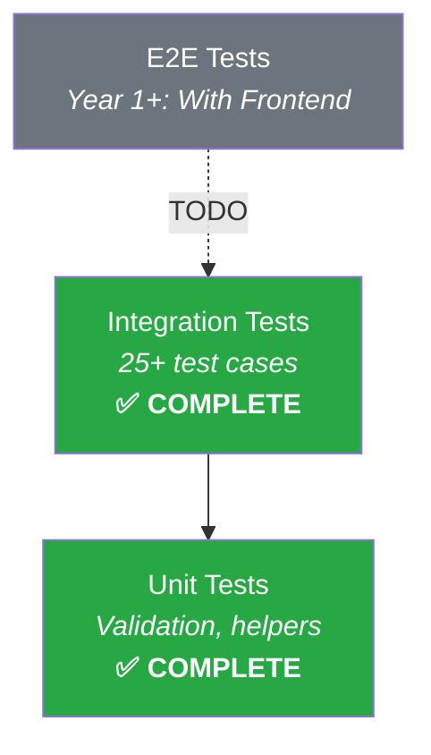
```mermaid
graph TD
    E2E[E2E Tests<br/><i>Year 1+: With Frontend</i>]
    INTEGRATION[Integration Tests<br/><i>25+ test cases</i><br/><b>✅ COMPLETE</b>]
    UNIT[Unit Tests<br/><i>Validation, helpers</i><br/><b>✅ COMPLETE</b>]

    E2E -.->|TODO| INTEGRATION
    INTEGRATION --> UNIT

    style INTEGRATION fill:#28a745,color:#fff
    style UNIT fill:#28a745,color:#fff
    style E2E fill:#6c757d,color:#fff
```

### Test Coverage (Year 1)

```mermaid
pie title Test Coverage by Layer
    "Route Handlers" : 100
    "Middleware" : 100
    "Database Access" : 100
    "Server Bootstrap" : 0
```

---

## Future Enhancements (Years 2-7)

### Year 2: Authentication & Authorization

```mermaid
graph LR
    A[Real JWT] --> B[RS256 Signing]
    A --> C[Refresh Tokens]
    A --> D[Session Management]
    A --> E[Password Hashing]

    style A fill:#9c1c1c,color:#fff
```

### Year 3: Real-Time Features

```mermaid
graph LR
    A[Socket.io] --> B[Live Incident Updates]
    A --> C[Presence Indicators]
    A --> D[Push Notifications]

    style A fill:#010101,color:#fff
```

### Year 7: Production Ready

```mermaid
graph LR
    A[Production] --> B[Winston Logging]
    A --> C[Rate Limiting]
    A --> D[Health Checks]
    A --> E[Metrics/Monitoring]
    A --> F[CI/CD Pipeline]

    style A fill:#ffd700,color:#000
```

---

## Related Documentation

- **[ARCHITECTURE-OVERVIEW.md](./ARCHITECTURE-OVERVIEW.md)** - High-level system architecture
- **[ARCHITECTURE-DEPENDENCIES.md](./ARCHITECTURE-DEPENDENCIES.md)** - Detailed dependency analysis
- **[ARCHITECTURE-DATABASE.md](./ARCHITECTURE-DATABASE.md)** - Database schema visualization
- **[GRYFFINDOR-YEAR1-SUMMARY.md](../GRYFFINDOR-YEAR1-SUMMARY.md)** - Implementation summary

---

**"Mischief managed."**
