# The Marauder's Map - Database Architecture

**Version**: v0.0.1 (Year 1: Gryffindor Wing)
**Database**: PostgreSQL 16
**Schema File**: `gringotts/init.sql` (620 lines)

---

## Database Overview


---

## Tables Overview

### Core Tables (8 total)

| Table | Rows (Seed) | Purpose | Year Activated |
|-------|-------------|---------|----------------|
| **users** | 6 | Aurors, Prefects, Students | Year 1 |
| **incidents** | ~8 | Dark activity tracking | Year 1 |
| **incident_comments** | 0 | Discussion threads | Year 3 |
| **incident_history** | 0 | Audit trail | Year 6 |
| **notifications** | 0 | Push notifications | Year 3 |
| **sessions** | 0 | Auth sessions | Year 2 |
| **refresh_tokens** | 0 | JWT rotation | Year 2 |
| **analytics_overview** | VIEW | Aggregated stats | Year 5 |

---

## Enums and Types

### severity_level

```mermaid
graph LR
    MISCHIEF[🎭 MISCHIEF<br/><i>Minor pranks</i>]
    SUSPICIOUS[🔍 SUSPICIOUS<br/><i>Questionable behavior</i>]
    DANGEROUS[⚠️ DANGEROUS<br/><i>Serious threat</i>]
    UNFORGIVABLE[💀 UNFORGIVABLE<br/><i>Dark magic</i>]

    MISCHIEF -->|Escalate| SUSPICIOUS
    SUSPICIOUS -->|Escalate| DANGEROUS
    DANGEROUS -->|Escalate| UNFORGIVABLE

    style MISCHIEF fill:#28a745,color:#fff
    style SUSPICIOUS fill:#ffc107,color:#000
    style DANGEROUS fill:#ff8c00,color:#fff
    style UNFORGIVABLE fill:#dc3545,color:#fff
```



**SQL Definition**:
```sql
CREATE TYPE severity_level AS ENUM (
    'MISCHIEF',        -- Minor rule breaking, pranks
    'SUSPICIOUS',      -- Questionable behavior worth monitoring
    'DANGEROUS',       -- Serious threat requiring immediate attention
    'UNFORGIVABLE'     -- Dark magic, highest severity
);
```

### incident_status


**SQL Definition**:
```sql
CREATE TYPE incident_status AS ENUM (
    'OPEN',            -- Newly reported, awaiting action
    'IN_PROGRESS',     -- Being investigated
    'RESOLVED',        -- Threat neutralized, case closed
    'ARCHIVED'         -- Old incidents (auto-archived after 90 days)
);
```

### location_type


**SQL Definition**:
```sql
CREATE TYPE location_type AS ENUM (
    'HOGWARTS',
    'FORBIDDEN_FOREST',
    'HOGSMEADE',
    'DIAGON_ALLEY',
    'KNOCKTURN_ALLEY',
    'MINISTRY_MAGIC',
    'UNKNOWN',
    'GREAT_HALL',
    'LIBRARY',
    'QUIDDITCH_PITCH',
    'GRYFFINDOR_TOWER',
    'SLYTHERIN_DUNGEON',
    'RAVENCLAW_TOWER',
    'HUFFLEPUFF_COMMON_ROOM',
    'SHRIEKING_SHACK',
    'HAGRID_HUT'
);
```

### user_role

```mermaid
graph TD
    AUROR[👮 AUROR<br/><b>Full Access</b><br/>Delete, Assign, Escalate]
    PREFECT[🎖️ PREFECT<br/><b>Moderate Access</b><br/>Update, Comment, Investigate]
    STUDENT[🎓 STUDENT<br/><b>Read-Only</b><br/>Report, View own incidents]

    AUROR -->|supervises| PREFECT
    PREFECT -->|monitors| STUDENT

    style AUROR fill:#dc3545,color:#fff
    style PREFECT fill:#ffc107,color:#000
    style STUDENT fill:#28a745,color:#fff
```



**SQL Definition**:
```sql
CREATE TYPE user_role AS ENUM (
    'STUDENT',         -- Basic user, can report incidents
    'PREFECT',         -- Moderator, can investigate and update
    'AUROR'            -- Admin, full access
);
```

### house_name

```mermaid
pie title House Distribution (Seed Data)
    "🦁 GRYFFINDOR" : 3
    "🐍 SLYTHERIN" : 1
    "🦅 RAVENCLAW" : 1
    "🦡 HUFFLEPUFF" : 1
```



**SQL Definition**:
```sql
CREATE TYPE house_name AS ENUM (
    'GRYFFINDOR',
    'SLYTHERIN',
    'RAVENCLAW',
    'HUFFLEPUFF'
);
```

---

## Table Schemas (Detailed)

### users Table


**Indexes**:
- `users_pkey` (PRIMARY KEY on id)
- `users_email_key` (UNIQUE on email)
- `users_role_idx` (BTREE on role) - for authorization queries

**Seed Data** (6 users):
```sql
Harry Potter    (harry.potter@hogwarts.edu)       AUROR      GRYFFINDOR
Hermione Granger (hermione.granger@hogwarts.edu)  PREFECT    GRYFFINDOR
Ron Weasley     (ron.weasley@hogwarts.edu)        PREFECT    GRYFFINDOR
Draco Malfoy    (draco.malfoy@hogwarts.edu)       PREFECT    SLYTHERIN
Luna Lovegood   (luna.lovegood@hogwarts.edu)      STUDENT    RAVENCLAW
Neville Longbottom (neville.longbottom@hogwarts.edu) STUDENT GRYFFINDOR
```

All passwords: `password` (bcrypt hashed)

---

### incidents Table (Core Entity)

```mermaid
classDiagram
    class incidents {
        +BIGSERIAL id PK
        +VARCHAR(255) title NOT NULL
        +TEXT description
        +severity_level severity DEFAULT 'MISCHIEF'
        +location_type location NOT NULL
        +incident_status status DEFAULT 'OPEN'
        +UUID reported_by FK→users
        +UUID assigned_to FK→users
        +TIMESTAMP reported_at DEFAULT NOW()
        +TIMESTAMP updated_at DEFAULT NOW()
        +TIMESTAMP deleted_at
        +TSVECTOR search_vector
    }

    class Triggers {
        <<trigger>>
        update_incidents_updated_at
        update_incidents_search_vector
    }

    class Indexes {
        <<index>>
        incidents_pkey (id)
        incidents_severity_idx (severity)
        incidents_status_idx (status)
        incidents_location_idx (location)
        incidents_reported_at_idx (reported_at DESC)
        incidents_search_idx GIN (search_vector)
    }

    incidents --> Triggers
    incidents --> Indexes
```



**Foreign Keys**:
- `reported_by` → `users(id)` ON DELETE RESTRICT
- `assigned_to` → `users(id)` ON DELETE SET NULL

**Soft Delete Pattern**:
```sql
-- When "deleting" an incident
UPDATE incidents
SET status = 'RESOLVED',
    deleted_at = NOW()
WHERE id = $1;

-- Query only active incidents
SELECT * FROM incidents
WHERE deleted_at IS NULL;
```

---

### incident_comments Table

```mermaid
classDiagram
    class incident_comments {
        +BIGSERIAL id PK
        +BIGINT incident_id FK→incidents NOT NULL
        +UUID author_id FK→users NOT NULL
        +TEXT content NOT NULL
        +TIMESTAMP created_at DEFAULT NOW()
    }

    class Use_Cases {
        <<Year 3>>
        Real-time comment threads
        Auror collaboration
        Investigation notes
    }

    incident_comments --> Use_Cases
```



**Indexes**:
- `incident_comments_pkey` (id)
- `incident_comments_incident_id_idx` (incident_id) - for fast lookup
- `incident_comments_created_at_idx` (created_at DESC) - for sorting

---

### incident_history Table (Audit Trail)


**Schema**:
```sql
CREATE TABLE incident_history (
    id                  BIGSERIAL PRIMARY KEY,
    incident_id         BIGINT NOT NULL REFERENCES incidents(id) ON DELETE CASCADE,
    changed_by          UUID NOT NULL REFERENCES users(id) ON DELETE RESTRICT,
    change_description  TEXT NOT NULL,
    changed_at          TIMESTAMP WITH TIME ZONE DEFAULT NOW()
);
```

**Usage** (Year 6):
```sql
-- View full history of an incident
SELECT h.*, u.email, u.role
FROM incident_history h
JOIN users u ON h.changed_by = u.id
WHERE incident_id = 42
ORDER BY changed_at DESC;
```

---

### notifications Table


**Schema**:
```sql
CREATE TABLE notifications (
    id                  BIGSERIAL PRIMARY KEY,
    user_id             UUID NOT NULL REFERENCES users(id) ON DELETE CASCADE,
    notification_type   notification_type NOT NULL,
    content             TEXT NOT NULL,
    related_incident_id BIGINT REFERENCES incidents(id) ON DELETE CASCADE,
    is_read             BOOLEAN DEFAULT FALSE,
    created_at          TIMESTAMP WITH TIME ZONE DEFAULT NOW()
);
```

**notification_type Enum**:
```sql
CREATE TYPE notification_type AS ENUM (
    'INCIDENT_CREATED',
    'INCIDENT_UPDATED',
    'INCIDENT_ASSIGNED',
    'INCIDENT_RESOLVED',
    'COMMENT_ADDED'
);
```

---

### sessions Table (Year 2)


**Schema**:
```sql
CREATE TABLE sessions (
    id              BIGSERIAL PRIMARY KEY,
    user_id         UUID NOT NULL REFERENCES users(id) ON DELETE CASCADE,
    session_token   VARCHAR(255) UNIQUE NOT NULL,
    expires_at      TIMESTAMP WITH TIME ZONE NOT NULL,
    created_at      TIMESTAMP WITH TIME ZONE DEFAULT NOW()
);
```

---

### refresh_tokens Table (Year 2)


**Schema**:
```sql
CREATE TABLE refresh_tokens (
    id              BIGSERIAL PRIMARY KEY,
    user_id         UUID NOT NULL REFERENCES users(id) ON DELETE CASCADE,
    token_hash      VARCHAR(255) UNIQUE NOT NULL,
    is_revoked      BOOLEAN DEFAULT FALSE,
    expires_at      TIMESTAMP WITH TIME ZONE NOT NULL,
    created_at      TIMESTAMP WITH TIME ZONE DEFAULT NOW()
);
```

**Security Notes**:
- Store `SHA-256(refresh_token)`, not the token itself
- Rotate tokens on each use (automatic revocation)
- Expire after 7 days of inactivity

---

## Advanced Features

### Triggers

#### 1. Auto-Update Timestamps


**Implementation**:
```sql
CREATE OR REPLACE FUNCTION update_updated_at_column()
RETURNS TRIGGER AS $$
BEGIN
    NEW.updated_at = NOW();
    RETURN NEW;
END;
$$ LANGUAGE plpgsql;

CREATE TRIGGER update_incidents_updated_at
    BEFORE UPDATE ON incidents
    FOR EACH ROW
    EXECUTE FUNCTION update_updated_at_column();
```

**Applied To**:
- `incidents` table
- `users` table

#### 2. Full-Text Search Vector


**Implementation**:
```sql
CREATE OR REPLACE FUNCTION update_incidents_search_vector()
RETURNS TRIGGER AS $$
BEGIN
    NEW.search_vector :=
        setweight(to_tsvector('english', COALESCE(NEW.title, '')), 'A') ||
        setweight(to_tsvector('english', COALESCE(NEW.description, '')), 'B');
    RETURN NEW;
END;
$$ LANGUAGE plpgsql;

CREATE TRIGGER update_incidents_search_vector
    BEFORE INSERT OR UPDATE ON incidents
    FOR EACH ROW
    EXECUTE FUNCTION update_incidents_search_vector();
```

**Usage** (Year 4):
```sql
-- Search for "dark mark"
SELECT *
FROM incidents
WHERE search_vector @@ to_tsquery('english', 'dark & mark')
ORDER BY ts_rank(search_vector, to_tsquery('english', 'dark & mark')) DESC;
```

---

### Stored Functions

#### 1. escalate_incident_severity()


**Implementation**:
```sql
CREATE OR REPLACE FUNCTION escalate_incident_severity(incident_id BIGINT)
RETURNS severity_level AS $$
DECLARE
    current_severity severity_level;
    new_severity severity_level;
BEGIN
    SELECT severity INTO current_severity
    FROM incidents WHERE id = incident_id;

    new_severity := CASE current_severity
        WHEN 'MISCHIEF' THEN 'SUSPICIOUS'
        WHEN 'SUSPICIOUS' THEN 'DANGEROUS'
        WHEN 'DANGEROUS' THEN 'UNFORGIVABLE'
        WHEN 'UNFORGIVABLE' THEN 'UNFORGIVABLE'
    END;

    UPDATE incidents
    SET severity = new_severity
    WHERE id = incident_id;

    RETURN new_severity;
END;
$$ LANGUAGE plpgsql;
```

**Usage**:
```sql
-- Escalate incident #42
SELECT escalate_incident_severity(42);
```

#### 2. resolve_incident()


**Implementation**:
```sql
CREATE OR REPLACE FUNCTION resolve_incident(
    incident_id BIGINT,
    auror_id UUID,
    resolution_notes TEXT DEFAULT NULL
)
RETURNS BOOLEAN AS $$
BEGIN
    UPDATE incidents
    SET status = 'RESOLVED',
        deleted_at = NOW()
    WHERE id = incident_id;

    INSERT INTO incident_history (incident_id, changed_by, change_description)
    VALUES (incident_id, auror_id, 'Incident resolved: ' || COALESCE(resolution_notes, 'No notes provided'));

    RETURN TRUE;
EXCEPTION
    WHEN OTHERS THEN
        RETURN FALSE;
END;
$$ LANGUAGE plpgsql;
```

---

### Materialized Views

#### analytics_overview (Year 5)


**Implementation**:
```sql
CREATE MATERIALIZED VIEW analytics_overview AS
SELECT
    COUNT(*) AS total_incidents,
    COUNT(*) FILTER (WHERE severity = 'MISCHIEF') AS mischief_count,
    COUNT(*) FILTER (WHERE severity = 'SUSPICIOUS') AS suspicious_count,
    COUNT(*) FILTER (WHERE severity = 'DANGEROUS') AS dangerous_count,
    COUNT(*) FILTER (WHERE severity = 'UNFORGIVABLE') AS unforgivable_count,
    COUNT(*) FILTER (WHERE status = 'OPEN') AS open_count,
    COUNT(*) FILTER (WHERE status = 'IN_PROGRESS') AS in_progress_count,
    COUNT(*) FILTER (WHERE status = 'RESOLVED') AS resolved_count,
    AVG(EXTRACT(EPOCH FROM (COALESCE(deleted_at, NOW()) - reported_at))) AS avg_resolution_seconds
FROM incidents
WHERE deleted_at IS NULL OR deleted_at IS NOT NULL;

CREATE INDEX analytics_overview_idx ON analytics_overview (total_incidents);
```

**Refresh Function**:
```sql
CREATE OR REPLACE FUNCTION refresh_analytics()
RETURNS VOID AS $$
BEGIN
    REFRESH MATERIALIZED VIEW CONCURRENTLY analytics_overview;
END;
$$ LANGUAGE plpgsql;
```

---

## Indexes Strategy

### Index Types Used


### Index Coverage Analysis

| Query Pattern | Index Used | Performance |
|---------------|------------|-------------|
| **SELECT * WHERE id = ?** | incidents_pkey | O(log n) |
| **SELECT * WHERE status = ?** | incidents_status_idx | O(log n) |
| **SELECT * WHERE search_vector @@ ?** | incidents_search_idx (GIN) | O(log n) |
| **SELECT * ORDER BY reported_at DESC** | incidents_reported_at_idx | O(log n) |
| **SELECT * WHERE deleted_at IS NULL** | Seq Scan (no index) | O(n) ⚠️ |

**Optimization Opportunity** (Year 7):
```sql
-- Add partial index for active incidents
CREATE INDEX incidents_active_idx ON incidents (id)
WHERE deleted_at IS NULL;
```

---

## Query Performance

### Expected Query Plans

#### 1. Get Incident by ID (Fast)

```sql
EXPLAIN ANALYZE
SELECT * FROM incidents WHERE id = 1;
```

```
Index Scan using incidents_pkey on incidents (cost=0.15..8.17 rows=1)
  Index Cond: (id = 1)
  Planning Time: 0.105 ms
  Execution Time: 0.023 ms
```

#### 2. Filter by Severity (Fast)

```sql
EXPLAIN ANALYZE
SELECT * FROM incidents WHERE severity = 'DANGEROUS';
```

```
Index Scan using incidents_severity_idx on incidents (cost=0.15..12.34 rows=5)
  Index Cond: (severity = 'DANGEROUS')
  Planning Time: 0.112 ms
  Execution Time: 0.045 ms
```

#### 3. Full-Text Search (Year 4)

```sql
EXPLAIN ANALYZE
SELECT * FROM incidents
WHERE search_vector @@ to_tsquery('english', 'dark & mark');
```

```
Bitmap Heap Scan on incidents (cost=4.56..18.23 rows=3)
  Recheck Cond: (search_vector @@ '''dark'' & ''mark'''::tsquery)
  -> Bitmap Index Scan on incidents_search_idx (cost=0.00..4.56 rows=3)
        Index Cond: (search_vector @@ '''dark'' & ''mark'''::tsquery)
  Planning Time: 0.234 ms
  Execution Time: 0.156 ms
```

---

## Backup and Recovery Strategy

### Backup Approach (Year 7)


**Commands**:
```bash
# Full backup
pg_dump -Fc marauders_map > backup_$(date +%Y%m%d).dump

# Restore
pg_restore -d marauders_map backup_20260202.dump

# Point-in-time recovery (with WAL)
pg_restore -t "2026-02-02 14:30:00" backup_20260202.dump
```

---

## Database Migrations Strategy

### Current Approach (Year 1)

```
Single init.sql file
- Simple, easy to understand
- No migration tracking
- Destructive: DROP DATABASE IF EXISTS
```

### Future Approach (Year 2+)

```mermaid
graph LR
    V1[V1: Initial Schema]
    V2[V2: Add JWT Tables]
    V3[V3: Add Notifications]
    V4[V4: Full-Text Search]

    V1 -->|node-pg-migrate| V2
    V2 -->|node-pg-migrate| V3
    V3 -->|node-pg-migrate| V4

    style V1 fill:#28a745,color:#fff
    style V4 fill:#007bff,color:#fff
```

**Tool**: `node-pg-migrate`

```bash
# Create migration
npx node-pg-migrate create add-notifications-table

# Run migrations
npx node-pg-migrate up

# Rollback
npx node-pg-migrate down
```

---

## Security Considerations

### SQL Injection Prevention

```mermaid
graph TD
    USER[User Input] --> VALIDATE[Validation Layer]
    VALIDATE -->|Sanitized| PARAMS[Parameterized Query]
    PARAMS -->|Safe| PG[PostgreSQL]

    VALIDATE -.Block.-> MALICIOUS[Malicious Input]

    style PARAMS fill:#28a745,color:#fff
    style MALICIOUS fill:#dc3545,color:#fff
```

**Good** (Current):
```javascript
// ✅ Parameterized query
const result = await pool.query(
    'SELECT * FROM incidents WHERE id = $1',
    [incidentId]
);
```

**Bad** (Never do this):
```javascript
// ❌ String concatenation - VULNERABLE!
const result = await pool.query(
    `SELECT * FROM incidents WHERE id = ${incidentId}`
);
```

### Row-Level Security (Year 6)

```sql
-- Students can only see their own incidents
CREATE POLICY student_own_incidents ON incidents
    FOR SELECT
    TO student_role
    USING (reported_by = current_user_id());

-- Prefects can see all incidents in their house
CREATE POLICY prefect_house_incidents ON incidents
    FOR SELECT
    TO prefect_role
    USING (
        reported_by IN (
            SELECT id FROM users
            WHERE house = current_user_house()
        )
    );

-- Aurors can see everything
CREATE POLICY auror_all_incidents ON incidents
    FOR ALL
    TO auror_role
    USING (TRUE);
```

---

## Related Documentation

- **[ARCHITECTURE-OVERVIEW.md](./ARCHITECTURE-OVERVIEW.md)** - High-level system architecture
- **[ARCHITECTURE-BACKEND-LAYERS.md](./ARCHITECTURE-BACKEND-LAYERS.md)** - Backend layer breakdown
- **[ARCHITECTURE-DEPENDENCIES.md](./ARCHITECTURE-DEPENDENCIES.md)** - Dependency analysis

---

**Database**: PostgreSQL 16 🐘
**Schema Version**: v0.0.1
**"The vault that holds our secrets."**
