# The Marauder's Map - Dependency Analysis

**Version**: v0.0.1 (Year 1: Gryffindor Wing)
**Analysis Tool**: Parseltongue v1.4.3
**Dependencies Analyzed**: 53 edges

---

## Parseltongue Analysis Summary

```
Database: rocksdb:parseltongue20260202143503/analysis.db
Total files scanned: 16
Files processed: 5
Code entities identified: 3 functions
Test entities: 6 (excluded from ingestion)
Dependency edges: 53
Analysis duration: 160.72ms
```

---

## Module Dependency Graph

```mermaid
graph TD
    subgraph "External Dependencies"
        EXPRESS[📦 express<br/><i>Web framework</i>]
        PG[📦 pg<br/><i>PostgreSQL driver</i>]
        DOTENV[📦 dotenv<br/><i>Environment config</i>]
        CORS[📦 cors<br/><i>CORS middleware</i>]
        JEST[📦 @jest/globals<br/><i>Testing framework</i>]
        SUPERTEST[📦 supertest<br/><i>API testing</i>]
    end

    subgraph "Application Files"
        SERVER[📄 server.js<br/><i>Entry point</i>]
        INCIDENTS[📄 incidentsRouteHandler.js<br/><i>REST endpoints</i>]
        AUTH[📄 authenticationMiddlewareHandler.js<br/><i>Auth middleware</i>]
        POOL[📄 connectionPoolManager.js<br/><i>DB pool</i>]
        TESTS[🧪 incidents.test.js<br/><i>Integration tests</i>]
    end

    SERVER -->|import| EXPRESS
    SERVER -->|import| CORS
    SERVER -->|import| DOTENV
    SERVER -->|import| INCIDENTS
    SERVER -->|import| POOL

    INCIDENTS -->|import| EXPRESS
    INCIDENTS -->|import| AUTH
    INCIDENTS -->|import| POOL

    POOL -->|import| PG
    POOL -->|import| DOTENV

    TESTS -->|import| JEST
    TESTS -->|import| SUPERTEST
    TESTS -->|import| SERVER
    TESTS -->|import| POOL

    style EXPRESS fill:#68a063,color:#fff,stroke:#333,stroke-width:2px
    style PG fill:#336791,color:#fff,stroke:#333,stroke-width:2px
    style SERVER fill:#ffd700,color:#000,stroke:#333,stroke-width:3px
    style INCIDENTS fill:#9c1c1c,color:#fff,stroke:#333,stroke-width:2px
    style POOL fill:#1a472a,color:#fff,stroke:#333,stroke-width:2px
    style TESTS fill:#99425b,color:#fff,stroke:#333,stroke-width:2px
```



---

## Detailed Dependency Breakdown

### 1. server.js Dependencies

**Imports**:
- `express` - Web application framework
- `cors` - Cross-Origin Resource Sharing middleware
- `dotenv` - Load environment variables from .env
- `./db/connectionPoolManager.js` - Database connection pool
- `./routes/incidentsRouteHandler.js` - Incidents API routes


**Key Functions**:
- `startServerWithDatabaseConnection()` - Bootstrap application
- `shutdownServerGracefullyCleanup()` - Handle SIGTERM/SIGINT

**External Calls**:
```javascript
testDatabaseConnectionStatus()  // From connectionPoolManager
app.listen(port)                // From Express
server.close()                  // From Express HTTP server
pool.end()                      // From connectionPoolManager
```

---

### 2. incidentsRouteHandler.js Dependencies

**Imports**:
- `express` - Router for REST endpoints
- `../middleware/authenticationMiddlewareHandler.js` - JWT auth
- `../db/connectionPoolManager.js` - Database queries


**Identified Functions** (from Parseltongue):

#### getUserIdFromEmailAddress
```
Location: lines 30-36
Calls: pool.query()
Purpose: Lookup user UUID by email address
```


#### validateSeverityEnumValue
```
Location: lines 43-46
Calls: array.includes()
Purpose: Validate severity against enum
Valid values: ['MISCHIEF', 'SUSPICIOUS', 'DANGEROUS', 'UNFORGIVABLE']
```


#### validateLocationEnumValue
```
Location: lines 53-65
Calls: array.includes()
Purpose: Validate location against enum
Valid values: ['HOGWARTS', 'HOGSMEADE', 'KNOCKTURN_ALLEY', etc.]
```

---

### 3. authenticationMiddlewareHandler.js Dependencies

**Imports**: None (no external dependencies)

**Identified Functions** (from Parseltongue):

#### authenticateRequestWithJwtToken
```
Location: lines 18-55
Calls:
  - res.status().json()
  - authorization.split(' ')
  - next()
Purpose: Mock JWT authentication (Year 1)
```

```mermaid
graph TD
    START[Request] --> CHECK{Authorization header?}
    CHECK -->|No| ERROR1[401: No token provided]
    CHECK -->|Yes| SPLIT[Split 'Bearer token']

    SPLIT --> FORMAT{Valid format?}
    FORMAT -->|No| ERROR2[401: Invalid token format]
    FORMAT -->|Yes| MOCK[Mock: Accept any token]

    MOCK --> SET[Set req.user = {<br/>email: harry.potter@...<br/>role: AUROR}]
    SET --> NEXT[next]

    style ERROR1 fill:#dc3545,color:#fff
    style ERROR2 fill:#dc3545,color:#fff
    style SET fill:#28a745,color:#fff
```

#### authorizeUserByRoleLevel
```
Location: lines 62-80
Calls:
  - allowedRoles.includes()
  - res.status().json()
  - allowedRoles.join(', ')
  - next()
Purpose: Role-based authorization
```


---

### 4. connectionPoolManager.js Dependencies

**Imports**:
- `pg` - PostgreSQL client library (Pool)
- `dotenv` - Load database credentials


**Identified Functions** (from Parseltongue):

#### executeQueryWithParameters
```
Location: lines 61-72
Calls:
  - Date.now()
  - pool.query(text, params)
  - console.log()
  - console.error()
Purpose: Execute parameterized SQL queries with performance logging
```


#### testDatabaseConnectionStatus
```
Location: lines 78-87
Calls:
  - pool.query('SELECT NOW()')
  - console.log()
  - console.error()
Purpose: Health check for database connection
```


---

### 5. incidents.test.js Dependencies

**Imports**:
- `@jest/globals` - describe, it, expect, beforeAll, afterAll
- `supertest` - HTTP request library for testing
- `../src/server.js` - Express app
- `../src/db/connectionPoolManager.js` - Clean up database connection

```mermaid
graph LR
    TESTS[incidents.test.js] --> JEST[@jest/globals]
    TESTS --> SUPERTEST[supertest]
    TESTS --> SERVER[server.js]
    TESTS --> POOL[connectionPoolManager.js]

    style TESTS fill:#99425b,color:#fff
    style JEST fill:#99425b,color:#fff
```

**Test Structure**:
```
describe('POST /api/incidents')
  ├─ it('should_create_incident_with_valid_data')
  ├─ it('should_reject_incident_without_title')
  ├─ it('should_reject_incident_with_invalid_severity')
  ├─ it('should_reject_incident_without_authorization')
  └─ it('should_default_severity_to_mischief')

describe('GET /api/incidents')
  ├─ it('should_return_all_incidents_as_array')
  ├─ it('should_filter_incidents_by_severity')
  └─ ...

[25+ total test cases]
```

---

## Function Call Graph

### Internal Function Calls


### External Function Calls (Parseltongue Data)


---

## Dependency Statistics

### By Module Type


### NPM Package Usage

| Package | Used By | Purpose |
|---------|---------|---------|
| **express** | server.js, incidentsRouteHandler.js | Web framework, routing |
| **pg** | connectionPoolManager.js | PostgreSQL driver |
| **dotenv** | server.js, connectionPoolManager.js | Environment configuration |
| **cors** | server.js | CORS middleware |
| **@jest/globals** | incidents.test.js | Testing framework |
| **supertest** | incidents.test.js | API testing |

### Coupling Analysis


**Observations**:
- ✅ **Low coupling** in authenticationMiddlewareHandler.js (no external dependencies)
- ⚠️ **Medium coupling** in connectionPoolManager.js (isolated to database concerns)
- ⚠️ **Higher coupling** in server.js (expected for entry point)

---

## Dependency Injection Patterns

### Year 1: Direct Imports (Current)

```javascript
// server.js
import { pool } from './db/connectionPoolManager.js';
import incidentsRouter from './routes/incidentsRouteHandler.js';

// Direct usage
app.use('/api/incidents', incidentsRouter);
```

**Characteristics**:
- ✅ Simple, straightforward
- ✅ No abstraction overhead
- ⚠️ Harder to test with mocks
- ⚠️ Tight coupling

### Year 6: Dependency Injection (Planned)

```javascript
// Future: Dependency injection container
class Container {
  constructor() {
    this.services = new Map();
  }

  register(name, factory) {
    this.services.set(name, factory);
  }

  resolve(name) {
    const factory = this.services.get(name);
    return factory(this);
  }
}

// Register services
container.register('database', () => new DatabaseService(config));
container.register('incidentsService', (c) =>
  new IncidentsService(c.resolve('database'))
);
```

**Benefits**:
- ✅ Testable with mock services
- ✅ Loose coupling
- ✅ Single responsibility
- ⚠️ More complex

---

## Circular Dependency Analysis

```mermaid
graph TD
    CHECK{Circular Dependencies?}
    CHECK -->|None Found| SAFE[✅ Safe Architecture]

    SAFE --> REASON[No module imports its own dependencies]

    style SAFE fill:#28a745,color:#fff
```



**Verification**:
```
server.js → incidentsRouteHandler.js → connectionPoolManager.js
  ↓                ↓                          ↓
  ✓ No cycles    ✓ No cycles              ✓ No cycles
```

---

## Import/Export Patterns

### ES Modules (Current)

```javascript
// Export (connectionPoolManager.js)
export const pool = new Pool(config);
export async function executeQueryWithParameters(text, params) { }

// Import (server.js)
import { pool, testDatabaseConnectionStatus } from './db/connectionPoolManager.js';
```

### CommonJS (Not Used)

```javascript
// Not used in this project
// Year 2+ might use for compatibility
```

---

## Dependency Upgrade Strategy

### Package Versions (package.json)

```json
{
  "dependencies": {
    "express": "^4.18.2",       // Major version locked
    "pg": "^8.11.3",            // Major version locked
    "dotenv": "^16.3.1",        // Major version locked
    "cors": "^2.8.5"            // Major version locked
  }
}
```

### Update Policy

```mermaid
graph LR
    MINOR[Minor Updates<br/>^4.18.x → ^4.19.x] -->|Automatic| LOW_RISK[Low Risk]
    MAJOR[Major Updates<br/>^4.x → ^5.x] -->|Manual| HIGH_RISK[High Risk]
    SECURITY[Security Patches<br/>Fix CVEs] -->|Immediate| CRITICAL[Critical]

    LOW_RISK --> TEST[npm test]
    HIGH_RISK --> REVIEW[Review changelog]
    CRITICAL --> DEPLOY[Deploy immediately]

    style CRITICAL fill:#dc3545,color:#fff
    style HIGH_RISK fill:#ffc107,color:#000
    style LOW_RISK fill:#28a745,color:#fff
```



---

## Tree-Shaking Opportunities

### Current Bundle (Development)

```
node_modules/: ~462 packages
Total size: ~150 MB (including dev dependencies)
```

### Production Optimization (Year 7)


**Expected Savings**:
- Express: ~900 KB → ~600 KB (-33%)
- pg: ~250 KB → ~250 KB (no savings, all code used)
- Overall: ~150 MB → ~5 MB production bundle

---

## Blast Radius Analysis

Using Parseltongue's blast radius feature, we can determine the impact of changes:

### Example: Changing executeQueryWithParameters()


**Blast Radius**: **High** (affects all database operations)
**Recommendation**: Thorough testing required, consider feature flag

---

## Future Dependency Plans

### Year 2: Authentication

```javascript
+ "bcrypt": "^5.1.0",           // Password hashing
+ "jsonwebtoken": "^9.0.0",     // JWT signing/verification
```

### Year 3: Real-Time

```javascript
+ "socket.io": "^4.6.1",        // WebSocket server
+ "socket.io-client": "^4.6.1"  // WebSocket client
```

### Year 7: Production

```javascript
+ "winston": "^3.10.0",         // Structured logging
+ "helmet": "^7.0.0",           // Security headers
+ "express-rate-limit": "^6.10.0", // Rate limiting
+ "compression": "^1.7.4"       // Response compression
```

---

## Related Documentation

- **[ARCHITECTURE-OVERVIEW.md](./ARCHITECTURE-OVERVIEW.md)** - High-level system architecture
- **[ARCHITECTURE-BACKEND-LAYERS.md](./ARCHITECTURE-BACKEND-LAYERS.md)** - Backend layer breakdown
- **[ARCHITECTURE-DATABASE.md](./ARCHITECTURE-DATABASE.md)** - Database schema visualization

---

**Analyzed with Parseltongue v1.4.3**
**"The code that binds us."**
