# The Marauder's Map - Architecture Overview

**Version**: v0.0.1 (Year 1: Core CRUD Complete)
**Generated**: 2026-02-02
**Analysis Tool**: Parseltongue v1.4.3

---

## System Architecture (High-Level)

The Marauder's Map is a multi-stack educational project demonstrating three implementations of the same application, all sharing one PostgreSQL database.

```mermaid
graph TB
    subgraph "Year 1: Gryffindor Wing (COMPLETE)"
        GC[Gryffindor Client<br/>React + Vite<br/>Port 3001<br/><i>TODO</i>]
        GS[Gryffindor Server<br/>Express.js<br/>Port 4001<br/><b>✅ COMPLETE</b>]
    end

    subgraph "Year 1+: Slytherin Wing (TODO)"
        SC[Slytherin Client<br/>Angular<br/>Port 3002]
        SS[Slytherin Server<br/>.NET Core<br/>Port 4002]
    end

    subgraph "Year 1+: Ravenclaw Wing (TODO)"
        RC[Ravenclaw Client<br/>Vue.js<br/>Port 3003]
        RS[Ravenclaw Server<br/>Spring Boot<br/>Port 4003]
    end

    subgraph "Gringotts Vault (Shared Database)"
        DB[(PostgreSQL 16<br/>marauders_map<br/>Port 5432<br/><b>✅ COMPLETE</b>)]
    end

    GC -.->|HTTP/REST| GS
    GS -->|SQL| DB

    SC -.->|HTTP/REST| SS
    SS -.->|SQL| DB

    RC -.->|HTTP/REST| RS
    RS -.->|SQL| DB

    style GS fill:#9c1c1c,stroke:#ffd700,stroke-width:3px,color:#fff
    style DB fill:#1a472a,stroke:#ffd700,stroke-width:3px,color:#fff
    style GC fill:#9c1c1c,stroke:#666,stroke-width:1px,color:#fff,stroke-dasharray: 5 5
    style SC fill:#1a472a,stroke:#666,stroke-width:1px,color:#fff,stroke-dasharray: 5 5
    style SS fill:#1a472a,stroke:#666,stroke-width:1px,color:#fff,stroke-dasharray: 5 5
    style RC fill:#0e1a40,stroke:#666,stroke-width:1px,color:#fff,stroke-dasharray: 5 5
    style RS fill:#0e1a40,stroke:#666,stroke-width:1px,color:#fff,stroke-dasharray: 5 5
```



**Legend**:
- 🦁 **Gryffindor** (Red): React + Express.js - Bold, fast, minimal ceremony
- 🐍 **Slytherin** (Green): Angular + .NET - Enterprise patterns, strong typing
- 🦅 **Ravenclaw** (Blue): Vue.js + Spring Boot - Elegant, intelligent design
- 🏦 **Gringotts** (Gold): Shared PostgreSQL database

---

## Current Status (v0.0.1)

### Completed Components

| Component | Status | Lines of Code | Files |
|-----------|--------|---------------|-------|
| **Database Schema** | ✅ Complete | 620 | 1 |
| **Gryffindor Backend** | ✅ Complete | 600 | 4 |
| **Backend Tests** | ✅ Complete | 550 | 1 |
| **Documentation** | ✅ Complete | 300 | 4 |
| **Infrastructure** | ✅ Complete | 100 | 1 |

### Parseltongue Analysis Results

```
Total files scanned: 16
Files processed: 5
Code entities: 3 (functions)
Test entities: 6 (excluded from ingestion)
Dependency edges: 53
Duration: 160.72ms
```

---

## Technology Stack (Year 1: Gryffindor)


---

## Deployment Architecture


---

## Data Flow (Year 1)


---

## Key Architectural Decisions

### 1. Shared Database Pattern

**Decision**: All three implementations (Gryffindor, Slytherin, Ravenclaw) share one PostgreSQL database.

**Rationale**:
- Enables direct comparison of different tech stacks solving the same problem
- Demonstrates database-agnostic design
- Educational value: students see how different ORMs/query builders work

**Trade-offs**:
- ✅ Consistent data model across implementations
- ✅ No data synchronization needed
- ⚠️ Schema migrations must be coordinated
- ⚠️ Cannot use stack-specific database features

### 2. Mock Authentication (Year 1)

**Decision**: Accept any Bearer token, map to Harry Potter user.

**Rationale**:
- Unblocks TDD implementation
- Focus on core CRUD operations first
- Real JWT in Year 2

**Trade-offs**:
- ✅ Simple, testable
- ✅ No external dependencies
- ⚠️ Not production-ready
- ⚠️ Must be replaced in Year 2

### 3. 4-Word Naming Convention (4WNC)

**Decision**: All functions follow `verb_constraint_target_qualifier()` pattern.

**Rationale**:
- Self-documenting code
- Consistent across entire codebase
- Searchable function names
- From idiomatic patterns in `agents-used-202512/`

**Examples**:
- `executeQueryWithParameters(text, params)`
- `authenticateRequestWithJwtToken(req, res, next)`
- `getUserIdFromEmailAddress(email)`
- `validateSeverityEnumValue(severity)`

### 4. Test-Driven Development (TDD)

**Decision**: Write tests first (RED), implement after (GREEN), refactor last (REFACTOR).

**Rationale**:
- Executable specifications
- Prevents scope creep
- Built-in regression testing
- Educational value

**Results**:
- 25+ test cases covering all CRUD operations
- 100% endpoint coverage
- Clear implementation requirements

---

## Code Statistics (Parseltongue Analysis)

### Files by Type

| Type | Count | Examples |
|------|-------|----------|
| **JavaScript** | 5 | server.js, incidentsRouteHandler.js |
| **SQL** | 1 | init.sql |
| **JSON** | 3 | package.json, openapi.yml |
| **Markdown** | 7 | README.md, SETUP.md, PRD, etc. |

### Code Entities Identified

| Entity Type | Count | Location |
|-------------|-------|----------|
| **Functions** | 9 | Backend source files |
| **Test Functions** | 25+ | incidents.test.js |
| **API Endpoints** | 5 | POST, GET, PUT, DELETE |
| **Database Tables** | 8 | PostgreSQL schema |

### Dependency Complexity

```
Total dependency edges: 53
Average dependencies per file: ~10.6
Deepest dependency chain: 4 levels
  (server.js → incidentsRouteHandler.js →
   connectionPoolManager.js → pg driver)
```

---

## Performance Characteristics (Year 1)

### Database Connection Pool

```javascript
max: 20 connections
idleTimeout: 30s
connectionTimeout: 2s
```

### API Response Times (Expected)

| Endpoint | Avg Response Time | Database Queries |
|----------|-------------------|------------------|
| POST /api/incidents | ~50ms | 2 (user lookup + insert) |
| GET /api/incidents | ~30ms | 1 (select with filters) |
| GET /api/incidents/:id | ~25ms | 1 (select by PK) |
| PUT /api/incidents/:id | ~40ms | 1 (update) |
| DELETE /api/incidents/:id | ~35ms | 1 (soft delete) |

---

## Security Considerations

### Year 1 (Current)

- ⚠️ **Mock authentication** - accepts any Bearer token
- ⚠️ **No rate limiting** - open to abuse
- ⚠️ **CORS wide open** - allows localhost:3001 only
- ✅ **SQL injection protection** - parameterized queries
- ✅ **Soft deletes** - incidents marked as RESOLVED, not deleted

### Year 2 (Planned)

- ✅ Real JWT with RS256 signing
- ✅ Password hashing with bcrypt (already in schema)
- ✅ Role-based access control (STUDENT, PREFECT, AUROR)
- ✅ Refresh token rotation
- ✅ Session management

---

## Scalability Considerations

### Current Limitations (Year 1)

- Single Express process
- No caching layer
- No load balancing
- Synchronous database queries
- No connection pooling optimization

### Future Improvements (Year 7)


---

## Next Steps

See detailed architecture documentation:

1. **[ARCHITECTURE-BACKEND-LAYERS.md](./ARCHITECTURE-BACKEND-LAYERS.md)** - Backend layer breakdown
2. **[ARCHITECTURE-DEPENDENCIES.md](./ARCHITECTURE-DEPENDENCIES.md)** - Parseltongue dependency analysis
3. **[ARCHITECTURE-DATABASE.md](./ARCHITECTURE-DATABASE.md)** - Database schema visualization
4. **[ARCHITECTURE-API-DESIGN.md](./ARCHITECTURE-API-DESIGN.md)** - REST API patterns

---

## References

- **PRD**: [PRD-Marauders-Map.md](../PRD-Marauders-Map.md)
- **Technical Specs**: [TECHNICAL-SPECS-Marauders-Map.md](../TECHNICAL-SPECS-Marauders-Map.md)
- **Setup Guide**: [SETUP.md](../SETUP.md)
- **Year 1 Summary**: [GRYFFINDOR-YEAR1-SUMMARY.md](../GRYFFINDOR-YEAR1-SUMMARY.md)
- **Parseltongue Tool**: https://github.com/that-in-rust/parseltongue-dependency-graph-generator

---

**"I solemnly swear that I am up to no good."**
